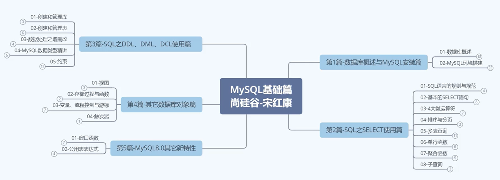
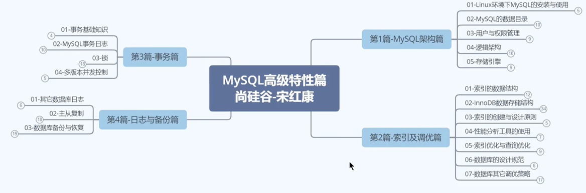
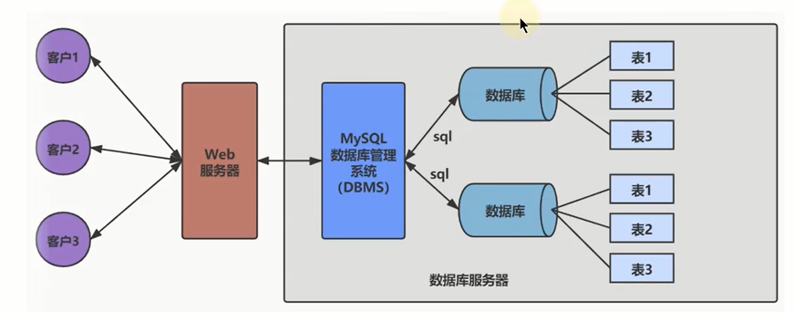

# 尚硅谷 MySQL

> TITLE：MySQL从菜鸟到大牛
>
> AUTHOR：宋红康 - 人称：康师傅
>
> SCHOOL：北航
>
> VIDEO：[BiliBili](https://www.bilibili.com/video/BV1iq4y1u7vj?spm_id_from=333.999.0.0)
>
> FILE：[初级](F:\STU\itcast\尚硅谷mysql高级\初级\课件pdf版\课件) [高级](F:\STU\itcast\尚硅谷mysql高级\高级\参考课件（供实操参考）)

## 学习进度

- 每天10节课打底
- 开始时间：2022-05-16
- 结束时间：

|    日期    | 课程编号 |       学习时长       | 复习时间 |
| :--------: | :------: | :------------------: | :------: |
| 2022-05-16 |  P1~P5   | 21:42~23:20  1h40min |  5-17,   |
| 2022-05-17 |  P6~P10  | 20:04~22:33 2h29min  |          |
|            |          |                      |          |

## 测验

- 题库

[LeetCode]()

[牛客网]()

## 课程大纲



- 第一篇：数据库概述与MySQL安装篇
- 第二篇：SQL之SELECT使用篇
- 第三篇：SQL之DDL、DML、DCL使用篇
- 第四篇：其它数据库对象篇
- 第五篇：MySQL8.0其它新特性



- 第一篇：MySQL架构篇
- 第二篇：索引及调优篇
- 第三篇：事务篇
- 第四篇：日志与备份篇

## 目录

[[toc]]


## 基础篇

## 第一章: 认识数据库

### 教程简介

> 新 全 细 真

- 新
  - 版本新：针对MySQL 8.0.26 版本讲解
  - 融合几乎所有语法，调优，底层新特性
  - 同时，如何面对企业对MySQL5.7的高占比
- 全
  - 知识内容全面、系统
  - 上篇：01 - 95 节
  - 下篇：95 - 199 节
  - 文档资料全面
- 细
  - 课程细致、层层深入
  - 讲解细致、庖丁解牛
- 真
  - 几百道MySQL真题演练
  - 真实案例：几十个一线案例需求、案例剖析、解决方案
  - 真实用
    - 7大SQL性能分析工具
    - 10大类30小类SQL优化场景
    - 7大日志剖析
    - 6大范式讲解
    - 15个xx锁的应用
    - 11大适合创建索引场景
    - 300+张高清无码技术剖析图

**优秀学习资料推荐**

MySQL官网：https://dev.mysql.com/doc/refman/8.0/en

索引数据结构演示：https://www.cs.usfca.edu/~galles/visualization/about.html

一本教材：MySQL是怎样运行的 - 小孩子4919

资料获取方式：

- B站等平台直接点播
- 关注**尚硅谷教育**微信公众号 回复：mysql

**适合人群**

1. MySQL数据库初学者
2. 从事后台开发（Java、Python、Go、PHP等）MySQL开发1-3年的开发人员和运维人员
3. 有资历的MySQL DBA


### 数据库常用概念

- 为什么要使用数据库
  - 持久化：内存 -> 磁盘
  - 数据库优点：存储数据量大

- 常用概念

DB：数据库（Database）

DBMS：数据库管理系统（Database Management System）

SQL：结构化查询语言（Structured Query Language）



### 常见数据库

Oracle

MySQL

SQL Server

PostgreSQL : pgsql

SQLite

### MySQL 介绍

### RDBMS 与 非RDBMS

- RDBMS
  - 实质：复杂数据结构的二元关系 | 行、列存储 -> 表 -> 库 |  表 <- 关系模型 -> 表 | SQL 为查询语言
  - 优势：复杂查询 | 事务支持
- 非RDBMS
  - 键值对存储数据 | 无需SQL | 性能高 | 免费
  - 类别：健值型数据库 Redis | 文档型数据库 MongoDB | 搜索引擎数据库 ES | 列式数据库 HBase | 图形数据库 Neo4j
  - 应用：日志收集、排行榜、定时器

### 关系型数据库设计规则 P5

- 关系型数据库的典型数据结构就是数据表，这些数据表的组成都是结构化的(Structured)。

- 将数据放到表中，表再放到库中。

- 一个数据库中可以有多个表，每个表都有一个名字，用来标识自己。表名具有唯一性。

- 表具有一些特性，这些特性定义了数据在表中如何存储，类似Java和Python中“类”的设计。

> ORM 思想（Object Relational Mapping）
>
> 数据库中的一个表   <--->       Java或Python中的一个类
>
> 表中的一条数据       <--->        类中的一个对象(或实体)
>
> 表中的一个列           <---->       类中的一个字段、属性(field)

**表、记录、字段**

E-R (entity-relationship，实体-联系）模型中有三个主要概念是：`实体集`、`属性`、`联系集`。

一个实体集(class）对应于数据库中的一个表(table)，一个实体（instance)则对应于数据库表中的一行(row)，也称为一条记录（record)。一个属性（attribute)对应于数据库表中的一列(column)，也称为一个字段(field)。


**表的关联关系**

- 表与表之间的数据记录有关系(relationship)。现实世界中的各种实体以及实体之间的各种联系均用关系模型来麦示。

- 四种：

  - 一对一关联

    实际开发中用的不多，因为一对一可以创建成一张表

    场景：基础信息表和档案信息表

    建表原则：1）外键唯一：主表的主键和从表的外键（唯一），形成主外键关系，外键唯一。

    ​						 2）外键是主键：主表的主键和从表的主键，形成主外键关系。

  - 一对多关联

    场景：客户和订单、分类表和商品表、部门表和员工表

    建表原则：在从表（多方）创建一个字段，字段作为外键指向主表（一方）主键

  - 多对多关联

    要表示多对多关系，必须创建第三个表，该表通常称为联接表，它将多对多关系划分为两个一对多关系。将这两个表的主键都插入到第三个表中。

    场景：学生-课程 -> 学生信息表 | 课程信息表 | 选课信息表

    ​			  产品-订单 -> 产品表 | 订单表 | 订单明细表

    ​			  用户-角色 -> 用户表 | 角色表 | 用户角色表

  - 自我引用

    场景：员工表 -> 员工 | 主管 scott Employee

## 第二章：MySQL 环境搭建 - Windows

### MySQL 卸载

步骤1：停止MySQL服务

​					`Win + q` 输入 服务

​					cmd `sc delete mysql服务名` 彻底删除残余的MySQL服务

步骤2：软件的卸载

​					控制面板:thumbsup:、360安全管家

步骤3：残余文件的清理

​					删除安装目录下文件

步骤4：清理注册表（选做）

​					8.0 自动删除服务

​					5.7 需要手动清理注册表 `regedit` 打开注册表

步骤5：删除环境变量


### MySQL的下载、安装、配置

MySQL4大版本

- MySQL Community Server 社区版本 免费

  开源免费，自由下载，但不提供官方技术支持，适用于 大多数普通用户。

- MySQL Enterprise Edition 企业版本 需付费

  不能在线下载，可以试用30天。提供了更多的 功能和更完备的技术支持，更适合于对数据库的功能和可靠性要求较高的企业客户。

- MySQL Cluster 集群版 免费

  用于架设集群服务器，可将几个MySQL Server封装成一个 Server。需要在社区版或企业版的基础上使用。

- MySQL Cluster CGE 高级集群版 需付费


- 下载

官网：https://www.mysql.com

建议：msi格式

- 安装

Advance Access ： 选择安装目录 | 选择数据存放目录

Config Type ：安装服务器类别，选择占用资源类别

- 配置环境变量

mysql --version 安装成功


### MySQL的登录

```bash
mysql -uroot -pxxx -hlocalhost -P3306
```

- 服务的启动与关闭

  找到服务，右键 启动 | 关闭

- 命令行工具

  ```bash
  # 启动mysql服务
  net start mysql服务名
  # 停止mysql服务
  net stop mysql服务名
  ```

- 自带客户端的登录与退出

- 显示版本

  ```bash
  # 登录前
  mysql --version
  # 登录后
  select version();
  ```

- 退出

  ```sql
  quit
  exit
  ```

  

### MySQL演示使用

```sql
show databases;
create database dbtest1;
use dbtest1;
show tables;
create table employees(id int,name varchar(15));
select * from employees;
insert into employees values(1001,'Tom');
show create table employees;
drop database dbtest1;
```

- mysql5.7 插入中文乱码

  原因：mysql5.7默认字符集 latinl 拉丁

  解决：

  ```bash
  # 步骤1：查看编码命令
  show variables like 'character_%';
  show variables like 'collation_%';
  # 步骤2：修改mysql数据目录下的my.ini配置文件
  [mysql]
  default-character-set=utf8
  [mysqld]
  character-set-server=utf8
  collation-server=utf8_general_ci
  ```

  重启服务

- MySQL8.0 默认支持中文

### MySQL图形化管理工具 P10

- MySQL Workbench mysql官方
- Navicat
- SQLyog
- Dbeaver
- DataGrip


客户端连接MySQL8.0报错2058

出现这个错误的原因是MySQL8之前的版本中加密规则是mysql_native_password，而在MySQL8.0之后，加密规则是caching_sha2_passwd。解决问题方法有2种，第一种是升级图形界面工具版本，第二种是把MySQL8用户登录密码加密规则还原成还原成mysql_native_password

```mysql
# 使用mysql数据库
use mysql;
# 修改root@localhost用户密码规则和密码
alter user 'root'@'localhost' indentified with mysql_native_password by 'abc123';
# 刷新权限
flush privileges;
```

### MySQL目录结构与源码

