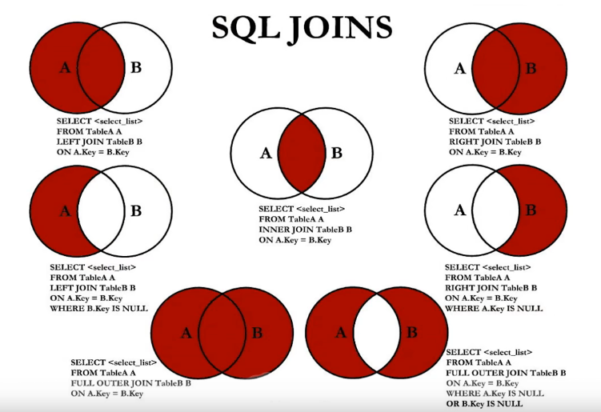

# 尚硅谷 MySQL

> TITLE：MySQL从菜鸟到大牛
>
> AUTHOR：宋红康 - 人称：康师傅
>
> SCHOOL：北航
>
> VIDEO：[BiliBili](https://www.bilibili.com/video/BV1iq4y1u7vj?spm_id_from=333.999.0.0)
>
> FILE：[初级](F:\STU\itcast\尚硅谷mysql高级\初级\课件pdf版\课件) [高级](F:\STU\itcast\尚硅谷mysql高级\高级\参考课件（供实操参考）)

> 学习技巧：大处着眼、小处着手

## 学习进度

- 每天10节课打底
- 开始时间：2022-05-16
- 结束时间：

|    日期    | 课程编号 |        学习时长         | 复习时间 |
| :--------: | :------: | :---------------------: | :------: |
| 2022-05-16 |  P1~P5   |  21:42~23:20  1h40min   |  5/17,   |
| 2022-05-17 |  P6~P10  |   20:04~22:33 2h29min   |          |
| 2022-05-18 | P11~P14  |   21:00~24:00 1h20min   |          |
| 2022-05-20 | P15~P18  |   22:30~次日00:38 1h    |          |
| 2022-05-25 | P15~P18  |   21:30~次日23:30 2h    |          |
| 2022-05-26 | P19~P22  | 21:30~次日23:30 1h30min |          |
| 2022-05-30 | P23~P27  |     22:40~00:00 1h      |          |
| 2022-06-01 | P28~P35  |   19:30~21:30 1h30min   |          |

## 测验

- 题库

[LeetCode]()

[牛客网]()

## 课程大纲


- 第一篇：数据库概述与MySQL安装篇
- 第二篇：SQL之SELECT使用篇
- 第三篇：SQL之DDL、DML、DCL使用篇
- 第四篇：其它数据库对象篇
- 第五篇：MySQL8.0其它新特性


- 第一篇：MySQL架构篇
- 第二篇：索引及调优篇
- 第三篇：事务篇
- 第四篇：日志与备份篇

## 目录

[[toc]]


## 基础篇

## 第一章: 认识数据库

### 教程简介

> 新 全 细 真

- 新
  - 版本新：针对MySQL 8.0.26 版本讲解
  - 融合几乎所有语法，调优，底层新特性
  - 同时，如何面对企业对MySQL5.7的高占比
- 全
  - 知识内容全面、系统
  - 上篇：01 - 95 节
  - 下篇：95 - 199 节
  - 文档资料全面
- 细
  - 课程细致、层层深入
  - 讲解细致、庖丁解牛
- 真
  - 几百道MySQL真题演练
  - 真实案例：几十个一线案例需求、案例剖析、解决方案
  - 真实用
    - 7大SQL性能分析工具
    - 10大类30小类SQL优化场景
    - 7大日志剖析
    - 6大范式讲解
    - 15个xx锁的应用
    - 11大适合创建索引场景
    - 300+张高清无码技术剖析图

**优秀学习资料推荐**

MySQL官网：https://dev.mysql.com/doc/refman/8.0/en

索引数据结构演示：https://www.cs.usfca.edu/~galles/visualization/about.html

一本教材：MySQL是怎样运行的 - 小孩子4919

资料获取方式：

- B站等平台直接点播
- 关注**尚硅谷教育**微信公众号 回复：mysql

**适合人群**

1. MySQL数据库初学者
2. 从事后台开发（Java、Python、Go、PHP等）MySQL开发1-3年的开发人员和运维人员
3. 有资历的MySQL DBA


### 数据库常用概念

- 为什么要使用数据库
  - 持久化：内存 -> 磁盘
  - 数据库优点：存储数据量大

- 常用概念

DB：数据库（Database）

DBMS：数据库管理系统（Database Management System）

SQL：结构化查询语言（Structured Query Language）


### 常见数据库

Oracle

MySQL

SQL Server

PostgreSQL : pgsql

SQLite

### MySQL 介绍

### RDBMS 与 非RDBMS

- RDBMS
  - 实质：复杂数据结构的二元关系 | 行、列存储 -> 表 -> 库 |  表 <- 关系模型 -> 表 | SQL 为查询语言
  - 优势：复杂查询 | 事务支持
- 非RDBMS
  - 键值对存储数据 | 无需SQL | 性能高 | 免费
  - 类别：健值型数据库 Redis | 文档型数据库 MongoDB | 搜索引擎数据库 ES | 列式数据库 HBase | 图形数据库 Neo4j
  - 应用：日志收集、排行榜、定时器

### 关系型数据库设计规则 P5

- 关系型数据库的典型数据结构就是数据表，这些数据表的组成都是结构化的(Structured)。

- 将数据放到表中，表再放到库中。

- 一个数据库中可以有多个表，每个表都有一个名字，用来标识自己。表名具有唯一性。

- 表具有一些特性，这些特性定义了数据在表中如何存储，类似Java和Python中“类”的设计。

> ORM 思想（Object Relational Mapping）
>
> 数据库中的一个表   <--->       Java或Python中的一个类
>
> 表中的一条数据       <--->        类中的一个对象(或实体)
>
> 表中的一个列           <---->       类中的一个字段、属性(field)

**表、记录、字段**

E-R (entity-relationship，实体-联系）模型中有三个主要概念是：`实体集`、`属性`、`联系集`。

一个实体集(class）对应于数据库中的一个表(table)，一个实体（instance)则对应于数据库表中的一行(row)，也称为一条记录（record)。一个属性（attribute)对应于数据库表中的一列(column)，也称为一个字段(field)。


**表的关联关系**

- 表与表之间的数据记录有关系(relationship)。现实世界中的各种实体以及实体之间的各种联系均用关系模型来麦示。

- 四种：

  - 一对一关联

    实际开发中用的不多，因为一对一可以创建成一张表

    场景：基础信息表和档案信息表

    建表原则：1）外键唯一：主表的主键和从表的外键（唯一），形成主外键关系，外键唯一。

    ​						 2）外键是主键：主表的主键和从表的主键，形成主外键关系。

  - 一对多关联

    场景：客户和订单、分类表和商品表、部门表和员工表

    建表原则：在从表（多方）创建一个字段，字段作为外键指向主表（一方）主键

  - 多对多关联

    要表示多对多关系，必须创建第三个表，该表通常称为联接表，它将多对多关系划分为两个一对多关系。将这两个表的主键都插入到第三个表中。

    场景：学生-课程 -> 学生信息表 | 课程信息表 | 选课信息表

    ​			  产品-订单 -> 产品表 | 订单表 | 订单明细表

    ​			  用户-角色 -> 用户表 | 角色表 | 用户角色表

  - 自我引用

    场景：员工表 -> 员工 | 主管 scott Employee

## 第二章：MySQL 环境搭建 - Windows

### MySQL 卸载

步骤1：停止MySQL服务

​					`Win + q` 输入 服务

​					cmd `sc delete mysql服务名` 彻底删除残余的MySQL服务

步骤2：软件的卸载

​					控制面板:thumbsup:、360安全管家

步骤3：残余文件的清理

​					删除安装目录下文件

步骤4：清理注册表（选做）

​					8.0 自动删除服务

​					5.7 需要手动清理注册表 `regedit` 打开注册表

步骤5：删除环境变量


### MySQL的下载、安装、配置

MySQL4大版本

- MySQL Community Server 社区版本 免费

  开源免费，自由下载，但不提供官方技术支持，适用于 大多数普通用户。

- MySQL Enterprise Edition 企业版本 需付费

  不能在线下载，可以试用30天。提供了更多的 功能和更完备的技术支持，更适合于对数据库的功能和可靠性要求较高的企业客户。

- MySQL Cluster 集群版 免费

  用于架设集群服务器，可将几个MySQL Server封装成一个 Server。需要在社区版或企业版的基础上使用。

- MySQL Cluster CGE 高级集群版 需付费


- 下载

官网：https://www.mysql.com

建议：msi格式

- 安装

Advance Access ： 选择安装目录 | 选择数据存放目录

Config Type ：安装服务器类别，选择占用资源类别

- 配置环境变量

mysql --version 安装成功


### MySQL的登录

```bash
mysql -uroot -pxxx -hlocalhost -P3306
```

- 服务的启动与关闭

  找到服务，右键 启动 | 关闭

- 命令行工具

  ```bash
  # 启动mysql服务
  net start mysql服务名
  # 停止mysql服务
  net stop mysql服务名
  ```

- 自带客户端的登录与退出

- 显示版本

  ```bash
  # 登录前
  mysql --version
  # 登录后
  select version();
  ```

- 退出

  ```sql
  quit
  exit
  ```

  

### MySQL演示使用

```sql
show databases;
create database dbtest1;
use dbtest1;
show tables;
create table employees(id int,name varchar(15));
select * from employees;
insert into employees values(1001,'Tom');
show create table employees;
drop database dbtest1;
```

- mysql5.7 插入中文乱码

  原因：mysql5.7默认字符集 latinl 拉丁

  解决：

  ```bash
  # 步骤1：查看编码命令
  show variables like 'character_%';
  show variables like 'collation_%';
  # 步骤2：修改mysql数据目录下的my.ini配置文件
  [mysql]
  default-character-set=utf8
  [mysqld]
  character-set-server=utf8
  collation-server=utf8_general_ci
  ```

  重启服务

- MySQL8.0 默认支持中文

### MySQL图形化管理工具 P10

- MySQL Workbench mysql官方
- Navicat
- SQLyog
- Dbeaver
- DataGrip


客户端连接MySQL8.0报错2058

出现这个错误的原因是MySQL8之前的版本中加密规则是mysql_native_password，而在MySQL8.0之后，加密规则是caching_sha2_passwd。解决问题方法有2种，第一种是升级图形界面工具版本，第二种是把MySQL8用户登录密码加密规则还原成还原成mysql_native_password

```mysql
# 使用mysql数据库
use mysql;
# 修改root@localhost用户密码规则和密码
alter user 'root'@'localhost' indentified with mysql_native_password by 'abc123';
# 刷新权限
flush privileges;
```

### MySQL目录结构与源码

|      |      |
| ---- | ---- |
|      |      |
|      |      |
|      |      |

MySQL主要开发语言是C++

### 常见问题解决（课外内容）

- 问题1：root用户密码忘记，重置的操作

- 问题2：mysql命令报“不是内部或外部命令”

  环境变量没配对

- 问题3：ERROR： No database selected

  use dbname;

- 问题4：命令行客户端字符集问题

  设置当前连接的客户端字符集 mysql> set names gbk;

- 问题5：修改数据库和表的[字符集编码](#MySQL演示使用)


## 课后练习：第一章、第二章

- **第一章**

1. 说说你了解的常见的数据库

2. 谈谈你对MySQL历史、特点的理解

   历史：瑞典MySQL AB -> SUN -> Oracle

   特点：开源、关系型、支持千万级别存储

3. 说说你对DB、DBMS、SQL的理解

4. 你知道哪些非关系型数据库的类型？

5. 表与表的记录之间存在哪些关联关系？

   一对一、一对多、多对多、自关联

- **第二章**

1. 安装好MySQL之后再windows系统中哪些位置能看到MySQL？
2. 卸载MySQL主要卸载哪几个位置的内容？
3. 能够独立完成MySQL8.0、MySQL5.7版本的下载、安装、配置
4. MySQL5.7 在配置完以后，如何修改配置文件
5. 熟悉常用的数据库管理和操作的工具

## 第三章：基本的SELECT语句

- 不同数据库生产厂商都支持SQL语句，但都有特有内容
- SQL规范
  - MySQL特有（方言）
  - Oracle特有（方言）

### SQL 分类

- DDL 数据定义语言
  - CREATE | ALTER | DROP | RENAME | TRUNCATE
- DML 数据操作语言
  - INSERT | DELETE | UPDATE | SELECT
- DCL 数据控制语言
  - COMMIT | ROLLBACK | SAVEPOINT | GRANT | REVOKE

### SQL 语言的规则与规范

规则：必须遵守

规范：建议遵守

**基本规则**

- 执行单个SQL可不写分号，执行多个SQL必须以分号区分
- 数据使用单引号，列的别名使用双引号，不建议省略as

**SQL大小写规范**

- windows不敏感、linux敏感
- 推荐：数据库名、表名、字段名、别名小写，关键字、函数名、变量大写

**注释**

- 单行注释：#  |  -- 空格
- 多行注释：/* */

**命名规则**

TODO

**数据导入指令**

1）source 文件全路径名（路径中不能有中文）

```mysql
source D:\mysqldb.sql
```

2）图形化界面导入SQL文件


### 基本的SELECT语句

```sql
select 1; -- 没有任何子句
select 9/12; -- 没有任何子句
select ... from ...; # dual 伪表
select * from ...; # * 表中所有字段（或列）
# 查询结果：结果集
```

- 列的别名

```mysql
# as alias 可以省略
# 别名可以用中文
# 别名可以用一对 "" 一起来，不要使用 ‘’
select employee_id emp_id,last_name as lname,department_id "部门id",salary * 12 "annual sal" from employees;
```

- 去除重复行

```mysql
select distinct department_id from employees;
# 仅仅没有报错，但是没有实际意义
select distinct department_id,salary from employees; -- 74
```

- 空值运算

```mysql
# 空值 null
# null 不等同于 0, '' , 'null'
# 有些人的年工资为 NULL
select employee_id,salary "月工资", salary*(1+ commission_pct)*12 "年工资" from employees;
# 引入问题解决方案：IFNULL
select employee_id,salary "月工资", salary *(1+IFNULL(commission_pct,0))*12 "年工资" from employees;
```

- 着重号 ``

```mysql
# 表名与保留字冲突
select * from `order`;
```

- 查询常数

```mysql
select '尚硅谷',123,last_name from employees;
```

- 显示表结构

```mysql
# 显示了表中字段的详细信息
describe employees;
# 同
desc employees;
```

### 过滤数据

```mysql
# 90号部门员工
select * from employees where department_no = 90;
# last_name 为 ‘King’ 的员工
select * from employees where last_name = 'King';
```

也能查出来 :thumbsdown:，MySQL自身的问题，Oracle就可以区分查询参数的大小写

```mysql
select * from employees where last_name = 'King';
```

## 课后练习：第三章

1. 员工12个月工资和，取别名ANNUAL SALARY
2. employees去重job_id
3. 工资大于120000，员工姓名、工资
4. 工号176，姓名、部门号
5. departments表结构

## 第四章：运算符

### 算数运算符

`+ - * / div % mod`

整数加减还是整数

有浮点数参与运算结果就是浮点数

MySQL种`+`表示数值相加，如果遇到非数值，先尝试转换成数值，如果转换失败，就按0计算。:star:

MySQL拼接字符串要使用`concat()`实现

除法结果带小数点

取模结果正负值看被模数

```mysql
select 100 + '1'; -- 101
select 100 + 'a'; -- 100
select 100 + NULL; -- NULL
select 100 / 0; -- NULL
select 100 / 2; -- 50.0000
select 100 % 5; -- 0
select -100 % -3; -- -1
```


### 比较运算符

比较运算符用来对表达式左边的操作数和右边的操作数进行比较，比较的结果为`真`则返回`1`，比较的结果为`假`则返回`0`，`其他`情况则返回`NULL`。

比较运算符经常被用来作为SELECT查询语句的条件来使用，返回符合条件的结果记录。

**记不住，测一下**

| 运算符       | 名称     | 作用 | 例子                                                         |
| :----------- | -------- | ---- | ------------------------------------------------------------ |
| =            | 等于     |      | select 1=2,1!=2,1='1',1='a',0='a'; #0、1、1、0、1<br />字符串存在隐式转换，如果转换不成功，则看作0<br />select 'a'='a','ab'='ab','a'='b';#1、1、0<br />两边都是字符串，按ANSI比较规则进行比较<br />select 1=NULL,NULL=NULL;<br />只要有NULL参与判断，结果就是NULL |
| <=>          | 安全等于 |      | select count(*) from employees where commission_pct <=> NULL;#72<br />为NULL而生 |
| <>      (!=) | 不等于   |      |                                                              |
| <            | 小于     |      |                                                              |
| <=           | 小于等于 |      |                                                              |
| >            | 大于     |      |                                                              |
| >=           | 大于等于 |      |                                                              |

- 非符号类型的运算符

| 运算符      | 名称             | 作用                                 | 示例 |
| ----------- | ---------------- | ------------------------------------ | ---- |
| IS NULL     | 为空运算符       | 判断值、字符串或表达式是否为空       |      |
| IS NOT NULL | 不为空运算符     | 判断值、字符串或表达式是否不为空     |      |
| LEAST       | 最小值运算符     | 在多个值中返回最小值                 |      |
| GREATEST    | 最大值运算符     | 在多个值中返回最小大值               |      |
| BETWEEN AND | 两值之间运算符   | 判断一个值是否在两个值之间，包含边界 |      |
| ISNULL      | 为空运算符       | 判断一个值、字符串或表达式是否为空   |      |
| IN          | 属于运算符       | 判断一个值是否为列表中的任意一个值   |      |
| NOT IN      | 不属于运算符     | 判断一个值是否不是列表中的任意一个值 |      |
| LIKE        | 模糊匹配         | 判断一个值是否符合模糊匹配规则       |      |
| REGEXP      | 正则表达式运算符 | 判断一个值是否符合正则表达式的规则   |      |
| RLIKE       | 正则表达式运算符 | 判断一个值是否符合正则表达式的       |      |

select count(*) from employees where not commission_pct <=> NULL; 等同于

select count(*) from employees where commission_pct is not NULL;

推荐：数值用` <=> `字段 用` IS NULL`

select least('1','2','3','4'),greatest('1','2','3','4'); # 1、4

select last_name,department_id from employees where department_id=10 or department_id=20 or department_id=30;

模糊查询：`%` 若干字符`_`一个字符，转义`\`

`like '_$_a%' ESCAPE '$'`; 告诉数据库服务器$是转义字符

select 'shkstart' regexp '^s','shkstart' regexp 't$','shkstart' regexp 'hk'; # 1、1、1

### 逻辑运算符

逻辑运算符主要用来判断表达式的真假，在MysQL中，逻辑运算符的返回结果为1、0或者NULL。

| 运算符     | 作用     | 示例                               |
| ---------- | -------- | ---------------------------------- |
| NOT 或 !   | 逻辑非   | select not a                       |
| AND 或 &&  | 逻辑与   | select a and b<br />select a && b  |
| OR 或 \|\| | 逻辑或   | select a or b<br />select a \|\| b |
| XOR        | 逻辑异或 | select a xor b                     |

XOR 异  两边不同时满足

注意：OR可以和AND一起使用，但是在使用时要注意两者的优先级，由于AND的优先级高于OR，因此先对AND两边的操作数进行操作，再与OR中的操作数结合。

### 位运算符

位运算符是在二进制数上进行计算的运算符。位运算符会先将操作数变成二进制数，然后进行位运算，最后将计算结果从二进制变回十进制数。


| 运算符 | 作用              | 示例          |
| ------ | ----------------- | ------------- |
| &      | 按位与（位AND）   | select a & b  |
| \|     | 按位或（位OR）    | select a \| b |
| ^      | 按位异或（位XOR） | select a ^ b  |
| ~      | 按位取反          | select ~ a    |
| >>     | 按位右移          | select a >> 2 |
| <<     | 按位左移          | select a << 2 |

按位与(&）运算符将给定值对应的二进制数逐位进行逻辑与运算。当给定值对应的二进制位的数值都为1时，则该位返回1，否则返回0。

> 位运算能提高运算速度，但是SQL优化是减少查询次数、减少磁盘IO，不用位运算优化

### 运算符的优先级

数字编号越大，优先级越高，优先级高的运算符先进行计算。可以看到，赋值运算符的优先级最低，使用“()"括起来的表达式的优先级最高。

### 拓展：使用正则表达式查询

## 课后习题：第四章

1. 选择工资不在5000到12000的员工的姓名和工资
2. 选择在20或50号部门工作的员工姓名和部门号
3. 选择公司中没有管理者的员工姓名及job_id
4. 选择公司中有奖金的员工姓名，工资和奖金级别
5. 选择员工姓名的第三个字母是a的员工姓名
6. 选择姓名中有字母a和k的员工姓名
7. 显示出表employees表中first_name以'e'结尾的员工信息
8. 显示出表employees部门编号在80~100之间的姓名、工种
9. 显示出表employees的manager_id是100/101/110的员工姓名、工资、管理者ID


## 第五章：排序与分页

### 排序

如果没有使用排序操作，默认情况下查询返回的数据是按照添加数据的顺序显示的。

1. 基本使用

order by `ASC`升序，`DESC`降序

默认升序

2. 使用列的别名进行排序

列的别名只能在order by中使用，不能在where中使用。

```mysql
select employee_id,salary,salary * 12 annual_sal from employees order by annual_sal;

select employee_id,salary,salary * 12 annual_sal from employees where annual_sal > 81600;
# ERROR 1054 (42S22): Unknown column 'annual_sal' in 'where clause'
```

原因：SQL执行顺序

3. 强调格式

where需要声明在from后，order by之前

4. 二级排序

department_id降序、salary升序

```mysql
select employee_id,salary,department_id from employees order by department_id desc,salary asc;
```

### 分页

背景1：查询返回的记录太多了，查看起来很不方便，怎么样能够实现分页查询呢?
背景2：表里有4条数据，我们只想要显示第2、3条数据怎么办呢?

1. 分页原理

```mysql
select employee_id,last_name from employees limit 0,20;
```

需求：每页显示pageSize条记录，此时显示第PageNo页
公式：limit (pageNo-1)*pageSize,pageSize;

2. 声明顺序：where ... order by ... limit

limit的格式：严格来说：limit 位置偏移量,条目数
结构limit 0,条目数 等价于 limit 条目数 

```mysql
select employee_id,last_name from employees limit 10
```

练习：显示第32/33条数据

```mysql
select employee_id,last_name from employees limit 31,2;
```

3. MySQL8.0新特性：limit ... offset ...

```mysql
select employee_id,last_name from employees limit 2 offset 31;
```

练习：查询员工表中工资最高的员工信息

```mysql
select employee_id,last_name from employees order by salary desc limit 0,1;
```

- 使用limit的好处

约束返回结果的数量可以减少数据表的网络传输量，也可以提升查询效率。如果我们知道返回结果只有1条，就可以使用LIMIT 1，告诉SELECT语句只需要返回一条记录即可。这样的好处就是SELECT不需要扫描完整的表，只需要检索到一条符合条件的记录即可返回。

**拓展**

SQL Server、Oracle 、PGSQL、DB2 都有各自的分页写法

### 课后练习

1. 查询员工的姓名和部门号和年薪，按年薪降序，按姓名升序显示
2. 选择工资不在 8000到17000的员工的姓名和工资，按工资降序，显示第21到40位置的数据
3. 查询邮箱中包含e 的员工信息，并先按邮箱的字节数降序，再按部门号升序

```mysql
select employee_id,last_name,email,department_id from employees 
# where email like '%e%' 
where email regex '[e]' 
order by length(email) desc,department_id;
```

## 第六章：多表查询

多表查询，也称为关联查询，指两个或更多个表一起完成查询操作。
前提条件:这些一起查询的表之间是有关系的(一对一、一对多)，它们之间一定是有关联字段，这个关联字段可能建立了外键，也可能没有建立外键。比如:员工表和部门表，这两个表依靠“部门编号"进行关联。

- 为什么需要使用多表的查询？
  - 减少：冗余、磁盘IO

熟悉常见的几个表：employees、departments、locations

### 案例：员工'Abel'在哪个城市工作

### 笛卡尔积（或交叉连接）的理解

笛卡尔乘积是一个数学运算。假设我有两个集合X和Y，那么`X和Y的笛卡尔积就是X和Y的所有可能组合`，也就是第一个对象来自于X，第二个对象来自于Y的所有可能。组合的个数即为两个集合中元素个数的乘积数。|
交叉连接：CROSS JOIN

错误的方式：

```sql
select * from employees cross join departments; # 2889 条数据
```

### 案例分析与问题解决

正确方式：需要有连接条件

```mysql
select e.employee_id,e.last_name,d.department_name,l.city from employees e,departments d,locations l 
where last_name = 'Abel' 
and e.department_id = d.department_id 
and l.location_id = d.location_id;
```

如果查询语句中出现了多个表中都存在的字段，则必须指明此字段所在的表
建议：从SQL优化的角度，建议多表查询时，每个字段前都指明其所在的表

可以给表起别名，在select和where中使用表的别名
有了别名就不能再使用原名

如果有n个表实现多表的查询，则需要至少n-1个连接条件

```mysql
/*
演绎式：提出问题 ---> 解决问题1 ---> 提出问题2 ---> 解决问题2 ....
		优点：引导兴趣
归纳式：总分
		优点：效率高，中国教育
*/
```

### 多表查询的分类：

角度1：等值连接 vs 非等值连接
角度2：自连接 vs 非自连接
角度3：内连接 vs 外连接

### 等值连接 vs 非等值连接

```mysql
select e.last_name,e.salary,j.grade_level from employees e,job_grades j 
# where e.salary between j.lowest_sal and j.highest_sal;
where e.salary >= j.lowest_sal and e.salary <= j.highest_sal;
```

### 自连接 vs 非自连接

查询员工id、last_name 及其 管理者 的id、last_name

```mysql
select e.employee_id,e.last_name,m.employee_id,m.last_name 
from employees e,employees m 
where e.manager_id = m.employee_id; # 106 rows
```

> DATE：2022-05-31

### 内连接 vs 外连接

内连接：合并具有同一列的两个以上的表的行，结果集中不包含一个表与另一个表不匹配的行

```mysql
select employee_id,department_name 
from employees e,departments d 
where e.department_id = d.department_id; # 106 rows
```

外连接：合并具有同一列的两个以上表的行，结果集中除了包含一个表与另一个表匹配的行之外，还查询到了左表或右表中不匹配的行

外连接的分类：左外连接、右外连接、满外连接

左外连接：两个表在连接过程中除了返回满足连接条件的行意外还返回左表中不满足条件的行，这种连接称为左外连接。

SQL92 语法实现外连接：使用 +

```sql
select last_name,department_name
from employees e ,departments d 
where e.department_id = d.department_id(+);
```

SQL99 语法中使用join ... on 的方式实现多表的查询。解决外连接查询，mysql支持此种方式

- 内连接

```mysql
select last_name,department_name
from employees e 
join departments d 
	on e.department_id = d.department_id;
```

- 多表内连接

```mysql
select last_name,department_name,city
from employees e 
join departments d 
	on e.department_id = d.department_id
join locations l
	on d.location_id = l.location_id; # 106 rows
```

- 左外连接

```mysql
select last_name,department_name
from employees e 
left outer join departments d 
on e.department_id = d.department_id; # 107 rows
```

- 右外连接

```mysql
select last_name,department_name
from employees e 
right outer join departments d 
on e.department_id = d.department_id; # 122 rows 有部门没有人
```

- 满外连接

MySQL不支持 full outer join

### 使用SQL99实现7种join操作



### UNION的使用

利用UNION关键字，可以给出多条SELECT语句，并将它们的结果组合成单个结果集。合并时，两个表对应的`列数`
和`数据类型`必须相同，并且相互对应。各个SELECT语句之间使用UNION或UNION ALL关键字分隔。

语法格式：

```mysql
select column1,... from table1
union
select column2,... from table2
```

- 中间

```sql
```

- 左上

```mysql

```

- 右上

```mysql

```

- 左中

```mysql

```

- 右中

```mysql

```

- 左下

```mysql

```

- 右下

```mysql

```

### natural join 与 using 的使用

SQL99在SQL92的基础上提供了一些特殊语法，比如`NATURAL JOIN` 用来表示自然连接。我们可以把自然连接
理解为SQL92中的等值连接。它会帮你自动查询两张连接表中`所有相同的字段`，然后进行`等值连接`。

```mysql
select last_name,department_name 
from employees e join departments d
on e.department_id = d.department_id
and e.manager_id = d.manager_id;
```

SQL99语法新特性：自然连接
natural join：他会帮你自动查询两张表中所有相同的字段，然后进行等值连接

```mysql
select last_name,department_name 
from employees e natural join departments d
```

SQL99语法新特性：using
SQL99还支持使用USING指定数据表里的`同名字段`进行等值连接。但是只能配合JOIN一起使用。

```mysql
select last_name,department_name 
from employees e join departments d
using(department_id);
```

自连接一般是匹配同表中不同字段，不适用

超过三张表不允许使用join

## 课后练习：第六章

1. 显示所有员工姓名、部门号、部门名称
2. 查询90号部门员工job_id和90号部门location_id
3. 选择所有有奖金的员工的last_name,department_name,location_id,city
4. 选择city在Toronto工作的员工的last_name,job_id,department_id,department_name
5. 查询员工所在的部门名称、部门地址、姓名、工作、工资，其中员工所在部门的部门名称为Executive
6. 选择指定员工的姓名、员工号、以及管理者的姓名、员工号
7. 查询哪些部门没有员工
8. 查询哪个城市没有部门
9. 查询部门名为Sales或IT的员工信息

> DATE：2022-06-01

```mysql

```


```mysql

```


```mysql

```


```mysql

```


```mysql

```


```mysql

```


```mysql

```


```mysql

```


```mysql

```


```mysql

```


```mysql

```


```mysql

```


```mysql

```

