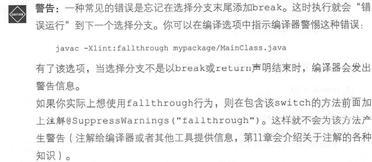

# Java SE 9

> FILE ：[写给大忙人的Java SE 9核心技术](F:/Book/java9.pdf)
>
> THEME：查漏补缺

在本书中，我不会详细介绍API，因为读者可以很方便地浏览API。如果你不能一直上网，就可下载文档，然后解压后离线浏览。

**方法论：**

先读半个小时：然后再整理书中值得记录的内容，因为边读边摘录太慢了

## 读书历程

| 日期             | 页码    | 概要 |
| ---------------- | ------- | ---- |
| 2022-05-23 18:15 | P16~P50 |      |
| 2022-05-26 18:40 | P51~P   |      |
|                  |         |      |


## Chapter 1

如何使用Java API中最有用的部分类控制常见的数据类型

Java不是用来快速完成几个命令的脚本语言。它明确定位为可以从组织有序的类和包以及模块中获益的大型程序的编程语言。

Java中，所有的一切都必须在类中声明。这种一致性会产生有些冗长的代码，但是它使得理解程序含义更加容易。

“编写一次，到处运行”的承诺是Java重要的设计准则。


### JShell

JShell 提供“读取、评估、打印”循环（REPL）模式，可以输入表达式

- 填写类型：`new Random` -> `Shift + Tab` -> `v` -> `Random | = new Random()`
- 自动补全：`Tab`
- 默认包

```
  s1 : import java.io.*;
  s2 : import java.math.*;
  s3 : import java.net.*;
  s4 : import java.nio.file.*;
  s5 : import java.util.*;
  s6 : import java.util.concurrent.*;
  s7 : import java.util.function.*;
  s8 : import java.util.prefs.*;
  s9 : import java.util.regex.*;
 s10 : import java.util.stream.*;
```

- 导包：`Duration` -> `Shift + Tab` -> `i` -> `1` -> `Imported: java.time.Duration` 
- 帮助：`/help`
- 退出：`/exit`

### 基本类型

Java有8个基本数据类型，4个有符号整型、两个浮点型、一个char型、一个boolean型

```java
byte short int long
float double
char
boolean
```

- 有符号整型

Java 中整型的范围不依赖程序锁运行的机器。

- 浮点类型

float类型有个F后缀（例如，3.14F)。没有F后缀的浮点类型被默认为double类型。使用D作为double类型的后缀（例如，3.14D ) 。

特殊浮点值：`Double.POSITIVE_INFINITY` 正无穷、`Double.NEGATIVE_INFINITY`负无穷、`Double.NaN`非数值

⚡所有“非数值”都被认为是彼此不相同的。不能`if(x == Double.NaN)`检查x是否为NaN.

可以：`if(Double.isNaN(x))` `Double.isInfinite`：是否正负无穷大、`Doublie.isFinite`：判断浮点数既不是无穷也不是NaN

浮点数不适合做金融计算，因为金融计算中舍入误差是不能被接受的。`2.0 - 1.1`

精确而无舍入误差的数字计算，使用`BigDecimal`类

- char类型

- 布尔型：true 、false

### 变量

java是强类型语言

```java
int total = 0, count;
```

大小写敏感

### 常量

常量：关键字final修饰一个值，一但赋值之后就不能改变了

根据习惯，常量使用大写字母

`System.out`：少数几个常量没有大写的情况之一

允许延迟final变量初始化（只要它在首次使用前恰好初始化了一次）

```java
final int DAYS_IN_FEBRARY;
if(leapYear){ DAYS_IN_FEBRARY = 29; } else { DAYS_IN_FEBRARY = 28; }
```

定义一组相关的常量，可以使用枚举值

```java
enum Weekday { MONDAY, TUESDAY, WENDESDAY }
Weekday startDay = Weekday.MONDAY;
```

### 算数操作

格外小心`/`操作符。如果两个操作数都是整型，就代表整除，而没有小数部分。例：`17/5`=`3`

`整数`除以0会导致异常。

`浮点数`除以0会产生`无限值`或`NaN`

- 数学方法

```java
Math.pow(x); // 平方
Math.pow(x, y); // x的y次方
Math.sqrt(x); // 平方根
// 三角函数
// 对数
Math.PI;
Math.E;
```

当`计算溢出`时，数学操作符会默默返回错误结果。10亿乘以3是负数，`最大int刚过20亿`

调用`Math.multiplyExact(10亿, 3)`方法，就会报错

处理无符号值：Integer或Long：compareUnsigned、divideUnsigned、remainderUnsigned

StrictMath类提供严格可重现浮点运算

- 数字类型转换

`double`  `float`  `long` 

- 关系操作符合逻辑操作符

如果你在程序中进行过位操作，就会明白它们的含义。如果没做过，你将不需要这些操作符。

- 大数

如果基本的整数类型和浮点类型的精确度还无法满足需求，那么你可以使用java.math包中的`BigInteger`和`BigDecimal`类。这些类的对象代表了数字，该数字有任意长序列的位数。BigInteger类实现了任意精度整数的计算，BigDecimal对浮点数有同样的实现。

Java不允许对象使用操作符，因此操作大数时，必须使用方法调用。

### 字符串

- 连接字符串

```java
String.join("，", "Peter", "Paul", "Mary"); // "Peter，Paul，Mary"
```

连接大量字符串，效率低下，这种情况最好使用`StringBuilder`替换

- 子字符串
- 字符串比较

要检查两个字符串是否相等，可使用equals方法，**不要使用==操作符比较字符串**。⚡

```java
"Hello" == "Hellommm".substring(0,5) // false
"Hello".equals("Hellosss".substring(0,5)) // true
```

比较字符串和文字串时，将文字串放在前面是一个好主意，避免变量为null抛出异常

```java
if ("World".equals(location)) ...
```

提示：对用户可读的字符串排序时，使用Collator对象（它知道关于特定语言的排序规则）。

- 数字与字符串转换

数字 -> 字符串：1）Integer.toString  2）"" + n

字符串 -> 数字：Integer.parseInt(str)

- String API

注意：在Java中，String类是不可变的。也就是任何String方法都不能修改自己的字符串。对字符串的修改都会创建新的字符串

- 编码点和编码单元

### 输入与输出

- 读取输入

```java
Scanner in = new Scanner(System.in);
System.out.println("What's your name?");
// 读取一行
String name = in.nextLine();
System.out.println("name: " + name);
System.out.println("What's your age?");
// 读取整数
int age = in.nextInt();
System.out.println("age: " + age);
// 检查是否有另外一行：阻塞  hasNextLine()、hasNext()、hasNextInt()、hasNextDouble()
if (in.hasNextInt()) {
    int i = in.nextInt();
    System.out.println("i: " + i);
}
```

- 格式化输出

```java
System.out.printf("%8.2f",1000.0/3.0); // 333.33
// 你可以指定标记符，对输出的显示形式进行格式化
System.out.printf("%,+.2f",100000.0/3.0); // +33,333.33
```

以%字符开始的每一个格式说明符( format specifer )都会被相应的参数替代。转换
字符( conversion character)说明了要被格式化的值所属的类型: f是浮点数字，s是字
符串，d是十进制整数。


```java
// 使用String.format方法创建不打印输出的格式化字符串
String.format("Hello, %s. Next year, you'll be %d.\n",name,age);
// "Hello, zhangsan. Next year, you'll be 18.\n"
```

**How use this table?**


> 第一天结束了

### 控制流

- 分支
- 循环
- 跳出循环与继续循环
- 局部变量作用域

#### 分支

**if**

**switch**

> char、byte、short、int、这些包装类、字符串、枚举类型值



#### 循环

**while、for**

你可以将任何for循环重写成while循环
但是，在while循环中，初始化、条件评估以及变量的更新分散在不同地方。而
在for循环中，它们整齐地在一块。
初始化、条件评估以及更新可以是任意形式。

```java
// 当小于target时，你可以将 该值翻倍
for (int i = 1; i < target; i *= 2){
    System.out.println(i);
}
// 不用在循环头部声明变量，你可以初始化现有变量
for (i = 1; i <= target; i++)
// 你可以逗号分隔分别声明或初始化多个变量，提供多个更新
for (int i = 1, j = n - 1; i < j; i++, j--)
```


#### 跳出循环与继续循环

**continue、break**

break声明只是跳出直接封闭循环或者switch。如果你想跳到另外一个封闭声明
的结尾，就需要使用带标签的break声明。在应该退出的声明中加上标签，并且像这
样给break提供标签

```java
outer:
while (...){
    ...
    while (...){
        ...
        if (...) break outer;
        ...
    }
    ...
}
// 带标签的break跳转到这里
警告：你在声明的顶部加标签，但是break声明跳到尾部。
```

普通的break只能用来退出循环或switch,但是带标签的break可以将控制转移
到任何声明的尾部，甚至可以是声明块:

```java
exit: {
    ...
    if (...) break exit;
    ...
}
// 带标签的break跳转到这里
```

提示：这些声明完全是可选项----没有它们，你依然可以表达同样的逻辑在本书中，我从不使用break或continue

#### 局部变量作用域

`局部变量`是指在方法内一包括在方法的参数变量内一 声明的任何变量。 
`变量的作用域`是指程序中你可以访问变量的地方。局部变量的作用域从声明变量处延伸到封闭块的结束。

在Java中，重叠的作用域范围内不允许有同名的局部变量。

但是，如果作用域不重叠，就可以重用同样的变量名

### 数组和数组列表

数组是收集`相同类型`多个元素的基本编程结构。

- 使用数组
- 构造数组
- 数组列表
- 基本类型包装类
- 增强的for循环
- 数组与数组列表的复制
- 数组算法
- 命令行参数
- 多维数组


#### 使用数组

```java
String[] names = new String[100];
```

警告:如果你试图访问不存在的元素，例如names[-1]或者names[100] ,
就会发生ArrayIndexOutOfBoundsException异常。

#### 构造数组

当你使用操作符new构造数组时，Java会用默认值填充数组

- 数字类型（包括char类型）的数组用0填充
- boolean类的数组用false填充
- 对象数组用null填充

```java
BigInteger[] bs = new BigInteger[100];
// 1.  此刻，你还没有任何BigInteger对象，仅仅是一个100个空引用的数组。你需要用BigInteger对象的引用代替它们。
for (int i = 0;i<100;i++){
    bs[i] = BigInteger.valueOf(i);
}
// 2. 有时，你知道想要的值，这时可以将它们列在括号中
int[] nums = {1, 2, 3, 4, 5, };
// 3. 不适用new操作符，不用指定数组长度。后面的逗号是允许的
// 4. 如果你不想给数组名称，则可以使用类似初始化语法，例如，给已存在的数组变量赋值
primes = new int[]{5,7,8,9}
```

注意：允许数组的长度为0

`new int[0] `   ` int[] {}`

如果一个方法返回匹配的数组，并且数组没有任何特定输入，就返回一个长度为0的数组。注意，这与nul1不同:如果数组a的长度为0，那么a. length为0;如果a是null，那么a. length会导致空指针异常( NullPointerException )

#### 数组列表

构造数组时，你需要知道数组的长度。`一旦构造后`，数组的长度`不能改变`。

在实际应用中，不能改变数组长度会带来很多不便。解决这种问题的办法就是使用java.util包中的ArrayList类。ArralyList对象在内部管理数组。当数组太小或者不够使用时，自动创建另外-一个内部数组，并且将元素移动到该数组。这个过程对使用数组列表的程序员是不可见的。

数组列表是类，你可以使用构造实例和调用方法的语法。

ArrayList是泛型类------一种电邮类型参数的类

```java
// 声明一个数组列表变量：
ArrayList<String> friends;
friends = new ArrayList<>(); //钻石语法

// 数组列表没有初始化语法，最多可以这样构造数组列表
ArrayList<String> friends = new ArrayList<>(List.of("Peter", "Paul"));
friends.remove(1); // 删除元素
friends.add(0, "Ppt"); // 添加元素到索引0前面
System.out.println(friends.get(0)); // 读取
friends.set(1, "Marry"); // 替换
System.out.println(friends);
// 循环遍历所有元素
for (int i = 0; i < friends.size(); i++) {
    System.out.println(friends.get(i));
}
```

#### 基本类型包装类

泛型类有一个不幸的限制:你不能使用基本类型作为类型参数。例如，ArrayList<int>是非法的。解决办法是使用包装类。每一种基本类型，都有对应的包装类: Integer、 Byte、Short、Long、Character、 Float、Double和Boolean。要收集整数，可使用ArrayList<Integer>

基本类型和它们对应的包装类型之间的转换是自动进行的。

```java
ArrayList<Integer> numbers = new ArrayList<>();
numbers.add(42); // 自动装箱
int first = numbers.get(0); // 自动拆箱
```


`==和!=操作符比较对象的引用，而不是对象的内容`

#### 增强的for循环

```java
int sum = 0;
for (int n : numbers) {
    sum += n;
}
```

增强的for循环遍历数组元素时，循环变量不是索引值。

#### 数组与数组列表的复制

你可以将数组变量复制到另外一个数组变量，但是那样两个变量引用同一个数组

```java
int[] primes = {1,2,3,4,5,6};
int[] nums = primes;
nums[5] = 42;
System.out.println(nums.equals(primes)); // true
```

如果你想要的不是这种共享的数组，则需要复制数组。这时可使用静态方法`Arrays.copyOf`。

```java
int[] nums = Arrays.copyOf(primes, primes.length);
nums[5] = 42;
System.out.println(nums.equals(primes)); // false
```

该方法构造一个 期望长度的新数组，并将原数组的元素复制进去。
数组列表引用的也是同样的工作方式:

```java
ArrayList<String> people = friends;
people.set(0，"MMM"); //现在数组列表friends中的friends . get (0)也是"Mary"
System.out.println(people.get(0)); // MMM
System.out.println(friends.get(0)); // MMM
System.out.println(people.equals(friends)); // true
```


要复制数组列表，可从已存的数组列表构造一个新的数组列表

```java
ArrayList<String> people = new ArrayList<>(friends);
people.set(0, "MMM");
System.out.println(people.get(0)); // MMM
System.out.println(friends.get(0)); // Ppt
System.out.println(people.equals(friends)); // false
```

构造函数也可以用来将数组复制到数组列表中。调用List.of方法将数组封装到
一个不可变的列表中，然后构造ArrayList:

```java
String[] names = ...;
ArrayList<String> friends = new ArrayList<> (List.of (names)) ;
```


你也可以将数组列表复制到数组中。为了令人沮丧的向后兼容性(第6章会讲到这一点)，你必须提供正确类型的数组。

```java
String[] names = friends. toArray (new String[0]);
```

注意：没有一种容易的方式可以完成基本类型数组和对应的包装类数组列表之间的转换。例如，要在int []和ArrayList<Integer>中间转换，你需要一个显式循环或者IntStream (参看第8章)。

#### 数组算法

#### 命令行参数

#### 多维数组


### 功能分解

- 静态方法的声明与调用
- 数组参数与返回值
- 可变参数

### 练习


## 第二章：面向对象编程

### 使用对象

#### 访问器方法和修改器方法

#### 对象引用


### 实现类

#### 实例变量

#### 方法头

#### 方法体


#### 实例方法调用

#### this引用

#### 值调用


### 构造对象

#### 实现构造函数

#### 重载

#### 调用另一个构造函数

#### 默认初始化

#### 实例变量的初始化

#### final实例变量

#### 无参构造函数


### 静态变量和方法

#### 静态变量

#### 静态常量

#### 静态初识块

#### 静态方法

#### 工厂方法


### 包

#### 包的声明

#### jar命令

#### 类路径

#### 包访问权限

#### 导入类

#### 静态导入


### 嵌套类

#### 静态嵌套类

#### 内部类

#### 内部类的特殊语法


### 文档注释

#### 插入注释

#### 类注释

#### 方法注释

#### 变量注释

#### 通用注释

#### 链接

#### 包、模块和概述注释

#### 注释的提取


### 练习


> 116

## 第三章：接口和lambda表达式

