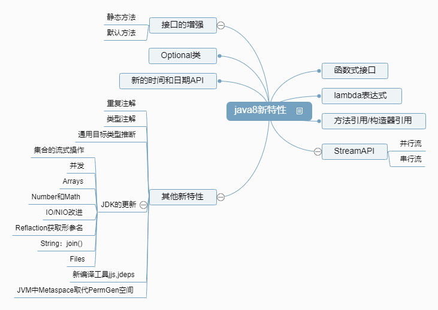

# Java 8 新特性

> TITLE：Springboot零基础到项目实战
>
> AUTHOR：黎老师
>
> SCHOOL：
>
> VIDEO：[黎曼的猜想 - 宋红康](https://www.bilibili.com/video/BV184411x7XA)
>
> FILE：
>
> GITHUB：[学习SpringBoot](https://github.com/tianming-jianai/jdkfeature)

相关： [ Java学习笔记目录索引 (持续更新中)_Guizy-CSDN博客](https://blog.csdn.net/m0_37989980/article/details/103987924)


## 学习进度

- 开始时间：2022-08-13
- 结束时间：

|    日期    | 课程编号 | 学习时长 |
| :--------: | :------: | :------: |
| 2022-08-13 |  P1~P10  |    2h    |
| 2022-08-14 | P11~P13  |  40min   |
| 2022-08-15 | P14~P20  | 19:55 2h |

- 复习

| 日期 | 内容 |
| ---- | ---- |
|      |      |




- 学习的思维方式：
  - 大处着眼、小处着手
  - 逆向思维、反证法
  - 透过问题看本质

- 两句话：
  - 小不忍则乱大谋
  - 识时务为俊杰

- 技术书：和其他类书籍的思维方式不同

（读经济学：（研究人的行为）生活中的经济学，宏观、围观经济学，博弈论）

## java 8 新特性

- 速度更快（红黑树...）
- 代码更少（增加了新的语法：**lambda表达式**）
- 强大的**Stream API**
- 便于并行
- 最大化减少空指针异常：Optional
- Nashorn引擎：允许在JVM上允许JS应用

java语言不一定是世界上最强大的语言，但是java虚拟机一定是目前世界上最强大的虚拟机

## 一、 Lambda 表达式

Lambda是一个匿名函数，我们可以把 Lambda表达式理解为是**一段可以传递的代码**将代码像数据一样进行传递）。使用它可以写出更简洁、更灵活的代码。作为一种更紧凑的代码风格，使Java的语言表达能力得到了提升。

- 代码示例

```java
Runnable r = () -> System.out.println("我爱北京天安门");
r.run();
```

```java
Comparator<Integer> comp = (c1,c2) -> Integer.compare(c1,c2);
int res = comp.compare(1, 1);
System.out.println(res);
```

```java
// 方法引用
Comparator<Integer> comp2 = Integer::compare;
int res2 = comp2.compare(3, 2);
System.out.println(res2);
```


左边：接口抽象方法的形参

右边：重写抽象方法的方法体

本质：**作为接口的实例**（**函数式接口只有一个抽象方法**）

如果一个接口中只声明了一个抽象方法，name这个接口就可以被称为函数式接口

- 六中情况下使用Lambda表达式

1. 无参，无返回值

2. 一个参数，没有返回值

   ```java
   Consumer<String> con = param -> System.out.println(param);
   Consumer<String> con2 = System.out::println;
   con.accept("abc");
   con2.accept("ABC");
   ```

3. 类型推断

4. 参数只有一个，小括号不用写

5. 两个参数及以上，可以有返回值

6. 只有一条执行语句，可省略大括号，有返回值return也不用写

### 1. 什么是函数式接口

- **只包含一个抽象方法的接口，称为函数式接口**
- 你可以通过lambda表达式来创建该接口的对象。（若lambda表达式抛出一个受检异常（即：非运行时异常），那么该异常需要在目标接口的抽象方法上声明）
- 我们可以在一个接口上使用**@FunctionalInterface**注解，这样可以检查它是否是一个函数式接口。同时也会包含一条声明，说明这个接口是一个函数式接口。
- **在java.util.function包下定义了java8的丰富的函数式接口**

java不但可以支持OOP还可以支持OOF（面向函数编程）

java8中，lambda表示是对象，而不是函数，它们必须依附于一类特别的对象——函数式接口

lambda表达式就是一个函数式接口的实例

所以以前用匿名实现类表示的现在都可以用lambda表达式来写

### 2. java内置四大函数式接口

| 函数式接口                | 参数类型 | 返回类型 | 用途                                                         |
| ------------------------- | -------- | -------- | ------------------------------------------------------------ |
| Consumer<T><br />消费型   | T        | void     | 对类型T的对象应用操作，包含方法 **void accept(T t)**         |
| Supplier<T><br />供给型   | 无       | T        | 返回类型为T的对象，包含方法**T get()**                       |
| Function<T,R><br />函数型 | T        | R        | 对类型为T的对象应用操作，并返回结果。结果是R类型的对象。包含方法**R apply(T t)** |
| Predicate<T><br />断定型  | T        | boolean  | 确定类型为T的对象是否满足某约束，并返回boolean的值，包含方法**boolean test(T t)** |

```java
package com.zsg.chapter01;

import org.junit.jupiter.api.Test;

import java.sql.Array;
import java.util.ArrayList;
import java.util.Arrays;
import java.util.List;
import java.util.function.Consumer;
import java.util.function.Predicate;

/**
 * @BelongsProject: jdkfeature
 * @BelongsPackage: com.zsg.chapter01
 * @Author: 张世罡
 * @CreateTime: 2022/8/14 1:27
 * @Description:
 */
public class LambdaTest2 {
    /**
     * 测试 消费型
     */
    @Test
    public void test1() {
        happyTime(2D, new Consumer<Double>() {
            @Override
            public void accept(Double money) {
                System.out.println(String.format("花%.0f块钱买了瓶可乐", money));
            }
        });

        happyTime(30D, money -> System.out.println(String.format("花%.2f元，玩了把真人模拟射击", money)));
    }

    public void happyTime(Double money, Consumer<Double> consumer) {
        consumer.accept(money);
    }

    /**
     * 测试 断定型
     */
    @Test
    public void test2() {
        List<String> list = Arrays.asList("北京", "南京", "天津", "东京", "普京");
        List<String> filterResult = filterString(list, new Predicate<String>() {
            @Override
            public boolean test(String s) {
                return s.contains("京");
            }
        });
        System.out.println(filterResult);

        System.out.println(filterString(list, s -> s.contains("京"));
    }

    public List<String> filterString(List<String> list, Predicate<String> predicate) {
        ArrayList<String> newList = new ArrayList<>();
        for (String s : list) {
            if (predicate.test(s)) {
                newList.add(s);
            }
        }
        return newList;
    }
}
```

### 3. 方法引用与构造器引用

#### 方法引用

- 当要传递给lambda体的操作，**已经有实现方法了，可以使用方法引用**
- 方法引用可以看做是lambda表达式深层次的表达，换句话说，方法引用就是lambda表达式，也就是函数式接口的一个实例，通过方法名来指向一个方法，可以认为是lambda的一个语法糖
- 要求：**实现接口的抽象方法的参数列表和返回值类型，必须与方法引用的方法的参数列表和返回值类型保持一致！**
- 格式：双引号"**::**"
- 三种情况
  - **对象::实例方法名**
  - **类::静态方法名**
  - **类::实例方法名**
- 方法引用使用要求，要求接口中的抽象方法的形参列表（和）返回值类型 与 方法引用的方法形的参列表（和）返回值类型相同！


- 代码示例

```java
/**
* 情境一： 对象：实例方法
* Consumer     void accept(T t)
* PrintStream  void println(T t)
*/
@Test
public void test1() {
    Consumer<String> con = str -> System.out.println(str);
    con.accept("北京");

    PrintStream ps = System.out;
    Consumer<String> con2 = ps::println;
    con2.accept("天安门");
}

/**
* Supplier void get()
* Employee void getName()
*/
@Test
public void test2() {
    Employee emp = new Employee(1001, "Tom", 23, 5600);
    Supplier<String> sup1 = () -> emp.getName();
    System.out.println(sup1.get());

    Supplier<String> sup2 = emp::getName;
    System.out.println(sup2.get());
}
```

- 代码示例

```java
/**
* 情境二 类 :: 静态方法
* Comparator   int compare(T t1, T t2)
* Integer      int compare(T t1, T t2)
*/
@Test
public void test3() {
    Comparator<Integer> com = (t1, t2) -> Integer.compare(t1, t2);
    System.out.println(com.compare(1, 2));

    Comparator<Integer> com2 = Integer::compare;
    System.out.println(com2.compare(2, 1));
}

/**
* Function R apply(T t)
* Math     long round(Double d)
*/
@Test
public void test4() {
    Function<Double, Long> func = d -> Math.round(d);
    System.out.println(func.apply(12.3));

    Function<Double, Long> func2 = Math::round;
    System.out.println(func2.apply(12.6));
}
```

- 代码示例

```java
/**
* 情况三 类 :: 实例方法
* Comparator   int compare(T t1, T t2)
* String       int t1.compareTo(t2)
*/
@Test
public void test5() {
    Comparator<String> comp = (s1, s2) -> s1.compareTo(s2);
    System.out.println(comp.compare("abc", "abd"));

    Comparator<String> comp2 = String::compareTo;
    System.out.println(comp2.compare("abd", "abc"));
}

/**
* BiPredicate  boolean test(T t1, T t2)
* String       boolean t1.equals(t2)
*/
@Test
public void test6() {
    BiPredicate<String, String> pre = (s1, s2) -> s1.equals(s2);
    System.out.println(pre.test("abc", "abd"));

    BiPredicate<String, String> pre2 = String::equals;
    System.out.println(pre2.test("abd", "abd"));
}

/**
* Function R apply(T t)
* Employee String getName()
*/
@Test
public void test7() {
    Employee employee = new Employee();
    employee.setName("Jack");
    Function<Employee, String> func = e -> e.getName();
    System.out.println(func.apply(employee));

    Function<Employee, String> func2 = Employee::getName;
    System.out.println(func2.apply(employee));
}
```

#### 构造器引用

和方法引用类似，函数式接口的抽象方法的形参列表和构造器的形参列表一致抽象方法的返回值类型即为构造器所属的类的类型

```java
/**
* 构造器引用
* Supplier T get()
* Employee Employee()
*/
@Test
public void test1() {
    Supplier<Employee> sup = new Supplier<Employee>() {
        @Override
        public Employee get() {
            return new Employee();
        }
    };
    System.out.println(sup.get());

    Supplier<Employee> sup2 = () -> new Employee();
    System.out.println(sup2.get());

    Supplier<Employee> sup3 = Employee::new;
    System.out.println(sup3.get());
}

/**
* Function R apply(T t)
*/
@Test
public void test2() {
    Function<Integer, Employee> func = id -> new Employee(id);
    Employee apply = func.apply(1001);
    System.out.println(apply);
    Function<Integer, Employee> func2 = Employee::new;
    Employee apply2 = func2.apply(1002);
    System.out.println(apply2);
}

/**
* BiFunction R apply(T t, U u)
*/
@Test
public void test3() {
    BiFunction<Integer, String, Employee> func = (id, name) -> new Employee(id, name);
    Employee tom = func.apply(1001, "Tom");
    System.out.println(tom);

    BiFunction<Integer, String, Employee> func2 = Employee::new;
    Employee jack = func2.apply(1002, "Jack");
    System.out.println(jack);
}
```

#### 数组引用

大家可以把数组看做是一个特殊的类，则写法与构造器引用一致。

```java
/**
* 数组引用
* Function R apply(T t)
*/
@Test
public void test4() {
    Function<Integer, String[]> func = length -> new String[length];
    String[] apply = func.apply(5);
    System.out.println(Arrays.toString(apply));

    Function<Integer, String[]> func2 = String[]::new;
    System.out.println(Arrays.toString(func2.apply(6)));
}
```

## 二、Stream API

### 强大的Stream API

- Java8有两大最重要的改变。第一个是**Lambda表达式**；另一个则是**Stream API**。
- **Stream API（java.util.stream）**把真正的函数式编程风格引入到Java中。这是目前为止对Java类库最好的补充，因为Stream API可以极大提供java程序员的生产力，让程序员写出高效率、干净、简洁的代码。
- Stream 是 Java8中处理集合关键抽象概念，它可以指定你希望对集合进行的操作，可以执行非常复杂的查找、过滤和映射数据等操作。**使用Stream API对集合数据进行操作，就类似于使用SQL执行的数据库查询。**也可以使用Stream API来并行执行操作。简言之，Stream API提供了一种高效且易于使用的处理数据的方式。

### 为什么使用Stream API

- 实际开发中，项目中多数数据都来源于MySQL、Oracle等。但现在数据源可以更多了，有MongoDB、Redis等，而这些NoSQL的数据就需要Java层面去处理。
- Stream和Collection集合的区别：**Collection是一种静态的内存数据结构，而Stream是有关计算的**。前者主要面向存储，存储在内存中，后者主要面向CPU，通过CPU实现计算。

### 什么是Stream

**Stream到底是什么呢？**

是数据渠道，用于操作数据源（集合、数组等）所生成的元素序列。
“集合讲的是数据，Stream讲的是计算！”

注意：
① Stream不会自己存储元素
② Stream不会改变源对象。相反，他们会返回一个持有结果的新Stream
③ Stream操作是延迟执行的。这意味着他们会等到需要结果的时候再执行。

### Stream的操作的三个步骤

- 创建Stream
  - 一个数据源，获取一个流
- 中间操作
  - 一个中间操作，对数据源的数据进行处理
- 终止操作
  - 一旦执行终止操作，就执行中间操作链，并产生结果。之后，不会再被使用。


### (一) Stream的创建操作（4种）

#### 1. 通过集合

Java8中的Collection接口被扩展，提供了两个获取流的方法：

```java
default Stream<E> stream() 返回一个顺序流
default Stream<E> parallelStream() 返回一个并行流
```

#### 2. 通过数组

Java8中的Arrays的静态方法stream()可以获取数组流

```java
public static <T> Stream<T> stream(T[] array) 返回一个流
// 重载形式
public static IntStream stream(int[] array)
public static LongStream stream(long[] array)
public static DoubleStream stream(double[] array)
```

#### 3. 通过Stream的of()

可以调用Stream类静态方法of()，通过显示值创建一个流。它可以接收任意数量的参数。

```java
public static<T> Stream<T> of(T... values)
```

#### 4. 创建无限流（用的较少，了解）

可以使用静态方法Stream.iterate() 和 Stream.generate() 创建无限流

```java
// 迭代
public static<T> Stream<T> iterate(final T seed, final UnaryOperator<T> f)
// 生成
public static<T> Stream<T> generate(Supplier<? extends T> s)
```

```java
public class StreamAPITest {

    List<Employee> employees = null;

    @BeforeEach
    public void beforeEach() {
        employees = EmployeeData.getEmployees();
    }

    /**
     * 创建Stream方式一：通过集合
     */
    @Test
    public void test1() {
        Stream<Employee> stream = employees.stream();
        Stream<Employee> stream1 = employees.parallelStream();
    }

    /**
     * 创建Stream方式二：通过数组
     */
    @Test
    public void test2() {
        int[] arr = new int[]{1, 2, 3, 4, 5, 6};
        IntStream stream = Arrays.stream(arr);

        Employee[] arr1 = new Employee[]{employees.get(0), employees.get(1)};
        Stream<Employee> stream1 = Arrays.stream(arr1);
    }

    /**
     * 创建Stream方式三：通过Stream of()
     */
    @Test
    public void test3() {
        Stream<Integer> stream = Stream.of(1, 2, 3, 4, 5, 6);
    }

    /**
     * 创建Stream方式四：创建无限流
     */
    @Test
    public void test4() {
        // 遍历前10个偶数
        Stream.iterate(0, t -> t + 2).limit(10).forEach(System.out::println);
        System.out.println("---------------------");
        // 输出10个随机数
        Stream.generate(Math::random).limit(10).forEach(System.out::println);
    }
}
```


### (二) Stream的中间操作（3种）

#### 1. 筛选与切片

```java
// filter(Predicate p) 接收Lambda，从流中排除某些元素
// limit(n) 截断流，使其元素不超过给定数量
// skip(n) 跳过元素，返回一个丢掉了前n个元素的流，若流中元素不足n个，则返回一个空流。与limit(n)互补
// distinct() 筛选，通过流所生成元素的hashCode()和equals()去除重复元素
```

```java
/**
* 1. 筛选与切片
*/
@Test
public void test1() {
    // filter(Predicate p) 接收Lambda，从流中排除某些元素
    list.stream().filter(e -> e.getSalary() > 7000).forEach(System.out::println);
    System.out.println("-------------------");

    // limit(n) 截断流，使其元素不超过给定数量
    list.stream().limit(3).forEach(System.out::println);
    System.out.println("-------------------");

    // skip(n) 跳过元素，返回一个丢掉了前n个元素的流，若流中元素不足n个，则返回一个空流。与limit(n)互补
    list.stream().skip(3).forEach(System.out::println);
    System.out.println("-------------------");

    // distinct() 筛选，通过流所生成元素的hashCode()和equals()去除重复元素
    list.add(new Employee(1010, "zsg", 18, 20000));
    list.add(new Employee(1010, "zsg", 18, 20000));
    list.add(new Employee(1010, "zsg", 18, 20000));
    list.stream().distinct().forEach(System.out::println);
}
```

#### 2. 映射

```java
// map(Function f) 接收一个函数作为参数将元素换成其他形式或提取信息，该函数会被应用到每个元素上，并将其映射成一个新的元素。
// flatMap(Function f) 接收一个函数作为参数，将流中的每个值都换成另一个流，将流中的每个值都换成另一个流，然后把所有流连接成一个流。
```

```java
/**
* 2. 映射
*/
@Test
public void test2() {
    // map(Function f) 接收一个函数作为参数将元素换成其他形式或提取信息，该函数会被应用到每个元素上，并将其映射成一个新的元素。
    List<String> strings = Arrays.asList("aa", "bb", "cc", "dd", "ee");
    strings.stream().map(e -> e.toUpperCase()).forEach(System.out::println);
    list.stream().map(Employee::getName).filter(name -> name.length() > 3).forEach(System.out::println);
    System.out.println("------------------");

    // flatMap(Function f) 接收一个函数作为参数，将流中的每个值都换成另一个流，然后把所有流连接成一个流。
    strings.stream().flatMap(StreamAPITest2::formatString).forEach(System.out::println);
}

private static Stream<Character> formatString(String s) {
    ArrayList<Character> list = new ArrayList<>();
    for (Character c : s.toCharArray()) {
        list.add(c);
    }
    return list.stream();
}
```

#### 3. 排序

```java
// sorted() 自然排序
// sorted(Comparator comp) 定制排序
```

```java
/**
* 3. 排序
*/
@Test
public void test3() {
    // sorted() 自然排序
    List<Integer> integers = Arrays.asList(12, 43, 65, 34, 87, 0, -98, 7);
    integers.stream().sorted().forEach(System.out::println);
    System.out.println("-------------------");

    // sorted(Comparator comp) 定制排序
    list.stream().sorted((e1, e2) -> {
        int res = Integer.compare(e1.getAge(), e2.getAge());
        if (res != 0) {
            return res;
        } else {
            return Double.compare(e1.getSalary(), e2.getSalary());
        }
    }).forEach(System.out::println);
}
```

### (三) Stream的终止操作（3种）

#### 1. 匹配与查找

```java
// allMatch(Predicate p) 检查是否匹配素有元素
// anyMatch(Predicate p) 检查是否至少匹配一个元素。
// noneMatch(Predicate p) 检查是否没有匹配的元素。
// findFirst() 返回第一个元素
// findAny() 返回流中任意元素
// count() 返回流中元素的总个数
// max(Comparator c) 返回流中最大值
// min(Comparator c) 返回流中最小值
// foreach(Consumer c) 内部迭代
// 
```

```java
/**
* 1. 匹配与查找
*/
@Test
public void test1() {
    // allMatch(Predicate p) 检查是否匹配素有元素
    // 练习：是否所有员工的年龄都大于18
    boolean allMatch = list.stream().allMatch(e -> e.getAge() > 18);
    System.out.println("all > 18 : " + allMatch);

    // anyMatch(Predicate p) 检查是否至少匹配一个元素。
    // 练习：是否存在员工的工资大于10000
    boolean anyMatch = list.stream().anyMatch(e -> e.getSalary() > 10000);
    System.out.println("any salary > 10000 : " + anyMatch);

    // noneMatch(Predicate p) 检查是否没有匹配的元素。
    // 练习：是否存在员工姓“雷”
    boolean noneMatch = list.stream().noneMatch(e -> e.getName().startsWith("雷"));
    System.out.println("exists 雷 : " + noneMatch);

    // findFirst() 返回第一个元素
    Optional<Employee> first = list.stream().findFirst();
    System.out.println(first);

    // findAny() 返回流中任意元素
    Optional<Employee> any = list.stream().findAny();
    System.out.println(any);

    // count() 返回流中元素的总个数
    long count = list.stream().count();
    System.out.println("count : " + count);

    // max(Comparator c) 返回流中最大值
    // 返回员工最大工资
    Optional<Double> maxSalary = list.stream().map(e -> e.getSalary()).max(Double::compare);
    System.out.println(maxSalary);

    // min(Comparator c) 返回流中最小值
    // 返回最低工资员工
    Optional<Employee> max = list.stream().min((e1, e2) -> Double.compare(e1.getSalary(), e2.getSalary()));
    System.out.println(max);

    // foreach(Consumer c) 内部迭代
    // 使用Collection接口需要用户去做迭代，成为外部迭代。相反，Stream API使用内部迭代——它帮你做了
}
```


#### 2. 规约

```java
// reduce(T identity, BinaryOperator) 可以将流中元素反复结合起来，得到一个值。返回
// reduce(BinaryOperator) 可以将流中元素反复结合起来，得到一个值。返回Optional<T>
```

```java
/**
* 2. 规约
*/
@Test
public void test2() {
    // reduce(T identity, BinaryOperator) 可以将流中元素反复结合起来，得到一个值。返回
    // 练习1：计算1-10的自然数的和
    List<Integer> integers = Arrays.asList(1, 2, 3, 4, 5, 6, 7, 8, 9, 10);
    Integer sum = integers.stream().reduce(0, Integer::sum);
    System.out.println("sum: " + sum);

    // reduce(BinaryOperator) 可以将流中元素反复结合起来，得到一个值。返回Optional<T>
    // 练习2：计算所有员工工资的总和
    Double sumSalary = list.stream().map(Employee::getSalary).reduce(0D, Double::sum);
    System.out.println("sum salary : " + sumSalary);
}
```

#### 3. 收集

```java
// collect(Collector c) 将流转转换为其他形式。接收一个Collector接口的实现，用于给Stream中元素做汇总的方法
```

Collector接口中方法的实现决定了如何对流执行收集的操作(如收集到List、Set、Map)。
另外，Collectors 实用类提供了很多静态方法，可以方便地创建常见收集器实例，具体方法与实例如下表:

```java
```

