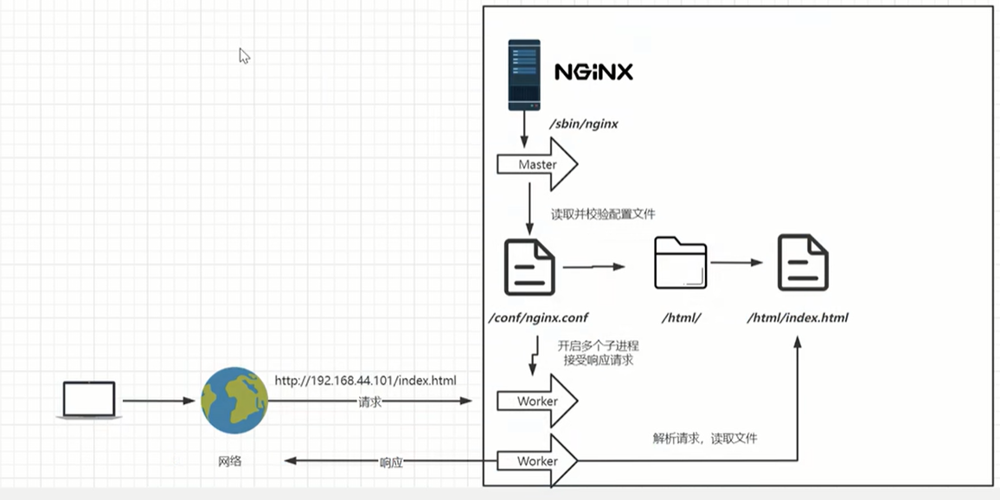
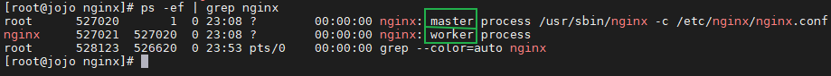

# Nginx

> TITLE：尚硅谷 2022版Nginx教程（nginx入门到亿级流量）
>
> AUTHOR：张一明
>
> SCHOOL：
>
> VIDEO：[BiliBili](https://www.bilibili.com/video/BV1yS4y1N76R)
>
> FILE：

> 学习技巧：

## 学习进度

- 开始时间：2022-05-21
- 结束时间：

|    日期    | 课程编号 |        学习时长        | 复习时间 |
| :--------: | :------: | :--------------------: | :------: |
| 2022-05-21 |  P1-P10  | 22:00~次日0:24 2h24min |          |
| 2022-05-22 |   P11~   |         21:00          |          |
|            |          |                        |          |
|            |          |                        |          |

## 测验

- 题库

[Nginx面试题（2022年总结最全)](https://zhuanlan.zhihu.com/p/475487139)

## yum 安装 Nginx

[教程](https://www.cnblogs.com/gshelldon/p/13289048.html)

- 修改Nginx安装源

```bash
vi /etc/yum.repos.d/nginx.repo
```

```bash
[nginx-stable]
name=nginx stable repo
baseurl=http://nginx.org/packages/centos/$releasever/$basearch/
gpgcheck=1
enabled=1
gpgkey=https://nginx.org/keys/nginx_signing.key
module_hotfixes=true
```

- 安装

```bash
# 查看安装源中是否存在nginx
yum search nginx
# 安装nginx
yum -y install nginx
# 启动nginx
systemctl start nginx
# 开机启动nginx
systemctl enable nginx
# 查看nginx状态
systemctl status nginx
# 查看版本
nginx -v # nginx version: nginx/1.14.1
```

```bash
netstat -lntup |grep 80 # 检查端口
ps -ef | grep nginx # 检查进程
```

- nginx的启动、停止、重启、重新加载配置文件

```bash
systemctl restart nginx # 在配置文件配置错误的时候容易导致服务起不起来
systemctl start nginx
systemctl stop nginx
systemctl reload nginx
```

- yum更新nginx

```bash
yum update -y nginx
```

- 二进制包nginx管理

```bash
/app/nginx/sbin/nginx -s stop		# 停止
/app/nginx/sbin/nginx -s reload		# 重新加载配置文件
/app/nginx/sbin/nginx				# 启动
```

- 访问结果


> 首页：/usr/share/nginx/html
>
> 配置：/etc/nginx/nginx.conf
>
> 日志：/var/log/nginx

> :star: lsof -i:80 # 可查看80端口被哪个进程占用 

## 安装包安装

> 教程：[Linux下搭建Nginx运行环境详细教程](https://mp.weixin.qq.com/s?__biz=MzkwMTE3ODA4Mg==&mid=2247484482&idx=1&sn=eb66af797507ec766815ecdb5af8fbce&chksm=c0b9f3cff7ce7ad98aef06f1a210eccfd515342ecce0c6610808251e95d1ae590757843e348a&scene=132#wechat_redirect)

- 下载安装包

[官网](http://nginx.org)

- 安装依赖库

否则Nginx配置和编译时会出现错误。
nginx依赖以下模块：gzip模块需要`zlib`库、rewrite模块需要`pcre`库、ssl 功能需要`openssl`库

```bash
yum install gcc zlib zlib-devel pcre pcre-devel openssl openssl-devel -y
```

`gcc`编译相关，`openssl`加密算法相关，`xx-devel`表示可以进行二次开发
Nginx可以进行二次开发，我们可以修改它里面的东西或者扩展一些东西

- 解压安装包

```bash
tar -zxvf nginx-1.18.0.tar.gz
```

- 使用configure配置Nginx

```bash
cd nginx-1.18.0
./configure --prefix=/usr/local/nginx --with-http_ssl_module
```

（其中`--prefix是指定nginx安装路径`，这里使用的源码包安装方式，解压的是源码，安装位置使用`--prefix`指定）

- 执行编译

```bash
make
```

c语言编译打包完成后，会在xxx/nginx-1.18.0/objs下生成一个nginx可执行程序，此时，在`/usr/local`下还没生成`nginx`安装目录

- 真正的安装

```bash
make install
```

这一步骤之后，才是真正意义的完成了Nginx的安装，因为这一步，才会在刚才`--prefix`指定的安装路径`/usr/local`下，生成Nginx相关的目录

至此，Nginx就安装完成了。

- 启动nginx

进入安装好的目录/usr/local/nginx/sbin

```bash
./nginx 启动
./nginx -s stop 快速停止
./nginx -s quit 优雅关闭，在退出前完成已经接受的连接请求
./nginx -s reload 重新加载配置
```


## Lnux 环境配置

### 配置虚拟机上网

```bash
ip addr
# 修改网卡
vim /etc/sysconfig/network-scripts/ifcfg-eth0
ONBOOT=yes # 网卡随着系统启动而启动
BOOTPROTO=dhcp # 自动分配IP
# 网卡修改完成，重启网络服务
systemctl restart network
```

- ### 连接Linux的终端工具

XShell 、Pretty、MobaXterm

### 配置静态IP

```bash
BOOTPROTO=static
IPADDR=192.168.44.101 # IP
NETMASK=255.255.255.0 # 子网掩码
GATEWAY=192.168.44.1 # 网关，一般最后一位是1
DNS1=8.8.8.8
```

重启网络服务

### 防火墙

- 关闭防火墙

```bash
systemctl stop firewalld.service # 关闭防火墙
systemctl disable firewalld.service # 进制防火墙开机启动
```

- 开放端口

```bash
firewall-cmd --zone=public --add-port=80/tcp --permanent
```

- 重启防火墙

```bash
firewall-cmd --reload
```

### 安装成系统服务

```bash
vi /usr/lib/systemd/systemd/nginx.service
```

```bash
[Unit]
Description=nginx - web server
After=network.target remote-fs.target nss-lookup.target
[Service]
Type=forking
PIDFile=/usr/local/nginx/logs/nginx.pid
ExecStartPre=/usr/local/nginx/sbin/nginx -t -c /usr/local/nginx/conf/nginx.conf
ExecStart=/usr/local/nginx/sbin/nginx -c /usr/local/nginx/conf/nginx.conf
ExecReload=/usr/local/nginx/sbin/nginx -s reload
ExecStop=/usr/local/nginx/sbin/nginx -s stop
ExecQuit=/usr/local/nginx/sbin/nginx -s quit
PrivateTmp=true
[Install]
WantedBy=multi-user.target
```

- 重新加载系统服务

```bash
systemctl daemon-reload
```

- 启动服务

```bash
systemctl start nginx.service
systemctl enable nginx.service # 开机启动
```


## 目录和基本运行原理

- 目录

- 基本运行原理





## Nginx基础配置

## 虚拟主机与域名解析

域名、dns、ip地址的关系

浏览器、Nginx与http协议

虚拟主机原理
域名解析与泛域名解析实战
域名解析相关企业项目实战技术架构

- 多用户二级域名
- 短网址

- httpdns

Nginx中的虚拟主机配置
