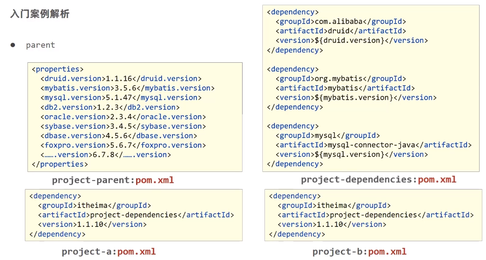
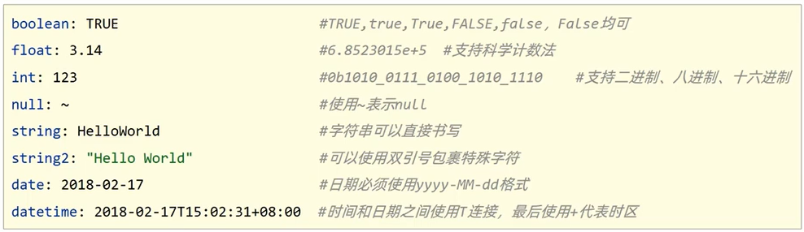
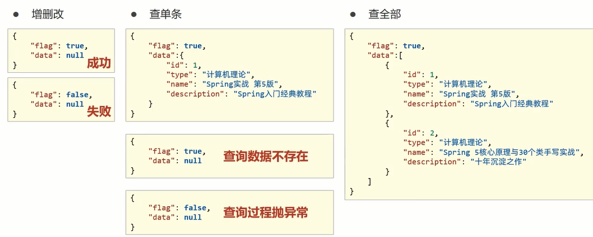

# 黑马 SpringBoot 基础篇

> TITLE：Springboot零基础到项目实战
>
> AUTHOR：黎老师
>
> SCHOOL：
>
> VIDEO：[BiliBili](https://www.bilibili.com/video/BV15b4y1a7yG)
>
> FILE：[基础篇](F:\STU\itcast\SpringBoot-黑马\基础篇) [运维实用篇](F:\STU\itcast\SpringBoot-黑马\运维实用篇) [开发实用篇](F:\STU\itcast\SpringBoot-黑马\开发实用篇) [原理篇](F:\STU\itcast\SpringBoot-黑马\原理篇)
>
> GITHUB：[学习SpringBoot](https://github.com/tianming-jianai/springboot2022)

> 废寝忘食
>
> disregard meal times and go without sleep; 
>
> 天道酬勤
>
> God helps those who help themselves.
>
> 学会反思，理解**记忆**

相关：[尚硅谷雷神SpringBoot2零基础入门springboot全套完整版](https://www.bilibili.com/video/BV19K4y1L7MT)

## 学习进度

- 开始时间：2022-05-25
- 结束时间：

|    日期    | 课程编号 |       学习时长       | 复习时间 |
| :--------: | :------: | :------------------: | :------: |
| 2022-05-25 |  P1~P12  |   18:30~20:30  2h    |          |
| 2022-05-26 | P13~P21  |   14:40~16:40  2h    |          |
| 2022-05-27 | P22~P31  |   15:30~17:30  2h    |          |
| 2022-05-28 | P32~P35  | 14:30~16:30  1h40min |          |
| 2022-05-29 | P36~P42  |   14:20~16:20  2h    |          |
| 2022-05-30 | P43~P48  |   18:50~20:50  2h    |          |
| 2022-05-31 | P49~P53  |   13:30~15:30  2h    |          |
| 2022-06-01 | P54~P60  |   14:40~16:40  2h    |          |
| 2022-06-02 | P61~P69  |   13:50~15:50  2h    |          |

> 学习经验：
> 看视频就看视频，不要急着去扩展新的知识点，可以先记下来，否则有损学习进度

## 测验

- 题库

## 课程大纲

- 基础篇
  - 会用
- 应用篇
  - 补全知识树
  - 加强应用
  - 提高能力
  - 解决能力
- 原理篇
  - 提升理解层次
  - 能够自定义
- 番外篇
  - 丰富视野
  - 提升方案能力

### 学习目标

- 基础篇
  - 能够创建Spring Boot工程
  - 基于SpringBoot实现SSM整合
- 实用篇
  - 运维实用篇
    - 能够掌握SpringBoot程序多环境开发
    - 能够基于Linux系统发布SpringBoot工程
    - 能够解决线上灵活配置SpringBoot工程的需求
  - 开发实用篇
    - 能够基于springBoot整合任意第三方技术
- 原理篇
  - 掌握SpringBoot内部工作流程
  - 理解SpringBoot整合第三方技术的原理
  - 实现自定义开发整合第三方技术的组件

## 课程介绍

### 课程适用人群及收获

- 小白：完全没有用过SpringBoot技术
  - 初步掌握SpringBoot程序的开发流程，能够基于SpringBoot实现基础SSM框架整合
- 初学者：能使用SpringBoot技术完成基础的SSM整合
  - 掌握各式各样的第三方技术与SpringBoot整合的方案
  - 积累基于SpringBoot的实战开发经验
- 开发者：能使用SpringBoot技术实现常见的技术整合工作
  - 提升对Spring及SpringBoot原理的理解层次
  - 基于原理理解基础上，实现自主研发基于SpringBoot整合任意技术的开发方式

### SpringBoot课程学习前置知识

- 基础篇
  - Java基础语法
  - Spring与springMVC
    - 知道Spring是用来管理bean，能够基于Restful实现页面请求交互功能
  - Mybatis与Mybatis-Plus
    - 基于Mybatis和MybatisPlus能够开发出包含基础CRUD功能的标准Dao模块
  - 数据库MySQL
    - 能够读懂基础CRUD功能的SQL语句
  - 服务器
    - 知道服务器与web工程的关系，熟悉web服务器的基础配置
  - maven
    - 知道maven的依赖关系，知道什么是依赖范围，依赖传递，排除依赖，可选依赖，继承
  - web技术（含vue，ElementUI)
    - 知道vue如何发送ajax请求，如何获取响应数据，如何进行数据模型双向绑定

- 实用篇
  - Linux ( centeroS7)
    - 熟悉常用的Linux基础指令，熟悉Linux系统目录结构
  - 实用开发技术
    - 缓存:Redis、MongoDB、.....
    - 消息中间件:RocketMq、RabbitMq、.…
    - …
      .

- 原理篇
  - spring
    - 了解Spring加载bean的各种方式
    - 知道Spring容器底层工作原理，能够阅读简单的Spring底层源码

## 基础篇

## 01 快速上手SpringBoot

SpringBoot是由Pivotal团队提供的全新框架，其设计目的是用来`简化`Spring应用的`初始搭建`以及`开发过程`

- Spring程序与SpringBoot程序对比

| 类/配置文件            | Spring   | SpringBoot |
| ---------------------- | -------- | ---------- |
| pom文件种的坐标        | 手工添加 | 勾选添加   |
| web3.0配置类           | 手工制作 | 无         |
| Spring/SpringMVC配置类 | 手工制作 | 无         |
| 控制器                 | 手工制作 | 手工制作   |

1. 开发springBoot程序可以根据向导进行联网快速制作
   公
2. SpringBoot程序需要基于JDK8进行制作
3. SpringBoot程序中需要使用何种功能通过勾选选择技术
4. 运行SpringBoot程序通过运行Application程序入口进行

- 自定义项目创建网址

`http://start.aliyun.com`

- 创建SpringBoot工程的四种方式

1. 基于Idea创建SpringBoot工程
2. 基于官网创建SpringBoot工程
3. 基于阿里云创建SpringBoot工程
4. 手工创建Maven工程修改为SpringBoot工程

> 隐藏不想看到的文件
>
> Setting -> Editor -> File Types -> Ignore File and Folders
>
> 输入要隐藏的文件名，支持*号通配符

### SpringBoot 简介

- SpringBoot是由Pivotal团队提供的全新框架，其设计目的是用来`简化`Spring应用的`初始搭建`以及`开发过程`
  - Spring程序缺点
    - 依赖设置繁琐
    - 配置繁琐
  - Spring Boot程序有点
    - 起步依赖（简化依赖配置）
    - 自动配置（简化常用工程相关配置）
    - 辅助功能（内置服务器，。。。）

### 入门案例分析

- parent
- starter
- 引导类
- 内嵌tomcat

### parent



**小结**

1. 开发springBoot程序要继承spring-boot-starter-parent
2. spring-boot-starter-parent中定义了若干个依赖管理
3. 继承parent模块可以`避免`多个依赖使用相同技术时出现`依赖`版本`冲突`
4. 继承parent的形式也可以采用引入依赖的形式实现效果

### starter

spring-boot-starter-web.pom

- starter
  - SpringBoot中常见项目名称，定义了当前项目使用的所有依赖坐标，以达到`减少依赖配置`的目的
- parent
  - 所有SpringBoot项目要继承的项目，定义了若干个坐标版本号（依赖管理，而非依赖），以达到`减少依赖冲突`的目的
  - spring-boot-starter-parent各版本间存在着诸多坐标版本不同

- 实际开发
  - 使用任意坐标时，仅书写GAV中的G和A，V由SpringBoot提供，除非SpringBoot未提供对应版本
  - 如发生坐标错误，再指定Version(要小心版本冲突)


**小结**

1. 开发SpringBoot程序需要导入坐标时通常导入对应的starter
2. 每个不同的starter根据功能不同，通常包含多个依赖坐标
3. 使用starter可以实现快速配置的效果，达到`简化配置`的目的

> startr parent 解决的是配置问题

### 引导类

- 启动方式

```java
@SpringBootApplication
public class Spring0101QuickstartApplication {

    public static void main(String[] args) {
        ConfigurableApplicationContext context = SpringApplication.run(Spring0101QuickstartApplication.class, args);
        BookController bean = context.getBean(BookController.class);
        System.out.println("bean === " + bean);
    }

}
```

- SpringBoot的引导类是Boot工程的执行入口，运行main方法就可以启动项目
- SpringBoot工程运行后初始化Spring容器，扫描引导类所在包加载bean

**小结**

1. SpringBoot工程提供引导类用来启动程序
2. SpringBoot工程启动后创建并初始化Spring容器

### 内嵌tomcat

- 排除Tomcat 引入 Jetty

```xml
<dependency>
    <groupId>org.springframework.boot</groupId>
    <artifactId>spring-boot-starter-web</artifactId>
    <exclusions>
        <exclusion>
            <groupId>org.springframework.boot</groupId>
            <artifactId>spring-boot-starter-tomcat</artifactId>
        </exclusion>
    </exclusions>
</dependency>
<dependency>
    <groupId>org.springframework.boot</groupId>
    <artifactId>spring-boot-starter-jetty</artifactId>
</dependency>
```

- Jetty 比 Tomcat更轻量级．可扩展性更强（相较于Tomcat)，谷歌应用引擎〔GAE)已经全面切换为Jetty

**内置服务器**

- tomcat（默认）：apache出品，粉丝多，`应用面广`，负载了若干较重的组件
- jetty：`更轻量级`，负载性能远不及tomcat
- undertow：undertow，负载性能`勉强`跑赢tomcat

**小结**

1. 内嵌Tomcat服务器是SpringBoot辅助功能之一
2. 内嵌Tomcat工作原理是将Tomcat服务器作为对象运行，并将该对象交给Spring容器管理
3. 变更内嵌服务器思想是去除现有服务器，添加全新的服务器


## 知识加油站：REST开发

涉密课程:dog:

### REST 风格

- REST简介
- RESTful入门案例
- REST快速开发
- 案例:基于RESTful页面数据交互

### REST 简介

- REST (Representational State Transfer)，表现形式状态转换

  - 传统风格资源描述形式

    http://localhost/user/getById?id=1

    http://localhost/user/saveUser

  - REST风格描述形式

    http://localhost/user/1

    http://localhost/user/

- 优点
  - 隐藏资源的访问行为，无法通过地址得知对资源是何种操作
  - 书写简化

按照REST风格访问资源时使用`行为动作`区分对资源进行了何种操作

| http: / / localhost/users   | 查询全部用户信息 | GET(查询)       |
| --------------------------- | ---------------- | --------------- |
| http: / / localhost/users/1 | 查询指定用户信息 | GET(查询)       |
| http: / / localhost/users   | 添加用户信息     | POST(新增/保存) |
| http: / / localhost/users   | 修改用户信息     | PUT(修改/更新)  |
| http: / / localhost/users/1 | 删除用户信息     | DELETE (删除)   |

> 注意：
>
> 上述行为是约定方式，约定不是规范，可以打破，所以称REST风格，而不是REST规范
>
> 描述模块的名称通常使用复数，也就是加s的格式描述，表示此类资源，而非单个资源，例如: users、books、account....

**小结**

1. REST
2. 动作4个
3. RESTful

> DATE：2022-05-25

### RESTful 入门案例

1. 设定请求动作（动词）
2. 设定请求参数（路径变量）

```java
@Controller
public class UserController {

    @RequestMapping(value = "/users", method = RequestMethod.POST)
    public String save() {
        System.out.println("user save ...");
        return "{'module':'user save'}";
    }

    @RequestMapping(value = "/users/{id}", method = RequestMethod.DELETE)
    public String delete(@PathVariable("id") Integer id) {
        System.out.println("user delete ..." + id);
        return "{'module':'user delete'}";
    }

    @RequestMapping(value = "/users", method = RequestMethod.PUT)
    public String update(@RequestBody User user) {
        System.out.println("user save ..." + user);
        return "{'module':'user update'}";
    }

    @RequestMapping(value = "/users/{id}", method = RequestMethod.GET)
    public String getById(@PathVariable("id") Integer id) {
        System.out.println("user getById ..." + id);
        return "{'module':'user getById'}";
    }

    @RequestMapping(value = "/users", method = RequestMethod.GET)
    public String getAll() {
        System.out.println("user getAll ...");
        return "{'module':'user getAll'}";
    }
}
```

### @RequestBody @RequestParam @PathVariable

- 区别
  - @RequestParam用于接收url地址传参或表单传参
  - @RequestBody用于接收json数据
  - @PathVariable用于接收路径参数，使用{参数名称}描述路径参数
- 应用
  - 后期开发中，发送请求参数超过1个时，以json格式为主，@RequestBody应用较广
  - 如果发送非json格式数据，选用@RequestParam接收请求参数
  - 采用RESTful进行开发，当参数数量较少时，例如1个，可以采用@PathVariable接收请求路径变量，通常用于传递id值

### RESTful 快速开发

```java
@RestController
@RequestMapping("/books")
public class BookController {

    @PostMapping
    public String save() {
        System.out.println("book save ...");
        return "{'module':'book save'}";
    }

    @DeleteMapping("/{id}")
    public String delete(@PathVariable("id") Integer id) {
        System.out.println("book delete ..." + id);
        return "{'module':'book delete'}";
    }

    @PutMapping
    public String update(@RequestBody Book book) {
        System.out.println("book save ..." + book);
        return "{'module':'book update'}";
    }

    @GetMapping("/{id}")
    public String getById(@PathVariable("id") Integer id) {
        System.out.println("book getById ..." + id);
        return "{'module':'book getById'}";
    }

    @GetMapping
    public String getAll() {
        System.out.println("book getAll ...");
        return "{'module':'book getAll'}";
    }
}
```

**小结**

1. RESTful快速开发（标准开发）
2. @RestController
3. 标准请求动作映射（4种）

## 02 基础配置

- 属性配置
- 配置文件分类
- yaml文件
- yaml数据读取

### 教你一招：复制工程

- 原则
  - 保留工程基础结构
  - 抹掉原始工程痕迹

**小结**

1. 在工作空间中复制对应工程，并修改工程名称
2. 删除与Idea相关配置文件，仅保留src目录与pom. xml文件
3. 修改pom. xm1文件中的artifactId与新工程/模块名相同
4. 删除name标签(可选)
5. 保留备份工程供后期使用

### 属性配置

- 修改服务端口

- SpringBoot默认配置文件application. properties,通过键值对配置对应属性

  ```properties
  server.port=80
  ```

```properties
# 服务器端口配置
server.port=80

# 修改banner
#spring.main.banner-mode=off
#spring.banner.image.location=logo.png

# 日志
logging.level.root=info
logging.level.com.itheima=warn
```


- SpringBoot内置属性查询

官方文档中参考文档第一项: Application Properties

[SpringBoot所有配置](https://docs.spring.io/spring-boot/docs/current/reference/html/application-properties.html)

**小结**

- SpringBoot中导入对应starter后，提供对应配置属性
- 书写SpringBoot配置采用关键字+提示形式书写


**SpringBoot提供了多种属性配置方式**

SpringBoot提供了3种配置文件的格式

- properties (传统格式/默认格式)
- `yml (主流格式)`
- yaml

### 配置文件加载优先级

`.properties > .yml > yaml`

不同配置文件中相同配置按照加载优先级相互覆盖，不同配
置文件中不同配置全部保留


### 自动提示功能消失解决方案

1. 指定SpringBoot配置文件
   - Setting  →  Project Structure  →  Facets
   - 选中对应项目/工程
   - Customize Spring Boot
   - 选择配置文件

### yaml

- YAML (YAML Ain't Markup Language) ，-种数据序列化格式
- 优点:
  - 容易阅读
    - 容易与脚本语言交互 .
    - 以数据为核心, 重数据轻格式
  - YAML文件扩展名
    - `.yml (主流)`
    - . yaml


**语法规则**

- 大小写敏感
- 属性层级关系使用多行描述，每行结尾使用冒号结束
- 使用缩进表示层级关系，同层级左侧对齐，只允许使用空格(不允许使用Tab键)
- 属性值前面添加空格(属性名与属性值之间使用冒号+空格作为分隔)
- #表示注释

核心规则：`数据前面要加空格与冒号隔开`


- 字面值表示方式



- 数组表示方式

  ```yaml
  likes:
    - game
    - music
    - sleep
  
  likes2: [game,music,sleep]
  ```

- 对象数组格式

  ```yaml
  users:
    - name: zhangsan
      age: 18
    - name: lisi
      age: 17
  
  users:
    - 
    	name: zhangsan
      age: 18
    - 
    	name: lisi
      age: 17
      
  users2: [{name:zhangsan,age:18},{name:lisi,age:17}]
  ```

**小结**

1. yaml语法规则
   - 大小写敏感
   - 属性层级关 系使用多行描述，每行结尾使用冒号结束
   - 使用缩进表示层级关系, 同层级左侧对齐,只允许使用空格(不允许
     使用Tab键)
   - 属性值前面添加空格( 属性名与属性值之间使用冒号+空格作为分隔)
   - #表示注释
2. 注意属性名冒号后面与数据之间有一个空格
3. 字面值、对象数据格式、数组数据格式(略)

> DATE：2022-05-26

### 读取yaml配置数据

1. **使用@Value读取单个数据，属性名引用方式：`${一级属性名.二级属性名...}`**

```yam
server:
  port: 81

country: china
user:
  name: zhangsan

likes:
  - game
  - music
  - sleep

likes2: [game,music,sleep]

users:
  - name: zhangsan
    age: 18
  - name: lisi
    age: 17

users2: [{name:zhangsan,age:18},{name:lisi,age:17}]

baseDir: C:\windows
tempDir: ${baseDir}\temp
```

```java
@RestController
@RequestMapping("/books")
public class BookController {
    // 读取yaml单一数据
    @Value("${country}")
    private String country;
    @Value("${user.name}")
    private String name;
    @Value("${likes[1]}")
    private String likes1;
    @Value("${users[1].age}")
    private String age1;
    @Value("${server.port}")
    private String port;
    @Value("${tempDir}")
    private String tempDir;

    @GetMapping("/{id}")
    public String getById(@PathVariable("id") Integer id) {
        System.out.println("book getById ..." + id); // book getById ...1
        System.out.println("country: " + country); // country: china
        System.out.println("name: " + name); // name: shiga
        System.out.println("likes1: " + likes1); // likes1: music
        System.out.println("age1: " + age1); // age1: 17
        System.out.println("port: " + port); // port: 80
        System.out.println("tempDir: " + tempDir); // tempDir: C:\windows\temp
        return "{'module':'book getById'}";
    }
```

**小结**

1. 在配置文件中可以使用${属性名}方式引用属性值
2. 如果属性出现特殊符号，可以使用`双引号`包裹起来作为字符解析

2. **封装全部数据到Environment对象**

```java
	@Autowired
    private Environment env;

    @GetMapping
    public String getAll() {
        System.out.println("book getAll ...");
        System.out.println("port: " + env.getProperty("server.port")); // 80
        return "{'module':'book getAll'}";
    }
```

**小结**

1. 使用Environment对象封装全部配置信息
2. 使用@Autowired自动装配数据到Environment对象中


3. **自定义对象封装指定数据**

```yaml
datasource:
  driver: com.mysql.cj.jdbc.Driver
  url: jdbc:mysql://localhost/springboot_db
  username: root
  password: root666
```

```java
/**
 * 1. 定义数据模型封装yaml文件中对应的数据
 * 2. 定义为Spring管控的bean
 * 3. 指定加载的数据
 */
@Data
@Component
@ConfigurationProperties(prefix = "datasource")
public class MyDataSource {
    private String driver;
    private String url;
    private String username;
    private String password;
}
```

```java
@Autowired
private MyDataSource myDataSource;

@GetMapping
public String getAll() {
    System.out.println("book getAll ...");
    System.out.println("myDataSource: " + myDataSource);
    return "{'module':'book getAll'}";
}
// myDataSource: MyDataSource(driver=com.mysql.cj.jdbc.Driver, url=jdbc:mysql://localhost/springboot_db, username=root, password=root666)
```

**小结**

1. 实用@ConfigurationProperties注解绑定撇子信息到封装类中
2. 封装类需要定义为Spring管理的bean，否则无法进行属性注入


## 03 整合第三方技术

- 整合JUnit
- 整合Mybatis
- 整合MyBatis-Plus
- 整合Druid

### 整合JUnit

**小结**

1. 导入测试对应的starter
2. 测试类实用`@SpringBootTest`修饰
3. 实用自动装配的形式添加要测试的对象

- 名称：@SpringBootTest

- 类型：测试类注解

- 位置：测试类定义上方

- 作用：设置JUnit加载的`SpringBoot启动类`

- 范例：

  ```java
  @SpringBootTest(classes = SpringBoot04JunitApplication.class)
  class SpringBootApplicationTests{}
  ```

- 相关属性

  - classes：设置SpringBoot启动类

注意事项：
如果测试类在SpringBoot启动类的包或子包中，可以省略启动类配置，也就是省略`classes`的设定

**小结**

1. 测试类如果存在于引导类所在包或子包中无需指定引导类
2. 测试类如果不存在于引导类所在的包或子包中需要通过classes属性指定引导类

### 整合Mybatis

```mysql
CREATE TABLE `tbl_book` (
  `id` int DEFAULT NULL,
  `type` varchar(50) DEFAULT NULL,
  `name` varchar(50) DEFAULT NULL,
  `description` varchar(100) DEFAULT NULL
)
```

```sql
insert into tbl_book values
(1,'code','java','run everywhere'),
(2,'code','python','convinent'),
(3,'code','js','web king'),
(4,'code','go','efficient concurrent');
```

```java
@Data
public class Book {
    private Integer id;
    private String type;
    private String name;
    private String description;
}
```

设置数据源参数

```yaml
spring:
  datasource:
    driver-class-name: com.mysql.cj.jdbc.Driver
    url: jdbc:mysql://localhost:3306/ssm_db
    username: zhangsan
    password: 2233
```

定义数据层接口与映射配置

```java
@Mapper
public interface BookDao {
    @Select("select * from tbl_book where id = #{id}")
    public Book getById(Integer id);
}
```

测试

```java
@Autowired
BookDao bookDao;

@Test
void contextLoads() {
    System.out.println(bookDao.getById(1));
}
```

**小结**

1. 勾选MyBatis技术，也就是导入MyBatis对应的starter
2. 数据库连接相关信息转换成配置
3. 数据库SQL映射需要添加@Mapper被容器识别到

**小结**

1. MySQL 8.X驱动强制要求设置时区
   - 修改url，添加`?serverTimezone=UTC`设定
   - 永久解决方案，修改MySQL数据库配置（略)
2. 驱动类过时，提醒更换为`com.mysql.cj.jdbc.Driver`

### 整合MyBatis-Plus

- MyBatis-Plus与Mybatis区别
  - 导入坐标不同
  - 数据层实现简化

1. 手动昂添加lSpringBoot整合MyBatis-Plus的坐标，可以通过mvnrepository获取

```xml
<dependency>
    <groupId>com.baomidou</groupId>
    <artifactId>mybatis-plus-boot-starter</artifactId>
    <version>3.5.1</version>
</dependency>
```

注意事项：
由于SpringBoot中未收录MyBatis-Plus的坐标版本，需要指定对应的Version

2. XxxDao继承BaseMapper(Xxx)

```java
@Mapper
public interface BookDao extends BaseMapper<Book> {
}
```

3. 测试

```java
@Autowired
BookDao bookDao;

@Test
void contextLoads() {
    System.out.println(bookDao.selectById(1));
}

@Test
public void findAll(){
    System.out.println(bookDao.selectList(null));
}
```

**小结**

1. 手工添加MyBatis-Plus对应的starter
2. 数据层接口使用BaseMapper简化开发
3. 需要使用的第三方技术无法通过勾选确定时，需要手工添加坐标

### 整合Druid

```xml
<dependency>
    <groupId>com.alibaba</groupId>
    <artifactId>druid-spring-boot-starter</artifactId>
    <version>1.1.21</version>
</dependency>
```

**通用性指定数据源**

```yaml
spring:
  datasource:
    driver-class-name: com.mysql.cj.jdbc.Driver
    url: jdbc:mysql://localhost:3306/test
    username: root
    password: 2233
    type: com.alibaba.druid.pool.DruidDataSource
```

**变更Druid的配置方式**

```yaml
spring:
  datasource:
  	druid:
      driver-class-name: com.mysql.cj.jdbc.Driver
      url: jdbc:mysql://localhost:3306/test
      username: root
      password: 2233
```

### 整合第三方技术

- 导入对应的starter
- 配置对应的设置或采用默认配置

**小结**

1. 整合Druid需要导入Druid对应的starter
2. 根据Druid提供的配置方式进行配置
3. 整合第三方技术通用方式
   - 导入对应的starter
   - 根据提供的配置格式，配置非默认值对应的配置项

> DATE：2022-05-27

## 基于SpringBoot的SSMP整合案例

- ### 案例效果演示

TODO

### 案例实现方案分析

- 实体类开发——使用Lombok快速制作实体类

- Dao开发——整合MyBatisPlus，制作数据层测试类

- Service开发——基于MyBatisPlus进行增量开发，制作业务层测试类
- Controller开发——基于Restful开发，使用PostMan测试接口功能
- Controller开发——前后端开发协议制作

- 页面开发——基于VUE+ElementUI制作，前后端联调，页面数据处理，页面消息处理
  - 列表、新增、修改、删除、分页、查询

- 项目异常处理

- 按条件查询——页面功能调整、Controller修正功能、Service修正功能

**小结**

- SSMP案例效果演示
- SSMP案例制作流程解析
  - 先开发基础CRUD功能，做一层测一层
  - 调通页面，确认异步提交成功后，制作所有功能
  - 添加分页功能与查询功能

### 模块创建

```xml
<parent>
    <groupId>org.springframework.boot</groupId>
    <artifactId>spring-boot-starter-parent</artifactId>
    <version>2.7.0</version>
    <relativePath/> <!-- lookup parent from repository -->
</parent>
```

1. 勾选SpringMVC与MySQL坐标
2. 修改配置文件为yml格式
3. 设置端口为80方便访问

### 实体类快速开发（lobmok）

```java
@Data
public class Book {
    private Integer id;
    private String type;
    private String name;
    private String description;
}
```

快速查看实体类属性方法：`Ctrl + F12`

- 常用注解 @Data
- 为当前实体类在编译期设置对应的get/set方法，toString方法，hashCode方法，equales方法

**小结**

1. 实体类制作
2. 使用lombok简化开发
   - 导入lombok无需指定版本，由SpringBoot提供版本
   - @Data注解

### 数据层标准开发（基础CRUD）

- 导入mybatisPlus与Druid对应的stater

```xml
<dependency>
    <groupId>com.baomidou</groupId>
    <artifactId>mybatis-plus-boot-starter</artifactId>
    <version>3.5.1</version>
</dependency>
<dependency>
    <groupId>com.alibaba</groupId>
    <artifactId>druid-spring-boot-starter</artifactId>
    <version>1.2.9</version>
</dependency>
```

```sql
alter table book rename to tbl_book;
alter table tbl_book change id id int primary key;
alter table tbl_book change id id auto_increment;
```

- 配置数据源与MybaPlus对应的基础配置（id生成策略使用数据库自增策略）

```yaml
spring:
  datasource:
    druid:
      driver-class-name: com.mysql.cj.jdbc.Driver
      url: jdbc:mysql://localhost:3306/test
      username: root
      password: 2233
      
mybatis-plus:
  global-config:
    db-config:
      table-prefix: tbl_
      id-type: auto
```

- 继承BaseMapper并指定泛型

```java
@Mapper
public interface BookDao extends BaseMapper<Book> {
}
```

- 制作测试类测试结果

```java
@SpringBootTest
public class BookDaoTests {

    @Autowired
    BookDao bookDao;

    @Test
    public void getByIdTest() {
        System.out.println(bookDao.selectById(5));
    }

    @Test
    public void testSave() {
        Book book = new Book();
        book.setType("测试数据123");
        book.setName("测试数据123");
        book.setDescription("测试数据123");
        bookDao.insert(book);
    }

    @Test
    public void testUpdate() {
        Book book = new Book();
        book.setId(6);
        book.setType("测试数据abc");
        book.setName("测试数据abc");
        book.setDescription("测试数据abc");
        bookDao.updateById(book);
    }

    @Test
    public void testDelete() {
        int i = bookDao.deleteById(5);
        System.out.println(i);
    }

    @Test
    public void testGetAll() {
        System.out.println(bookDao.selectList(null));
    }
}
```

**小结**

1. 手工导入starter坐标（ 2个)
2. 配置数据源与MyBatisPlus对应的配置
3. 开发Dao接口（继承BaseMapper)
4. 制作测试类测试Dao功能是否有效

### 开启MP运行日志

- 为方便调试可以开启MyBatisPlus的日志

```yaml
mybatis-plus:
  configuration:
    log-impl: org.apache.ibatis.logging.stdout.StdOutImpl
```

**小结**

1. 使用配置方式开启日志，设置日志输出方式为标准输出

注意：禁止上线开启

### 分页

- 分页操作需要设定分页对象IPage

```java
IPage page = new Page(1,3);
bookDao.selectPage(page,null);
```

- IPage对象中封账了分页操作中的所有数据
  - 数据
  - 每页数据总量
  - 最大页码值
  - 数据总量

```java
@Test
public void testGetPage() {
    IPage page = new Page(1,3);
    bookDao.selectPage(page,null);
    List records = page.getRecords(); // 数据
    System.out.println(page.getCurrent()); // 当前页
    System.out.println(page.getSize()); // 单页显示数量
    System.out.println(page.getTotal()); // 总数据量
    System.out.println(page.getPages()); // 总页数
    System.out.println(records);
}
```

- 分页操作是在MyBatisPlus的常规操作基础上增强得到，内部是动态的拼写SQL语句，因此需要增强对应的功能，使用MyBatisPlus拦截器实现

```java
@Configuration
public class MPConfig {
    @Bean
    public MybatisPlusInterceptor mybatisPlusInterceptor() {
        MybatisPlusInterceptor mybatisPlusInterceptor = new MybatisPlusInterceptor();
        mybatisPlusInterceptor.addInnerInterceptor(new PaginationInnerInterceptor());
        return mybatisPlusInterceptor;
    }
}
```

**小结**

1. 使用IPage封装分页数据
2. 分页操作依赖MyBatisPlus分页拦截器实现功能
3. 借助MyBatisPlus日志查阅执行SQL语句

### 数据层标准开发（条件查询）

- 使用QueryWrapper对象封装查询条件，推荐使用LambdaQueryWrapper对象，所有查询操作封装成方法调用

```java
@Test
public void testGetBy() {
    QueryWrapper<Book> queryWrapper = new QueryWrapper<>();
    queryWrapper.like("name", "Java");
    bookDao.selectList(queryWrapper);

    String name = "o";
    LambdaQueryWrapper<Book> lambdaQueryWrapper = new LambdaQueryWrapper<>();
    lambdaQueryWrapper.like(StringUtils.hasText(name), Book::getName, name);
    bookDao.selectList(lambdaQueryWrapper);
}
```

- 支持动态拼写查询条件

```java
String name = null;
LambdaQueryWrapper<Book> lambdaQueryWrapper = new LambdaQueryWrapper<>();
lambdaQueryWrapper.like(StringUtils.hasText(name), Book::getName, name);
bookDao.selectList(lambdaQueryWrapper);
```

```java
==>  Preparing: SELECT id,type,name,description FROM tbl_book
==> Parameters: 
<==    Columns: id, type, name, description
<==        Row: 1, code, java, run everywhere
<==        Row: 2, cod, python, conveient
<==        Row: 3, code, javascript, web king
<==        Row: 4, code, go, efficient concurrency
<==        Row: 6, 测试数据abc, 测试数据abc, 测试数据abc
<==      Total: 5
```

**小结**

1. 使用Querywrapper对象封装查询条件
2. 推荐使用LambdaQuerywrapper对象
3. 所有查询操作封装成方法调用
4. 查询条件支持动态条件拼装

> DATE：2022-05-28

### 业务层标准开发（基础CRUD）

- Service层接口定义与数据层接口定义具有较大`区别`，不要混用
  - selectByUserNameAndPassword(String name, String password)
  - login(String username, String password)

- 接口定义

```java
public interface BookService {
    Boolean save(Book book);
    Boolean update(Book book);
    Boolean delete(Integer id);
    Book getById(Integer id);
    List<Book> getAll();
    IPage<Book> getByPage(int current, int size);
}
```

- 实现类定义

```java
@Component
public class BookServiceImpl implements BookService {

    @Autowired
    BookDao bookDao;

    @Override
    public Boolean save(Book book) {
        return bookDao.insert(book) > 0;
    }
    ...
    @Override
    public IPage<Book> getByPage(int current, int size) {
        IPage<Book> page = new Page<>(current, size);
        bookDao.selectPage(page, null);
        return page;
    }
}
```

- 测试类定义

```java
@SpringBootTest
class BookServiceImplTest {

    @Autowired
    BookService bookService;

    @Test
    void save() {
        Book book = new Book();
        book.setType("测试数据135");
        book.setName("测试数据135");
        book.setDescription("测试数据135");
        bookService.save(book);
    }
    ...
```


业务层方法`必须写测试用例`
快速创建该类的测试类：`Ctrl + Shift + T` 

将业务层都定义为操作状态，成功或失败，而不是影响了多少数据，那是数据层的工作，业务层都是逻辑规则

**小结**

1. Service接口名称定义成业务名称，并与Dao接口名称进行区分心
2. 制作测试类测试service功能是否有效


### 业务层快速开发（基于MyBatisPlus）

- 快速开发方案
  - 使用MybatisPlus提供有业务层通用接口（`IService<T>`）与业务层通用实现类（`ServiceImpl<M,T>`）
  - 在通用类基础上做功能重载 或功能追加
  - 注意`不要覆盖原始操作`，避免原始提供的功能丢失
- 接口定义

```java
public interface IBookService extends IService<Book> {
    // 追加的操作与原始操作通过名称区分，功能类似
    Boolean delete(Integer id);
    Boolean insert(Book book);
    Boolean modify(Book book);
    Book get(Integer id);
}
```

- 实现类定义

```java
@Component
public class IBookServiceImpl extends ServiceImpl<BookDao, Book> implements IBookService {
}
```

**小结**

1. 使用通用接口(` ISerivce<T>`）快速开发service
2. 使用通用实现类( `ServiceImpl<M,T>`)快速开发ServiceImpl
3. 可以在通用接口基础上做功能重载或功能追加
4. 注意重载时不要覆盖原始操作，避免原始提供的功能丢失

### 表现层标准开发

- 功能测试

```java
@RestController
@RequestMapping("/books")
public class BookController {
    @Autowired
    private IBookService bookService;
	
    @GetMapping
    public List<Book> getAll() {
        return bookService.list();
    }
}
```

```bash
curl http://localhost/books
```

- 表现层开发

```java
@RestController
@RequestMapping("/books")
public class BookController {
    @Autowired
    private IBookService bookService;

    @PostMapping
    public boolean save(@RequestBody Book book) {
        return bookService.save(book);
    }

    @PutMapping
    public boolean update(@RequestBody Book book) {
        return bookService.updateById(book);
    }

    @DeleteMapping("/{id}")
    public boolean delete(@PathVariable Integer id) {
        return bookService.removeById(id);
    }

    @GetMapping("/{id}")
    public Book getById(@PathVariable("id") Integer id) {
        return bookService.getById(id);
    }

    @GetMapping
    public List<Book> getAll() {
        return bookService.list();
    }

    @GetMapping("/{current}/{size}")
    public IPage<Book> getByPage(@PathVariable int current,@PathVariable int size) {
        return bookService.page(current, size);
    }
}
```

- 测试表现层

  - POSTMAN

  - CURL

    ```bash
    # save
    curl -X POST -H 'Content-Type: application/json' -d '{"type":"tool","name":"curl","description":"web_req"}' localhost/books
    # update
    curl -X PUT -H 'Content-Type: application/json' -d '{"id":"2","type":"tool","name":"idea","description":"java ide"}' localhost/books
    # delete
    curl -X DELETE http://localhost/books/1
    # getById
    curl http://localhost/books/11
    # getAll
    curl http://localhost/books
    # getByPage
    curl http://localhost/books/1/5
    ```

    

**小结**

1. 基于Restful制作表现层接口
   - 新增：POST
   - 删除：DELETE
   - 修改：PUT
   - 查询：GET
2. 接收参数
   - 实体数据：@RequestBody
   - 路径变量：@PathVariable

### 表现层消息一致性处理（R对象）

- 增删改

  true | false

- 查单条

  ```json
  {"id":1,"type":"测试数据246","name":"测试数据246","description":"测试数据246"}
  ```

- 查全部

  ```json
  [{"id":1,"type":"测试数据246","name":"测试数据246","description":"测试数据246"},{"id":2,"type":"测试数据246","name":"测试数据246","description":"测试数据246"},{"id":3,"type":"测试数据246","name":"测试数据246","description":"测试数据246"},{"id":4,"type":"测试数据246","name":"测试数据246","description":"测试数据246"},{"id":6,"type":"测试数据246","name":"测试数据246","description":"测试数据246"},{"id":9,"type":"测试数据135","name":"测试数据135","description":"测试数据135"}]
  ```

缺点：前端人员拿到数据格式乱七八糟


`改正：操作结果统一格式`




- 设计表现层返回结果的模型类，用于后端与前端进行数据格式统一，也称为`前后端数据协议`

```java
@Data
@NoArgsConstructor
@AllArgsConstructor
public class R {
    private Boolean flag;
    private Object data;

    public R(Boolean flag) {
        this.flag = flag;
    }
}
```

- 表现层接口统一返回类型结果

```java
@RestController
@RequestMapping("/books")
public class BookController2 {
    @Autowired
    private IBookService bookService;

    @PostMapping
    public R save(@RequestBody Book book) {
        return new R(bookService.save(book));
    }

    @PutMapping
    public R update(@RequestBody Book book) {
        return new R(bookService.updateById(book));
    }

    @DeleteMapping("/{id}")
    public R delete(@PathVariable Integer id) {
        return new R(bookService.removeById(id));
    }

    @GetMapping("/{id}")
    public R getById(@PathVariable("id") Integer id) {

        return new R(true, bookService.getById(id));
    }

    @GetMapping
    public R getAll() {
        return new R(true, bookService.list());
    }

    @GetMapping("/{current}/{size}")
    public IPage<Book> getByPage(@PathVariable int current, @PathVariable int size) {
        return bookService.page(current, size);
    }
}
```

**小结**

1. 设计统一的返回值结果类型便于前端开发读取数据
2. 返回值结果类型可以根据需求自行设定，没有固定格式
3. 返回值结果模型类用于后端与前端进行数据格式统一，也称为前后端数据协议

> DATE：2022-05-29

### 前后端调用（axios发送异步请求）

- 前后端协议联调
  - 前后端分离结构设计中页面归属前端服务器
  - 单体工程中页面放置在resources目录下的static目录中（建议执行clean)

```js
getAll() {
    axios.get('/books').then(res => {
        console.log(res.data);
    })
}
```


**小结**

1. 单体项目中页面放置在resources/static目录下
2. created钩子函数用于初始化页面时发起调用
3. 页面使用axios发送异步请求获取数据后确认前后端是否联通

### 列表功能

```js
getAll() {
    axios.get('/books').then(res => {
        if (res.data.flag) {
            this.dataList = res.data.data;
        }
    })
}
```

**小结**

1. 将查询数据返回到页面，利用前端数据双向绑定进行数据展示

### 添加功能

- 弹出添加窗口

```js
// 弹出添加窗口
handleCreate() {
    this.dialogFormVisible = true;
    this.resetForm();
},
```

- 清除数据

```js
// 弹出添加窗口
handleCreate() {
    this.dialogFormVisible = true;
    this.resetForm();
},
// 重置表单
resetForm() {
    this.formData = {};
},
```

- 添加

```js
// 添加
handleAdd() {
    axios
        .post("/books", this.formData)
        .then((res) => {
        if (res.data.flag) {
            // 1. 关闭弹层
            this.dialogFormVisible = false;
            this.$message.success("添加成功");
        } else {
            this.$message.success("添加失败");
        }
    })
        .finally(() => {
        // 2. 加载数据
        this.getAll();
    });
},
```

- 取消添加

```js
// 取消
cancel() {
    this.dialogFormVisible = false;
    this.$message.info("当前操作取消");
},
```

**小结**

1. 请求方式使用POST调用后台对应操作
2. 添加操作结束后动态刷新页面加载数据
3. 根据操作结果不同，显示对应的提示信息
4. 弹出添加Div时清除表单数据

### 删除功能

- 删除

```js
// 删除
handleDelete(row) {
    // console.log(row);

    this.$confirm("此操作永久删除当前信息，是否继续？", "提示", {
        type: "info",
    })
        .then(() => {
        // console.log('success');
        axios
            .delete("/books/" + row.id)
            .then((res) => {
            if (res.data.flag) {
                this.$message.success("删除成功");
            } else {
                this.$message.error("删除失败");
            }
        })
            .finally(() => {
            this.getAll();
        });
    })
        .catch(() => {
        this.$message.info("取消操作");
    });
},
```

**小结**

1. 请求方式使用Delete调用后台对应操作
2. 删除操作需要传递当前行数据对应的id值到后台
3. 删除操作结束后动态刷新页面加载数据
4. 根据操作结果不同，显示对应的提示信息
5. 删除操作前弹出提示框避免误操作

### 修改功能

- 弹出修改窗口

```js
// 弹出编辑窗口
handleUpdate(row) {
    axios
        .get("/books/" + row.id)
        .then((res) => {
        if (res.data.flag) {
            // 展示弹层，加载数据
            this.formData = res.data.data;
            this.dialogFormVisible4Edit = true;
        } else {
            this.$message.error("数据同步失败，自动刷新");
        }
    })
        .finally(() => {
        this.getAll();
    });
},
```

- 删除消息维护

```js{16}
// 删除
handleDelete(row) {
    // console.log(row);

    this.$confirm("此操作永久删除当前信息，是否继续？", "提示", {
        type: "info",
    })
        .then(() => {
        // console.log('success');
        axios
            .delete("/books/" + row.id)
            .then((res) => {
            if (res.data.flag) {
                this.$message.success("删除成功");
            } else {
                this.$message.error("数据同步失败，自动刷新");
            }
        })
            .finally(() => {
            this.getAll();
        });
    })
        .catch(() => {
        this.$message.info("取消操作");
    });
},
```

**小结**

1. 加载要修改数据通过传递当前行数据对应的id值到后台查询数据
2. 利用前端数据双向绑定将查询到的数据进行回显

- 修改

```js
// 修改
handleEdit() {
    axios
        .put("/books", this.formData)
        .then((res) => {
        if (res.data.flag) {
            // 1. 关闭弹层
            this.dialogFormVisible4Edit = false;
            this.$message.success("修改成功");
        } else {
            this.$message.error("修改失败");
        }
    })
        .finally(() => {
        this.getAll();
    });
},
```

- 取消添加和修改

```js
// 取消
cancel() {
    this.dialogFormVisible = false;
    this.dialogFormVisible4Edit = false;
    this.$message.info("当前操作取消");
},
```

**修改**

1. 请求方式使用PUT调用后台对应操作
2. 修改操作结束后动态刷新页面加载数据（同新增)
3. 根据操作结果不同，显示对应的提示信息（同新增)

> DATE：2022-05-30

### 异常消息处理

我们现在做的操作都是在理想情况下进行的操作，其实在企业开发中可能会出各种各样的问题

#### 业务消息一致性处理

- 业务操作成功或失败返回数据格式

```json
{
    "flag": true,
    "data": null
}
```

```json
{
    "flag": false,
    "data": null
}
```

- 后台代码bug导致数据格式不统一性

```json
{
    "timestamp":"2022-05-31T06:06:06.390+00:00",
    "status":400,
    "error":"Bad Request",
    "path":"/books/"
}
```

- 对异常进行统一处理，出现异常后，返回指定信息

```java{2,5}
// 作为SpringMVC的异常处理器
@RestControllerAdvice
public class ProjectExceptionAdvice {
    // 拦截所有异常信息
    @ExceptionHandler
    public R doException(Exception ex) {
        // 记录日志
        // 通知运维
        // 发送邮件给开发人员，ex对象发送给开发人员
        return new R("服务器故障，请稍后再试！");
    }
}
```

- 修改表现层返回结果，封装异常后对应的信息
  - flag：false
  - Data：null
  - 消息(msg)：要显示信息

```java{6,17,22}
@Data
@NoArgsConstructor
public class R {
    private Boolean flag;
    private Object data;
    private String msg;

    public R(Boolean flag) {
        this.flag = flag;
    }

    public R(String msg) {
        this.flag = false;
        this.msg = msg;
    }

    public R(Boolean flag, Object data) {
        this.flag = flag;
        this.data = data;
    }

    public R(Boolean flag, String msg) {
        this.flag = flag;
        this.msg = msg;
    }
}
```

- 页面消息处理，没有传递消息加载默认消息，传递消息后加载指定消息

```js{9}
 // 添加
handleAdd() {
    axios
        .post("/books", this.formData)
        .then((res) => {
        if (res.data.flag) {
            // 1. 关闭弹层
            this.dialogFormVisible = false;
            this.$message.success("添加成功");
        } else {
            this.$message.success(res.data.msg);
        }
    })
        .finally(() => {
        // 2. 加载数据
        this.getAll();
    });
},
```

- 可以在表现层Controller中进行消息统一处理

```java{9}
@PostMapping
public R save(@RequestBody Book book) throws IOException {
    if ("123".equals(book.getName())) {
        // 骗骗编译器
        throw new IOException();
    }
    boolean flag = bookService.save(book);
    // 消息全部由后台管理
    return new R(flag, flag ? "添加成功^_^" : "添加失败-_-!");
}
```

目的：**国际化**

- 页面消息处理

```js{9}
 // 添加
handleAdd() {
    axios
        .post("/books", this.formData)
        .then((res) => {
        if (res.data.flag) {
            // 1. 关闭弹层
            this.dialogFormVisible = false;
            this.$message.success(res.data.msg);// 消息全部由后台管理
        } else {
            this.$message.success(res.data.msg);
        }
    })
        .finally(() => {
        // 2. 加载数据
        this.getAll();
    });
},
```

**小结**

1. 使用注解@RestControllerAdvice定义SpringMVC`异常处理器`用来处理异常的
2. 异常处理器必须被`扫描`加载，否则无法生效
3. 表现层返回结果的模型类中添加`消息属性`msg用来传递消息到页面


### 分页

- 页面使用el分页组件添加分页功能

```html
<!--分页组件-->
<div class="pagination-container">
    <el-pagination
                   class="pagiantion"
                   @current-change="handleCurrentChange"
                   :current-page="pagination.currentPage"
                   :page-size="pagination.pageSize"
                   layout="total, prev, pager, next, jumper"
                   :total="pagination.total"
                   >
    </el-pagination>
</div>
```

- 定义分页组件需要使用的数据并将数据绑定到分页组件

```json
data:{
    pagination: {  		//分页相关模型数据
        currentPage: 1, //当前页码
        pageSize: 10, 	//每页显示的记录数
        total: 0, 		//总记录数
	},
}
```

- 替换查询全部功能为分页功能

```js
// 分页查询
getAll() {
    axios.get("/books/" +this.pagination.currentPage +
              "/" +this.pagination.pageSize
             )
        .then((res) => {
        
    });
},
```

- 后台：分页查询

```java
@GetMapping("/{current}/{size}")
public R getByPage(@PathVariable int current, @PathVariable int size) {
    IPage<Book> page = bookService.page(current, size);
    return new R(null != page, page);
}
```

使用路径参数传递分页数据局，封装对象传递数据

- 加载分页数据

```js
// 分页查询
getAll() {
    axios.get("/books/" +this.pagination.currentPage +
              "/" +this.pagination.pageSize
             )
        .then((res) => {
        if (res.data.flag) {
            this.pagination.currentPage = res.data.data.current;
            this.pagination.pageSize = res.data.data.size;
            this.pagination.total = res.data.data.total;
            this.dataList = res.data.data.records;
        }
    });
},
```

- 分页页码值切换

```js
// 切换页码
handleCurrentChange(currentPage) {
    // 1. 修改页码值为当前选中的页码值
    this.pagination.currentPage = currentPage;
    // 2. 执行查询
    this.getAll();
},
```

**小结**

1. 使用el分页组件
2. 定义分页组件绑定的数据模型
3. 异步调用获取分页数据
4. 分页数据页面回显

### 分页功能维护（删除BUG）

说明：最后一页一条数据被删除，仍然停留在这一页

- 对查询结果进行校验，如果当前页码值大于最大页码值，使用最大页码值作为当前页码值重新查询

```java
@GetMapping("/{current}/{size}")
public R getByPage(@PathVariable int current, @PathVariable int size) {
    IPage<Book> page = bookService.page(current, size);
    // 如果当前页码大于总页码值，那么重新执行查询，使用最大页码值作为当前页码值
    if (current > page.getPages()) {
        page = bookService.page((int) page.getPages(), size);
    }
    return new R(null != page, page);
}
```

当然，这只是一个业务上的补救方案，这样的解决方案并不完美，当短时数据变化量很大时，仍然会出现空白页面
如果直接跳到第一页，就不会出现这样的问题

**小结**

1. 基于业务需求维护删除功能


### 条件查询

- 查询条件数据封装
  - 单独封装
  - 与分页操作混合封装

```json
pagination: {
    //分页相关模型数据
    currentPage: 1, 	//当前页码
    pageSize: 10, 		//每页显示的记录数
    total: 0, 			//总记录数
    type: "",
    name: "",
    description: "",
},
```

- 页面数据模型绑定

```html
<div class="filter-container">
    <el-input placeholder="图书类别" v-model="pagination.type"
              style="width: 200px" class="filter-item" ></el-input>
    <el-input placeholder="图书名称" v-model="pagination.name"
              style="width: 200px" class="filter-item" ></el-input>
    <el-input placeholder="图书描述" v-model="pagination.description"
              style="width: 200px" class="filter-item" ></el-input>
    <el-button @click="getAll()" class="dalfBut">查询</el-button>
    <el-button type="primary" class="butT" @click="handleCreate()">新建</el-button>
</div>
```

- 组织数据成为get请求发送的数据

```js
// 分页查询
getAll() {
    // 获取查询条件拼接查询条件 最简单写法
    let param = "?name=" + this.pagination.name;
    param += "&type=" + this.pagination.type;
    param += "&description=" + this.pagination.description;
    console.log("-------------" + param);
    axios
        .get(
        "/books/" +
        this.pagination.currentPage +
        "/" +
        this.pagination.pageSize +
        param
    )
        .then((res) => {
        if (res.data.flag) {
            this.pagination.currentPage = res.data.data.current;
            this.pagination.pageSize = res.data.data.size;
            this.pagination.total = res.data.data.total;
            this.dataList = res.data.data.records;
        }
    });
},
```

条件数据可以根据条件判断写的更简洁

- Controller接收参数

```java
@GetMapping("/{current}/{size}")
public R getByPage(@PathVariable int current, @PathVariable int size, Book book) {
    System.out.println("请求参数：" + book);
    IPage<Book> page = bookService.page(current, size, book);
    // 如果当前页码大于总页码值，那么重新执行查询，使用最大页码值作为当前页码值
    if (current > page.getPages()) {
        page = bookService.page((int) page.getPages(), size, book);
    }
    return new R(null != page, page);
}
```

- 业务层接口开发

```java
public interface IBookService extends IService<Book> {
    /**
     * 接收参数返回页数据
     *
     * @param current 当前页
     * @param size    每页条数
     * @param book    查询条件
     * @return
     */
    IPage<Book> page(int current, int size, Book book);
}
```

```java
@Component
public class IBookServiceImpl extends ServiceImpl<BookDao, Book> implements IBookService {
	@Override
    public IPage<Book> page(int current, int size, Book book) {
        LambdaQueryWrapper<Book> lqw = new LambdaQueryWrapper<>();
        lqw.like(Strings.isNotEmpty(book.getType()), Book::getType, book.getType())
            .like(Strings.isNotEmpty(book.getName()), Book::getName, book.getName())
            .like(Strings.isNotEmpty(book.getDescription()), Book::getDescription, 
                  book.getDescription());
        
        IPage<Book> page = new Page<>(current, size);
        return bookDao.selectPage(page, lqw);
    }
}
```

- Controller 调用业务层分页条件查询接口

```java
@GetMapping("/{current}/{size}")
public R getByPage(@PathVariable int current, @PathVariable int size, Book book) {
    System.out.println("请求参数：" + book);
    IPage<Book> page = bookService.page(current, size, book);
    // 如果当前页码大于总页码值，那么重新执行查询，使用最大页码值作为当前页码值
    if (current > page.getPages()) {
        page = bookService.page((int) page.getPages(), size, book);
    }
    return new R(null != page, page);
}
```

**小结**

1. 定义查询条件数据模型（当前封装到分页数据模型中)
2. 异步调用分页功能并通过请求参数传递数据到后台

## 基础篇完结

- 基于SpringBoot的SSMP整合案例

1. pom.xml

   配置起步依赖

2. application.xml

   设置数据源、端口、框架技术相关配置

3. dao

   继承BaseMapper、设置@Mapper

4. dao测试类

5. service

   调用数据层接口或MyBatis-Plus提供的接口快速开发

6. service测试类

7. controller

   基于Restful开发，使用postman测试跑通功能

8. 页面

   放置在resource目录下的static目录中

### 总结

1. 整合JUint
2. 整合MyBatis
3. 整合MyBatis-Plus
4. 整合Druid
5. 基于springBoot的SSMP整合案例


### 后续学习

- 基础篇
  - 能够创建SpringBoot工程
  - 基于SpringBoot实现ssm/ ssmp整合
- 实用篇
  - 运维实用篇
    - 能够掌握SpringBoot程序多环境开发
    - 能够基于Linux系统发布SpringBoot工程
    - 能够解决线上灵活配置SpringBoot工程的需求
  - 开发实用篇
    - 能够基于springBoot整合任意第三方技术
- 原理篇

> DATE：2022-05-31

