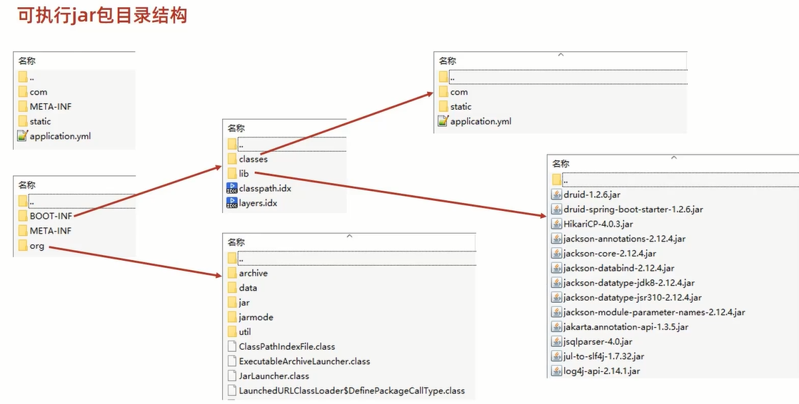

# SpringBoot 运维实战篇

## 目录

- 打包与运行
- 配置高级
- 多环境开发
- 日志

## 01 工程打包与运行

- 程序打包与运行(windows版)
- 程序运行（Linux版)

### SpringBoot项目快速启动（Windows版）

1. 对SpringBoot项目打包（执行maven构建指令package）

   ```bash
   mvn package
   ```

2. 运行项目（执行启动指令）

   ```bash
   java -jar springboot.jar
   ```

注意事项：
jar支持命令行启动需要依赖maven插件支持，请确认打包时是否具有SpringBoot对应的maven插件

```xml
<build>
    <plugins>
        <plugin>
            <groupId>org.springframework.boot</groupId>
            <artifactId>spring-boot-maven-plugin</artifactId>
        </plugin>
    </plugins>
</build>
```

**小结**

1. SpringBoot工程可以基于java环境下独立运行jar文件启动服务
2. SpringBoot工程执行mvn命令package进行打包
3. 执行jar命令： java -jar工程名.jar


### SpringBoot打包插件

- 使用SpringBoot提供的maven插件可以将工程打包成可执行jar包

```xml
<build>
    <plugins>
        <plugin>
            <groupId>org.springframework.boot</groupId>
            <artifactId>spring-boot-maven-plugin</artifactId>
        </plugin>
    </plugins>
</build>
```

- 可执行jar包目录结构



- jar包描述文件（MANIFEST.MF）


### 命令行启动常见问题及解决方案

- window端口被占用

```bash
# 查询端口
netsatat -ano
# 查询指定端口
netstat -ano | findstr "端口号"
# 根据进程PID查询进程名称
tasklist | findstr "进程PID号"
# 根据PID杀死任务
taskkill /F /PID "进程PID号"
# 根据进程名称杀死任务
taskkill -f -t -im "进程名称"
```

**小结**

1. spring- boot -maven- plugin插件作用

### SpringBoot工程快速启动（Linux版）

- 基于Linux (CenteOS7 )
- 安装JDK，且版本不低于打包时使用的JDK版本
- 安装包保存在`/usr/local/自定义目录`中或`$HOME`下
- 其他操作参照Windows版进行

**小结**

1. 上传安装包
2. 执行jar命令： java -jar 工程名.jar

### 总结

1. Boot程序打包依赖SpringBoot对应的Maven插件即可打包出可执行的jar包
2. 运行jar包使用jar命令进行
3. Windows与Linux下执行Boot打包程序流程相同，仅需确保运行环境有效即可

## 02 配置高级

- 临时属性设置
- 配置文件分类
- 自定义配置文件

### 临时属性设置

- 带属性启动SpringBoot

  ```bash
  java -jar springboot.jar --server.port=8080

- 携带多个属性启动SpringBoot，属性间使用空格分隔

属性加载先后顺序

[参看SpringBoot官网](https://docs.spring.io/spring-boot/docs/current/reference/html/features.html#features.external-config)

1. Default properties (specified by setting `SpringApplication.setDefaultProperties`).
2. [`@PropertySource`](https://docs.spring.io/spring-framework/docs/5.3.20/javadoc-api/org/springframework/context/annotation/PropertySource.html) annotations on your `@Configuration` classes. Please note that such property sources are not added to the `Environment` until the application context is being refreshed. This is too late to configure certain properties such as `logging.*` and `spring.main.*` which are read before refresh begins.
3. Config data (such as `application.properties` files).
4. A `RandomValuePropertySource` that has properties only in `random.*`.
5. OS environment variables.
6. Java System properties (`System.getProperties()`).
7. JNDI attributes from `java:comp/env`.
8. `ServletContext` init parameters.
9. `ServletConfig` init parameters.
10. Properties from `SPRING_APPLICATION_JSON` (inline JSON embedded in an environment variable or system property).
11. Command line arguments.
12. `properties` attribute on your tests. Available on [`@SpringBootTest`](https://docs.spring.io/spring-boot/docs/2.7.0/api/org/springframework/boot/test/context/SpringBootTest.html) and the [test annotations for testing a particular slice of your application](https://docs.spring.io/spring-boot/docs/current/reference/html/features.html#features.testing.spring-boot-applications.autoconfigured-tests).
13. [`@TestPropertySource`](https://docs.spring.io/spring-framework/docs/5.3.20/javadoc-api/org/springframework/test/context/TestPropertySource.html) annotations on your tests.
14. [Devtools global settings properties](https://docs.spring.io/spring-boot/docs/current/reference/html/using.html#using.devtools.globalsettings) in the `$HOME/.config/spring-boot` directory when devtools is active.

**小结**

1. 使用jar命令启动SpringBootI程时可以使用临时属性替换配置文件中的属性
2. 临时属性添加方式: java -jar工程名.jar -- 属性名=值
3. 多个临时属性之间使用空格分隔
4. 临时属性必须是当前boot工程支持的属性，否则设置无效

### 临时属性（开发环境）

- 带属性启动SpringBoot程序,为程序添加运行属性


- 通过编程形式带参数启动SpringBoot程序，为程序添加运行参数

  ```java
  public static void main(String[] args) {
      System.out.println(Arrays.toString(args));
      String[] arg = new String[1];
      arg[0] = "--server.port=8082";
      SpringApplication.run(SsmpApplication.class, arg);
  }

- 不携带参数启动SpringBoot程序，更加安全

  ```java
      public static void main(String[] args) {
          System.out.println(Arrays.toString(args));
          // 可以在启动boot程序时断开读取外部临时配置对应的入口，也就是去掉读取外部参数的形参
          SpringApplication.run(SsmpApplication.class);
      }

**小结**

1. 启动SpringBoot程序时，可以选择是否使用命令行属性为SpringBoot程序传递启动属性

### 配置文件4级分类

- 配置文件分类

1. SpringBoot中4级配置文件

   1级：file：config/application.yml     `【最高】`

   2级：file：application.yml

   3级：classpath：config/application.yml

   4级：classpath：application.yml        `【最低】`

2. 作用：

   - 1级与2级留做系统打包后设置通用属性，1级常用于运维经理进行线上整体项目部署方案调控
   - 3级与4级用于系统开发阶段设置通用属性，3级常用于项目经理进行整体项目属性调控

思考：
如果yml与properties在不同层级中共存会是什么效果?
例：类路径application . properties属性是否覆盖文件系统config目录中application. yml属性

**小结**

1. 配置文件分为4种
   - 项目类路径配置文件：服务于开发人员本机开发与测试
   - 项目类路径config目录中配置文件：服务于项目经理整体调控，
   - 工程路径配置文件：服务于运维人员配置涉密线上环境
   - 工程路径config目 录中配置文件：服务于运维经理整体调控
2. 多层级配置文件间的属性采用叠加并覆盖的形式作用于程序

备注：忘了args，命令行参数，临时属性有很大的风险性，还是用文件来管理好

### 自定义配置文件

问：所有配置文件都是`application`.yml开头，（项目经理:smirk:）能不能个改呢

- 通过启动参数加载指定文件路径下的配置文件时可以加载多个配置


- 自定义配置文件——重要说明

单服务器项目：使用自定义配置文件需求较低
多服务器项目：使用自定义配置文件需求较高,将所有配置放置在-一个目录中,统一管理
基于`SpringCloud技术`，所有的服务器将不再设置配置文件，而是通过配置中心进行设定，动态加载配置信息

**小结**

1. 配置文件可以修改名称，通过启动参数设定
2. 配置文件可以修改路径，通过启动参数设定
3. 微服务开发中配置文件通过配置中心进行设置

### 总结

1. SpringBoot在开发和运行环境均支持使用临时参数修改工程配置
2. SpringBoot支持4级配置文件，应用于开发与线上环境进行配置的灵活设置
3. SpringBoot支持使用自定义配置文件的形式修改配置文件存储位置
4. 基于微服务开发时配置文件将使用配置中心进行管理

> DATE：2022-06-01
