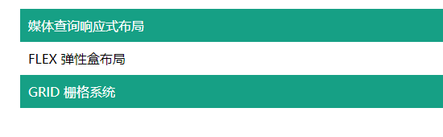
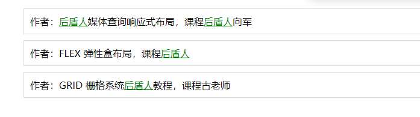

# 后盾人JavaScript教程

> TITLE：ECMASCRIPT系统课程含盖 es5 / es6 / es7 / es8 等知识点
>
> AUTHOR：向军
>
> VIDEO：[BiliBili](https://www.bilibili.com/video/BV1yE411y7QZ)
>
> OFFICE SITE：[后盾人 (houdunren.com)](https://www.houdunren.com/front/system/show?id=10)
>
> DOC：[文档](https://doc.houdunren.com/js/)

> 后盾人理念：人人做后盾

## 学习进度

- 开始时间：2022-05-30
- 结束时间：

|    日期    |             课程编号              |       学习时长       | 复习时间 |
| :--------: | :-------------------------------: | :------------------: | :------: |
| 2022-05-30 | 第一章：P1~P12<br />第二章：P1~P3 |   12:30~14:30  2h    |          |
| 2022-05-31 |          第二章：P4~P14           |   20:00~22:00  2h    |          |
| 2022-06-01 |           第三章：P1~P4           | 10:40~12:00  1h20min |          |

## 第一章：走进 JAVASCRIPT 黑洞

### 1. 课程介绍与代码获取方式

TODO

### 2. JavaScript的过去与将来

### 3. ES开发工具选择

- VS Code
- Chrome

### 4. 让程序跑起来/避免延迟

- 避免延迟

  将引入的js放在body最后

  ```javascript
  <body>
      <h1>Hello World!</h1>
  	<script src="1.js" />
  </body>
  ```

  ```javascript
  # 1.js
  alert("Click me")
  ```

### 5. 前端访问流程基本分析

TODO

### 6. 注释与执行符

TODO

### 7. 变量声明基础知识

- 变量声明

字母、数字、下划线、不要用$

```js
var web = url = name = 'hdr'
```

- 变量弱类型

```js
var web = "hdms"
console.log(typeof web)
web = 99
console.log(typeof web)
web = {}
console.log(typeof web)
```

### 8. 体验解析过程与变量提升

- 解析过程

```js
var web = 'hdr'
console.log(web)
var class = 'hdms'
// >>>
并没有先输出在报错，而是直接报错
Uncaught SyntaxError: Unexpected token 'class'

```

- 变量提升

```js
var web;
console.log(web); // undefined
web = 'hdr'
console.log(web); // hdr
```

```js
function hd(){
    if(false){
        var name = 'hdr'
    }
    console.log(name); // undefined
}
hd()
```

```js
function hd(){
    if(false){
        // var name = 'hdr'
    }
    console.log(name); // ReferenceError: name is not defined
}
hd()
```

解决办法：只能使用var的话，在开头声明，先声明，后使用

### 9. let & const & 暂时性死区TDC

- let

```js
// 变量TDC
console.log(web);
let web = 'hdr' // ReferenceError: Cannot access 'web' before initialization
// 变量必须先定义再使用
// const 同理
```

- function

```js
// 函数TDC：函数体里面存在全局同名变量也必须先声明，后使用
let web = 'hdr'

function func(){
    console.log(web);
    let web = 'hdr.com'
}
```

- 函数参数

```js
function run(a = b,b=3){

}
run()
// ReferenceError: Cannot access 'b' before initialization
```

```js
function run(a = 3, b = a) {

}
run()
```

这是一种很好的警示作用，在保护我们的程序，能够让我们的程序运行正常

### 10. var - let - const的共同点

```js
// 公园
var web = 'hdr'
function show(){
    // web = 'hdr.com' 修改公有参数
    // 自己家花园
    var web = 'hdr.com'
    console.log(web);// hdr.com
}
show()
console.log(web)// hdr
```

函数内声明会重新开辟出一片内存空间，专门为这个函数服务

### 11. 可怕的全局污染

- 函数内声明，函数外可访问

```js
function show(){
    // 不声明变量
    web = 'hdr.com'
}
show()
console.log(web); // hdr.com
```

- 别的文件声明，本文件可访问

```js
// qjwr.js
function show(){
    web = 'hdr.com'
}
```

```html
<body>
    <script src="./qjwr.js"></script>
    <script>
        web = 'hdr' // Uncaught ReferenceError: web is not defined
        show() // 修改了本文件的变量
        console.log(web); // hdr.com
    </script>
</body>
```

解决办法：

1. 一定要用var声明一下
2. 使用严格模式，强制要求声明

```html
<body>
    <script src="./qjwr.js"></script>
    <script>
        "use strict"
        web = 'hdr' // Uncaught ReferenceError: web is not defined
        show() // 修改了本文件的变量
        console.log(web); // hdr.com
    </script>
</body>
```


### 12. 块作用域这个先进的特性 :dog:

- demo 01

```js
{
    var web = 'hdr'
}
console.log(web) // hdr
```

```js
{
    let web = 'hdr'
}
console.log(web) // ReferenceError: web is not defined
```

- demo 02

```js
var i = 99
for (var i = 0; i < 5; i++) {
    console.log(i);
}
console.log(i);
// 0 1 2 3 4 5 // 影响到循环外同名变量
```

```js
var i = 99
for (let i = 0; i < 5; i++) {
    console.log(i);
}
console.log(i);
// 0 1 2 3 4 99
```

### 13. const常量声明一探究竟

const 常量 值不可以改变
值为引用类型，只要内存地址不变是没关系的
标量，比如字符串，不允许改变
块级作用域中不可以修改，全局作用域、局部作用域、函数作用域可以声明同一个常量

```js
const URL = 'hdr.com'
{
    const URL = 'hdr'
}
console.log(123) // 123
```

### 14. window全局对象污染与重复声明

- window全局对象污染

```html
<body>
    <script>
        var web = 'hdr'
        console.log(window.web); // hdr
        // window对象保存了窗口的一些信息
        // 我们自己声明的普通变量，直接影响了window，显然不合理
        var screenLeft = 88 // 改变了window的属性
        console.log(window.screenLeft); // 88
    </script>
</body>
```

解决方法：使用let

```html
<body>
    <script>
        let web = 'hdr'
        console.log(window.web); // undefined
        let screenLeft = 88
        console.log(screenLeft); // 88
        console.log(window.screenLeft); // 实际窗口值
    </script>
</body>
```

- 重复声明的问题

```js
var web = 'hdr'

// n lines code
// ...

var web = 'hdr.com' // 重复声明不会报错
```

解决方法：使用let | const 重复声明报错

### 15. Object.freeze冻结变量

```js
const HOST = {
    url : 'https://hdr.com',
    port: 443
}
HOST.port = 80
console.log(HOST);
// { url: 'https://hdr.com', port: 80 } // 修改了对象的值
```

```js
const HOST = {
    url : 'https://hdr.com',
    port: 443
}
Object.freeze(HOST) // 冻结变量
HOST.port = 80
console.log(HOST);
// { url: 'https://hdr.com', port: 443 } // 对象的值没有变
```

```js
'use strict'
const HOST = {
    url : 'https://hdr.com',
    port: 443
}
Object.freeze(HOST)
HOST.port = 80
console.log(HOST);
//TypeError: Cannot assign to read only property 'port' of object '#<Object>'
```

### 16. 标量与引用类型的传值与传值特性

```js
// 传值 传址
let a = 1
let b = a
console.log(a, b); // 1 1
b = 3
console.log(a, b); // 1 3

let e = {
    name: 'hdr'
}
let f = e
console.log(e, f); // { name: 'hdr' } { name: 'hdr' }
f.name = 'hdr.com'
console.log(e, f); // { name: 'hdr.com' } { name: 'hdr.com' }
```

基本类型传值：方便计算，引用类型传址：节省内存

### 17. null 与 undefined详解

```js
let m = 324;
let n;
console.log(typeof m); // number
console.log(typeof n); // undefined

function start(num) {
    console.log(typeof name); // undefined
    num = num || 5
    // if (num == undefined) {
    //    num = 5
    //}
    for (let i = 0; i < num; i++) {
        console.log('*');
    }
}
start()
```

### 18. use strict 严格模式高质量代码守卫

```js
'use strict'
// 不声明就不行
// 不能使用关键字

// 严格模式可以放在函数中，严格模式作用域就是函数内部
function show(){
    'use strict'
    web = 'hdr.com'
}
show() // 报错

let {naming,url} = {naming:'hdr','url':'hdr.com'}
// 简写，这种写法不好，不标准，会造成：打包报错、在别人环境运行报错
({naming,url} = {naming:'hdr','url':'hdr.com'})
// 使用严格模式：ReferenceError: Cannot access 'naming' before initialization
console.log(naming);
```

## 第二章：JavaScript运算符与流程控制

### 1. 赋值运算符与算术运算符

```js
+ - * / += 
```

### 2. 一元运算符的前置与后置操作

```js
i++ ++i
```

### 3. 比较运算符注意事项

```js
> < >= <= 
1 == '1' // true
1 === '1' // false
```

```html
<body>
    <input type="text" name="age">
    <span id="msg"></span>
    <script>
        let a = 1, b = 2, c = '1';
        console.log(a > b);
        console.log(a == c);
        console.log(b>=2);
        
        let span = document.querySelector('#msg')
        document.querySelector('[name=age]').addEventListener('keyup',function(){
            // if (this.value >= 90){
            //     msg = '年龄不能超过90'
            // }
            // span.innerHTML= msg;
            // 简化为1行
            span.innerHTML = this.value >= 90 ? '年龄不能超过90岁' : '';
        })
    </script>
</body>
```

> DATE：2022-05-30

### 4. 逻辑运算符实例详解

```html
<body>
    <input type="text" name="password" />
    <input type="text" name="confirm_password" />
    <span name="msg"></span>
    <script>
        function query(name) {
            return document.querySelector(`[name=${name}]`);
        }
        console.log(query('password'));

        let inputs = document.querySelectorAll("[name=password],[name=confirm_password]");
        console.log(inputs);
        [...inputs].map(item => {
            item.addEventListener('keyup', function () {
                let msg = '';
                if (query('password').value != query('confirm_password').value || query('password').value.length < 5) {
                    msg = '两次密码不一致或密码长度小于5位'
                }
                query('msg').innerHTML = msg
            })
        })
    </script>
</body>
```

### 5. 短路运算符的妙用

```js
let a = 3, b = 0;
console.log(a == true);
// 1. 短路与
if (a || b++) {
    console.log(b);
}

// 2. 赋值
let f = a || b;
console.log(f);
// 顺序很重要
let sex = prompt('请输入性别') || '保密';
console.log(sex);
// 提醒：有的语言是返回布尔值

// 3. 函数默认值
function start(num) {
    return '*'.repeat(num || 5);
}
console.log(start(3));

// 最新版js写法
function start2(num = 5) {
    return '*'.repeat(num);
}
```

### 6. 网站协议接受验证

```html
<body>
    <form action="/action" method="get" id="form">
      用户名：<input type="text" name="user" />
      <hr />
      <input type="checkbox" name="copyright" />接受协议
      <hr />
      <button>提交</button>
    </form>
    <script>
      function query(el) {
        return document.querySelector(el);
      }
      query("#form").addEventListener("submit",function(event){
          let user = query('[name=user]').value.trim();
          let copyright = query('[name=copyright]').checked;
          console.log(copyright);
          console.log(user);
          // 阻止默认事件，这样就提交不了了
          if(!user || copy === false){
              event.preventDefault();
                alert('请接受协议并添加用户名')
          }
      });
    </script>
  </body>
```

### 7. 使用if else判断密码强度

```js
if(passwd.length>10){
    clog('超级强度')
}else if(passwd.length>5){
    clog('中级轻度')
}else{
    clog('低级强度')
}
```

### 8. 三元表达式真的好可爱

```html
<body>
    <script>
      // let hd = true ? 2: 5;
      let hd = true ? (3 ? "hdr" : "hdr.com") : 5;
      console.log(hd);

      function div(options = {}) {
        let div = document.createElement('div');
        div.style.width = options.width ? options.width : '100px';
        div.style.height = options.height ? options.height : '100px';
        div.style.backgroundColor = options.bgcolor ? options.bgcolor : 'red';
        document.body.appendChild(div);
      }
      div({width:'300px',height:'50px',bgcolor:'green'});
    </script>
  </body>
```

### 9. switch循环控制

```js
let error = "notice";
switch (error) {
    case "notice":
    case "warning":
        console.log("提示或警告信息");
        break;
    case "error":
    default:
        console.log("错误消息");
}
// 向军大叔个人:能使用switch就不使用if，除非判断条件非常复杂
function message(age) {
    let msg = "";
    switch (age) {
        case age > 60:
            msg = "老年";
            break;
        case age > 40:
            msg = "中年";
            break;
        case age > 20:
            msg = "青年";
            break;
    }
    // if (age > 60) {
    //   msg = "老年";
    // } else if (age > 40) {
    //   msg = "青年";
    // } else if (age > 20) {
    //   msg = "少年";
    // }
    return msg;
}
console.log(message(32));
```

### 10. while循环控制

```js
// 创建table
let hd = {tr:10,td:5}
```

### 11. dowhile循环实例操作

```js
```

### 12. 使用for循环打印杨辉三角

```js
// 打印杨辉三角
function hd(row = 5) {
    for (let i = 1; i < row; i++) {
        for (let n = row - i; n > 0; n--) {
            document.write(`<span>*</span>`);
        }
        for (let m = i * 2 - 1; m > 0; m--) {
            document.write("*");
        }
        document.write("<br/>");
    }
}
hd(20);
```

### 13. break-continue与label标签的使用

```js
// 打印3个奇数
let count = 0
for(let i  = 1;i <= 10; i++){
    if(i % 2){
        if (count++ == 3) break;
        console.log(i)
    }
}

// 输出偶数
for(let i = 1; i <= 10; i++){
    if(i % 2) continue;
    console.log(i);
}

// 退出外层循环
hdr: for(let i = 1; i <= 10; i++){
    for(let n = 1; n <= 10; n++){
        if(n % 2 == 0){
            console.log(i,n)
        }
        if(n + i > 10){
            break hdr;
        }
    }
}
```

### 14. for-in与for-of使用方法操作

```js
// 以表格的形式展示
let hd = [
    { title: "第一章 走进JavaScript黑洞", lesson: 3 },
    { title: "ununtu19.10 配置工作站", lesson: 10 },
    { title: "媒体查询响应式布局", lesson: 6 },
];
document.write(`
        <table border='1' width='100%'>
        <thead><tr><th>标题</th><th>课程数量</th></tr></thead>
    `);
for (let i in hd) {
    document.write(`
        <tr>
            <td>${hd[i].title}</td>
            <td>${hd[i].lesson}</td>    
        </tr>
        `);
}
// for ... of ... 遍历可迭代对象
for (let video of hd) {
    document.write(`
        <tr>
            <td>${video.title}</td>
            <td>${video.lesson}</td>    
        </tr>
        `);
}
document.write("</table>");
```

点击li显示红色

```html
<style>
    ul {
        list-style: none;
    }

    li {
        border: solid 1px #ddd;
        height: 50px;
        width: 200px;
    }
</style>
<body>
    <ul>
        <li></li>
        <li></li>
        <li></li>
    </ul>
    <script>        
        let lis = document.querySelectorAll("li");
        for (const li of lis) {
            li.addEventListener("click", function () {
                li.style.backgroundColor = "red";
            });
        }
    </script>
</body>
```

> DATE：2022-05-31

## 第三章：JavaScript 值类型使用

### 1. 章节介绍与类型判断
```js
let hd = '3'
console.log(typeof hd);

hd = [];
let hdr = {};
console.log(hd instanceof Array); // true
console.log(hdr instanceof Object); // true

function User() {}
let xj = new User();
console.log(xj instanceof User); // true
console.log(xj instanceof Object); // true
```
### 2. 字符串转义与模板字面量使用
```js
// 声明字符串
let hd = new String("hdr.com");
console.log(hd);
console.log(hd.toString());
hd = "hdr.com"; // 这个显然更省力
console.log(hd);

// 字符转义
hd = "xj'hdr.com";
console.log(hd);
hd = 'xj"hdr.com';
console.log(hd);
hd = "xj\t\nhdr.com";
console.log(hd);

// 字符串拼接
let year = "2010年";
let site = "hdr";
console.log(site + "成立于" + year);

// 使用字面量
console.log(`${site} 成立 于 ${year}`);
```
### 3. 模板字面量嵌套使用技巧

字面量可以嵌套字面量



```js
<html lang="en">
  <head>
    <meta charset="UTF-8" />
    <meta http-equiv="X-UA-Compatible" content="IE=edge" />
    <meta name="viewport" content="width=device-width, initial-scale=1.0" />
    <title>Document</title>
    <style>
      ul {
        list-style: none;
      }
      li {
        padding: 10px;
      }
      li:nth-child(odd) {
        background: #16a085;
        color: white;
      }
    </style>
  </head>
  <body>
    <script>
      let str = "hdr.com";
      str += " 后盾人";
      console.log(str);

      function show() {
        return "hdr.com";
      }
      let hd = `www.${show()}`;
      console.log(hd);

      let lessons = [
        { title: "媒体查询响应式布局" },
        { title: "FLEX 弹性盒布局" },
        { title: "GRID 栅格系统" },
      ];
      function template() {
        return `<ul>${lessons
          .map((item) => `<li>${item.title}</li>`)
          .join("")}</ul>`;
      }
      document.body.innerHTML = template();
    </script>
  </body>
</html>
```
### 4. 神奇的标签模板实例操作

用函数处理模板字面量数据

```js
let name = "后盾人";
let web = "hdr.com";
console.log(tag`在线教程${name}，网址是${web}。`);
function tag(strings, name, web) {
    console.log(name);
    console.log(web);
}
// 如果不确定变量是什么，使用...语法
function show(strings, ...vars) {
    // strings : 获取字面量中的字符串部分
    // vars 将字面量中的变量收集到这一个变量中
    console.log(vars);
    console.log(strings);
}
console.log(show`${name}`);
```
给课程标题的`后盾人`关键字替换为`a标签`



```html
<body>
    <style>
        ul {
            list-style: none;
        }

        li {
            border: solid 1px #ddd;
            margin-bottom: 10px;
            padding: 10px;
        }

        li>a {
            color: green;
        }
    </style>
    <script>
        let lessons = [
            { title: "后盾人媒体查询响应式布局", author: '后盾人向军' },
            { title: "FLEX 弹性盒布局", author: '后盾人' },
            { title: "GRID 栅格系统后盾人教程", author: '古老师' },
        ];
        function template() {
            return `<ul>${lessons.map(item => links`<li>作者：${item.title}，课程${item.author}</li>`).join('')}</ul>`;
        }
        function links(strings, ...vars) {
            return strings.map((str, key) => {
                return str + (
                    vars[key] ? vars[key].replace('后盾人', '<a href="hdr.com">后盾人</a>') : ''
                );
            }).join('');
        }
        document.body.innerHTML += template();
    </script>
</body>
```

> DATE：2022-06-01

### 5. 字符串基本函数使用

```js
```
### 6. 字符串截取操作
```js
```
### 7. 检索字符串使用技巧
```js
```
### 8. 字符串替换标题关键字
```js
```
### 9. 电话号码模糊处理
```js
```
### 10. 类型转换使用技巧
```js
```
### 11. Boolean隐式转换原理
```js
```
### 12. 显示转换Boolean类型
```js
```
### 13. boolean实例操作
```js
```
### 14. Number声明方式与基本函数
```js
```
### 15. 数值类型转换技巧与NaN类型
```js
```
### 16. Math数学计算
```js
```
### 17. Math.random随机点名操作
```js
```
### 18. 日期时间戳的使用与计算脚本执行时间
```js
```
### 19. ISO与TIMESTAMP格式互换
```js
```


