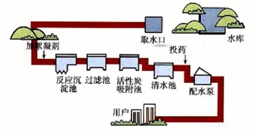
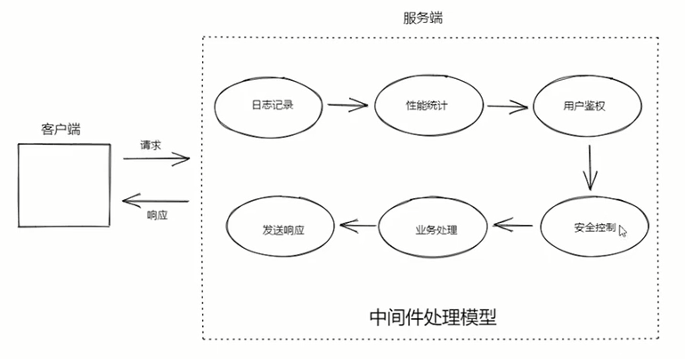

# Express

> TITLE：Node.js 系列教程之 Express
>
> AUTHOR：拉钩
>
> VIDEO：[BiliBili](https://www.bilibili.com/video/BV1mQ4y1C7Cn)
>
> Github：[Javascript/Express](https://github.com/tianming-jianai/JavaScript/tree/main/express)

## 学习进度

- 开始时间：2022-05-17
- 结束时间：

|    日期    | 课程编号 |    学习时长    | 复习时间 |
| :--------: | :------: | :------------: | :------: |
| 2022-05-17 |  P1~P5   |       1h       |   5/26   |
| 2022-05-18 |  P6~P10  |       1h       |          |
| 2022-05-26 | P11~P15  | 11:00~12:30 1h |          |


## 初识 Express


### 基础案例

```javascript
# app.js
const express = require('express')

const app = express()

app.get('/',(req,res)=>{
    console.log(req.url)
    console.log(req.header)
    console.log(req.headers)
    // res.send('Hello World!')

    res.cookie('foo','bar')
    res.cookie('a','abc')
    res.status(202).send('Hello')
})

app.post('/',(req,res)=>{
    console.log('请求参数：',req.query)
    // res.send('Hello World!')

    // res.statusCode = 201
    // res.end()

    // res.write('a')
    // res.write('b')
    // res.write('c')
    // res.end()

    // res.end('Hello world!')

    // res.send({
    //     foo:'bar'
    // })
})

app.put('/user',(req,res)=>{
    res.send('put user')
})

app.delete('/user',(req,res)=>{
    res.send('deltet user')
})

app.listen(3000,()=>{
    console.log('Server running at http://localhost:3000/')
})
```

## CRUD

### db.json

```json
{
  "todos": [
    {
      "id": 1,
      "title": "吃饭"
    },
    {
      "id": 2,
      "title": "奥利给"
    },
    {
      "id": 3,
      "title": "写代码"
    },
    {
      "id": 4,
      "title": "思考人生"
    },
    {
      "title": "打dota",
      "id": 5
    },
    {
      "title": "站在巨人的肩膀上编程",
      "id": 6
    }
  ],
  "users": []
}
```

### db.js

```js
const fs = require('fs')
// uiil.promisify
// 作用：将原生的异步API(不支持Promise,callback方式)转换为promise方式
// 避免出现回调地狱
const { promisify } = require('util')
const path = require('path')

const readFile = promisify(fs.readFile)
const writeFile = promisify(fs.writeFile)
const dbPath = path.join(__dirname, './db.json')

exports.getDb = async () => {
    const data = await readFile(dbPath, 'utf-8')
    return JSON.parse(data)
}

exports.saveDb = async db => {
    // 格式化
    const data = JSON.stringify(db,'','  ')
    await writeFile(dbPath, data)
}
```

### curd.js

```javascript
const express = require('express')
const { json } = require('express/lib/response')
const fs = require('fs')
const { title } = require('process')
const { getDb, saveDb } = require('./db')

const app = express()
// 1. 解析表单请求体 application/json
app.use(express.json())
// 2. 解析表单请求体 application/x-www-form-urlencoded
app.use(express.urlencoded())
// 注意：实际开发中只给客户端配置一种数据传输格式：从一而终

// 查询任务列表
app.get('/todos', async (req, res) => {
    // 1)
    // res.send('get /todos')

    // 2)
    // web开发中能用异步api就不要用同步api，同步阻塞，影响请求数量
    /*fs.readFile('./crud.json', 'utf-8', (err, data) => {
        if (err) {
            res.status(500).json({
                "error": err.message
            })
        }
        const db = JSON.parse(data)
        res.status(200).json(db.todos)
    })*/

    // 3)
    try {
        const db = await getDb()
        res.status(200).json(db.todos)
    } catch (err) {
        res.status(500).json({
            "error": err.message
        })
    }

})

// 根据id查询单个任务
app.get('/todos/:id', async (req, res) => {
    // res.send(`get /todos/${req.params.id}`)

    /*
    fs.readFile('./crud.json', (err, data) => {
        if (err) {
            res.status(500).json({
                "error": err.message
            })
        }
        const db = JSON.parse(data)
        const todo = db.todos.find(todo => todo.id === Number.parseInt(req.params.id))
        if (!todo) {
            return res.status(404).end()
        }
        res.status(200).send(todo)
    })
    */

    try {
        const db = await getDb()
        const todo = db.todos.find(todo => todo.id === Number.parseInt(req.params.id))
        if (!todo) {
            return res.status(404).end()
        }
        res.status(200).json(todo)
    } catch (err) {
        res.status(500), json({
            error: err.message
        })
    }
})

// 添加任务
app.post('/todos', async (req, res) => {
    // res.send('post /todos')

    // 1. 获取客户端请求参数
    // 2. 数据验证
    // 3. 数据验证通过，把数据存储到 db 中
    const todo = req.body
    console.log(req.body)

    if (!todo.title) {
        return res.status(422).json({
            error: 'The field title is required.'
        })
    }

    try {
        const db = await getDb()
        const lastTodo = db.todos[db.todos.length - 1]
        todo.id = lastTodo ? lastTodo.id + 1 : 1
        db.todos.push(todo)
        await saveDb(db)
        res.status(200).json(todo)
    } catch (err) {
        res.status(500).json({
            error: err.message
        })
    }


    res.send('post ')
})

// 修改任务
app.patch('/todos/:id', async (req, res) => {
    // res.send('patch /todos')

    try {
        // 1. 获取表单数据
        const todo = req.body
        // 2. 查找要修改的任务项
        const db = await getDb()
        const ret = db.todos.find(todo => todo.id === Number.parseInt(req.params.id))
        if (!ret) {
            return res.status(404).end()
        }
        console.log(todo)
        // 合并
        Object.assign(ret, todo)

        // 存储数据
        await saveDb(db)
        res.status(201).json(ret)
    } catch (err) {
        res.status(500).json({
            error: err.message
        })
    }

})

// 删除任务
app.delete('/todos/:id', async (req, res) => {
    // res.send('delete /todos')

    try {
        const todoId = Number.parseInt(req.params.id)
        const db = await getDb()
        const index = db.todos.findIndex(todo => todo.id === todoId)
        if (index === -1) {
            return res.status(404).end()
        }
        // 删除一个
        db.todos.splice(index, 1)
        await saveDb(db)
        res.status(204).end()
    } catch (err) {
        res.status(500).json({
            error: err.message
        })
    }
})


app.listen(3000, () => {
    console.log('Server running at http://localhost:3000/')
})
```

### 小总结

[起步-案例-总结](https://www.bilibili.com/video/BV1mQ4y1C7Cn?p=13)


## Express 中间件

- 示例引入
- 概念分析
- 详细使用
- 原理分析

### 示例引入

- app2.js

```js
const express = require('express')

const app = express()

app.get('/',(req,res)=>{
    res.send('get /')
})

app.get('/about',(req,res)=>{
    res.send('get /about')
})

app.post('/login',(req,res)=>{
    res.send('post /login')
})

app.listen(3000,()=>{
    console.log(`Server running at http://localhost:3000/`)
})
```

#### **需求：给每个请求打印日志**

1. 每个方法写打印日志语句

   ```js
   app.get('/',(req,res)=>{
       console.log(req.method,req.url,Date.now())
       res.send('get /')
   })
   ```

2. 封装打印日志语句

   ```js
   app.get('/about', (req, res) => {
       myLogger(req)
       res.send('get /about')
   })
   ```

3. 使用中间件解决

   匹配任意请求

   ```js
   // req 请求对象
   // res 响应对象
   // next 下一个中间件
   app.use((req, res, next) => {
       console.log(req.method, req.url, Date.now())
       // 放行：交出执行权，往后继续匹配执行
       next()
   })
   ```

   中间件的与请求的相对位置，决定了中间件是前置处理还是后置处理

### 中间件概念

Express的最大特色，也是最重要的一个设计，就是中间件。一个 Express应用，就是由许许多多的中间件来完成的。
为了理解中间件，我们先来看一下我们现实生活中的自来水厂的净水流程。



在上图中，自来水厂从获取水源到净化处理交给用户，中间经历了一系列的处理环节，我们称其中的每一个处理环节就是一个中间件。这样做的目的既提高了生产效率也保证了可维护性。

在我理解Express中间件和**AOP面向切面编程**就是一个意思，就是都需要经过经过的一些步骤，**不去修改自己的代码，以此来扩展或者处理一些功能**。

什么是AOP? 中文意思是面向切面编程，听起来感觉很模糊。先举个生产的例子。
农场的水果包装流水线一开始只有`采摘`-`清洗`–`贴标签`。

为了提高销量，想加上两道工序分类和包装但又不能干扰原有的流程，同时如果没增加收益可以随时撤销新增工序。

AOP (Aspect Oriented Programming)面向切面编程:

- 将日志记录，性能统计，安全控制，事务处理，异常处理等代码从业务逻辑代码中划分出来，通过对这些行为的分离，我们希望可以**将它们独立到非指导业务逻辑的方法中，进而改变这些行为的时候不影响业务逻辑的代码**。
- 利用AOP可以对业务逻辑的各个部分进行隔离，从而使得**业务逻辑各部分之间的耦合度降低**，提高**程序的可重用性**，同时**提高了开发的效率和可维护性**。



总结:就是在现有代码程序中，在程序生命周期或者横向流程中`加入`/`减去`一个或多个功能，不影响原有功能。
