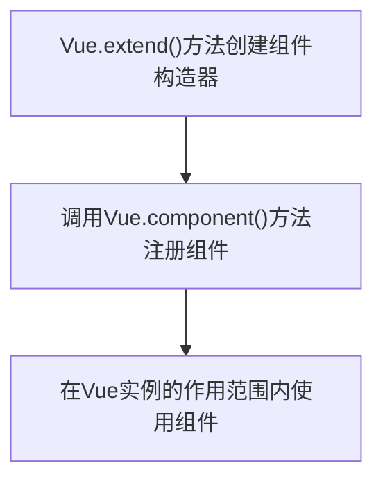

# Vue 教程

> author：coderwhy 王红元

[Video](https://www.bilibili.com/video/BV15741177Eh)

## let/var

- 块级作用域
  - JS中使用var来声明一个变量时,变量的作用域主要是和函数的定义有关.
  - 针对于其他块定义来说是没有作用域的，比如if/for等，这在我们开发中往往会引起一些问题。

## const

当我们修饰的标识符不会被再次赋值时，就可以使用const来保证数据的安全性.

在ES6开发中,优先使用const,只有需要改变某一个标识符的时候才使用let.

## 对象增强写法

```javas
// 1. 属性的简写
let name = 'why'
let age = 18
let obj = {
	name,age
}
// 2. 方法的简写
let obj2 = {
	test(){
		console.log('obj2的test函数')
	}
}
```


## 随笔、常识

类型检测：

- TypeScript :star:

- flow

缩进：2个空格

.editconfig  项目文件统一约束、规约

- indent_size = 2

## 事件监听

在前端开发中，我们需要经常和用于交互

Vue中监听事件：v-on

> 作用：绑定事件监听器
>
> 缩写：@
>
> 预期：Function | Inline Statement | Object
>
> 参数：event

- v-on 参数

如果该方法不需要额外参数，那么方法后的()可以不加；

如果方法本身中有一个参数，那么会默认将原生事件event参数传递进去

同时传递某个参数、event，可以通过$event传入事件

```html
<button @click="btn1Click">按钮1</button>
btn1Click(event){
	console.log(event)
}
<button @click="btn2Click(123)">按钮2</button>
btn2Click(num){
	console.log(num)
}
<button @click="btn3Click(num, $event)">按钮3</button>
btn3Click(num, event){
	console.log(num)
	console.log(event)
}
```

- v-on 修饰符

某些情况下，我们拿到event的目的可能是进行一些事件处理

| .stop                  | 调用event.stopPropagation() | 阻止冒泡事件 |
| ---------------------- | --------------------------- | ------------ |
| .prevent               | 调用event.preventDefault()  | 阻止默认事件 |
| .{keyCode \| keyAlias} | 只是事件是从特定键触发回调  |              |
| .native                | 监听组件根元素的原生事件    |              |
| .once                  | 只触发一次回调              |              |

```html
<div @click="divClick">
	<p>How was you day?</p>
	<button @click.stop="btnClick">按钮</button>
</div>
```

```html
<form action="baidu" method="get">
    <input type="submit" value="提交" @click.prevent="submit"/>
</form>
```

```html
<input type="text"  @keyup.enter="keyup">
```

```html
自定义组件通过.native才能被监控
<cpn @click.native="cpnClick"></cpn>
```

```html
<button @click.once="doClick">按钮</button>
```

## v-if/v-else-if/v-else

### 登录input复用切换问题

```html
<span v-if="isUser">
    <label for="username">用户账号</label>
    <input type="text" id="username" placeholder="用户账号">
</span>
<span v-else>
    <label for="email">用户邮箱</label>
    <input type="text" id="email" placeholder="用户邮箱">
</span>
<button @click="isUser = !isUser">切换类型</button>
```


> 问题解答：
>
> - 这是因为Vue在进行DOM渲染时，出于性能考虑，会尽可能的复用已经存在的元素，而不是重新创建新的元素
> - 在上面的案例中，Vue内部会发现原来的input元素不再使用，直接作为else的input来使用了

> 解决方案：
>
> - 如果我们不希望Vue出现类似重复利用的问题，可以给对应的input添加key
> - 并且我们需要保证key的不同

## v-show

```html
<h2 v-if="isShow"></h2>
<h2 v-show="isShow"></h2>
```

- isShow = false 消失
  - v-if ：dom中没了
  - v-show：style="display: none;"   切换频率高使用

## v-for

```html
# 遍历数组
<li v-for="item in names">{{item}}</li>
# 遍历数组及其下标
<li v-for="(item,index) in names">{{index}} - {{item}}</li>
# 遍历对象 v
<li v-for="item in info">{{item}}</li>
# 遍历对象 k,v
<li v-for="(value,key) in info">{{key}} - {{value}}</li>
# 遍历对象 index,k,v
<li v-for="(value,key,index) in info">{{index}} - {{key}} - {{value}}</li>
```

### 组件的key属性

> 官方推荐我们在使用v-for时，给对应的元素或组件添加一个:key属性
>
> 我们需要使用key来给每个节点做一个唯一标识
>
> - diff算法就可以正确的识别到此节点
> - 找到正确的位置插入新的节点
>
> **所以一句话：key的作用主要是为了搞笑的更新虚拟DOM**


## 数组中哪些方法是响应式的

```js
this.letters.push('aaa')
this.letters.pop()
this.letters.shift()
this.letters.unshift('aaa','bbb','ccc')
this.letters.splice(1) // 删除元素
this.letters.splice(1,1) // 删除元素
this.letters.splice(1,0,'aaa') // 插入元素
this.letters.splice(1,1,'bbb') // 替换元素
this.letters.sort()
this.letters.reverse()

// Vue.set方式修改数组的值，响应式
Vue.set(this.letters,0,'ggg')
```

- 非响应式

```js
// 注意：通过 = 赋值 修改数组中的元素，不会被Vue的监听器监听
this.letters[0] = 'aaaaa'
```

## 小作业：点击选项变红色

```html
<ul>
    <li v-for="(item,index) in movies" :class="{active:currIndex == index}" @click="liClick(index)">{{item}}</li>
</ul>

data:{
	books: ['西游记','红楼梦','三国演义','水浒传','二十四史','中国通史'],
	currIndex:-1
},
methods:{
	liClick(index){
		this.currIndex = index
	}
}
```


## 图书购物车案例


<details>
    <summary>CSS</summary>
    <pre>
    table {
        border: 1px solid #e9e9e9;
        border-collapse: collapse;
        border-spacing: 0;
    }
    th,td {
        padding: 8px 16px;
        border: 1px solid #E9E9E9;
        text-align: left;
    }
    th {
        background-color: #f7f7f7;
        color: #5c6b77;
        font-weight: 600;
    }
    </pre>
</details>

<details>
    <summary>HTML</summary>
    <code>
    <div id="app">
			<h1>图书购物车</h1>
			<table>
				<thead>
					<tr>
						<th></th>
						<th>书籍名称</th>
						<th>出版日期</th>
						<th>价格</th>
						<th>购买数量</th>
						<th>操作</th>
					</tr>
				</thead>
				<tbody>
					<tr v-for="(item,index) in books" :key="item">
						<td>{{item.id}}</td>
						<td>{{item.name}}</td>
						<td>{{item.date}}</td>
						<td>{{item.price | showPrice}}</td>
						<td>
							<button type="button" @click="decre(index)" :disabled="item.count <= 1">-</button>
							{{item.count}}
							<button type="button" @click="incre(index)">+</button>
						</td>
						<td>
							<button type="button" @click="remove(index)">移除</button>
						</td>
					</tr>
				</tbody>
			</table>
			<h2>总价：{{totalPrice | showPrice}}</h2>
		</div>
    </code>
</details>

<details>
    <summary>JS</summary>
    <pre>
        const vm = new Vue({
				el: '#app',
				data: {
					books: [{id: 1,name: '西游记',date: '2006-09',price: 85.00,count: 1}, 
					{id: 2,name: '红楼梦',date: '2006-02',price: 82.00,count: 1}, 
					{id: 3,name: '三国演义',date: '2002-03',price: 77.00,count: 1}, 
					{id: 4,name: '水浒传',date: '2003-03',price: 65.00,count: 1}, 
					{id: 5,name: '二十四史',date: '2004-04',price: 68.00,count: 1}, 
					{id: 6,name: '中国通史',date: '2005-07',price: 60.00,count: 1}]
				},
				methods: {
					incre(index) {this.books[index].count++},
					decre(index) {this.books[index].count--},
					remove(index) {this.books.splice(index, 1)}
				},
				computed: {
					totalPrice() {return this.books.reduce((prev,curr)=>{return prev+curr.price*curr.count},0)}
				},
				filters: {
					showPrice(price) {return '￥' + price.toFixed(2)}
				}
			})
    </pre>
</details>

```
# {{item.price | showPrice}} 过滤器
# :disabled="item.count <= 1" 绑定属性，true标识标签具有这个属性
```

## v-model 表单绑定

> Vue中使用v-model指令来实现表单元素和数据的双向绑定

```html
<input type="text" v-model="message">
// 等同于
<input type="text" v-bind:value="message" v-on:input="message = $event.target.value">
```

### v-model : radio

```html
<label for="male">
    <input type="radio" id="male" name="sex" value="男" v-model="sex">男
</label>
<label for="famale">
    <input type="radio" id="famale" name="sex" value="女" v-model="sex">女
</label>
<h2>性别：{{sex}}</h2>
```

- sex:'男' // 默认绑定
- 有v-model 可以不写name，作为表单提交必须写name

### v-model：checkbox

```html
<label for="agree">
    <input type="checkbox" name="agree" id="agree" v-model="isAgree" />同意协议
</label>
<button :disabled="!isAgree">下一步</button>
<h2>您的选择是：{{isAgree}}</h2>
```

```html
<input type="checkbox" value="篮球" v-model="hobbies">篮球
<input type="checkbox" value="足球" v-model="hobbies">足球
<input type="checkbox" value="乒乓球" v-model="hobbies">乒乓球
<input type="checkbox" value="羽毛球" v-model="hobbies">羽毛球
<h2>您的爱好是：{{hobbies}}</h2>
```

### v-model：修饰符

```html
<!-- 1. lazy 回车之后再响应 -->
<input type="text" v-model.lazy="message" />
<h2>{{message}}</h2>

<!-- 2. number v-model 默认绑定类型为string, .number就是数字类型，不需要再进行类型转换 -->
<input type="number" v-model.number="age">
<h2>{{age}} - {{typeof age}}</h2>

<!-- 3. trim 消除字符串前后的空格-->
<input type="text" v-model="name">
<h2>您输入的名字是：{{name}}</h2>
```

## 什么是组件化

> 人面对复杂问题的处理方式：
>
> - 任何一个人处理信息的能力都是有限的，不太可能一次性稿定一大堆的内容
> - 人有一种天生的能力，就是将问题进行拆解
> - 拆分为可处理的小问题，大的问题也就会迎刃而解

> 组件化思想也是如此：
>
> - 将所有逻辑放在一起，处理起来就会变得非常复杂，不利于后续的管理以及扩展
> - 但，将一个页面页面拆分成一个个小的模块，完成属于自己这部分的功能，那么真题的管理和维护就非常容易了


## Vue 组件化思想

> - 组件化是Vue.js中的重要思想
>   - 它提供了一种抽象，让我们可以开发出一个个独立可复用的小组件来构造我们的应用。
>   - 任何的应用都会被抽象成一颗组件树。


## 注册组件的基本步骤

> 组件的使用分成三个步骤
>
> - 创建组件构造器
> - 注册组件
> - 使用组件



```html
<div id="app">
    <!-- 3. 使用组件 -->
    <my-cpn></my-cpn>
</div>
<script>
    // 1. 创建组件构造器
    const myComponent = Vue.extend({
        template:`
        	<div>
        		<h2>组件标题</h2>
        		<p>我是组件中的一个段落内容</p>
    		</div>
        `
    })
	// 2. 注册组件
    Vue.component('my-cpn',myComponent)
    let app = new Vue({
        el: '#app'
    })
</script>
```
<!--
<details>
    <summary>完整版代码</summary>
    <code>
    <div id="app">
			<my-cpn></my-cpn>
			<my-cpn></my-cpn>
		</div>
		<script src="https://unpkg.com/vue@2.6.14/dist/vue.min.js"></script>

		<script src="https://unpkg.com/element-ui@2.15.7/lib/index.js"></script>
		<script type="text/javascript">
			const cpnc = Vue.extend({
				template:`
					<div>
						<h2>我是标题</h2>
						<p>我是内容。。。</p>
						<p>我是内容。。。</p>
					</div>
				`
			})
			Vue.component('my-cpn', cpnc)
			const vm = new Vue({
				el: '#app',
				data: {
					message:'你好'
				},
				methods: {}
	        })
	    </script>
	</code>
</details>
-->
## 注册组件步骤解析


## 全局组件和局部组件
<!--
<details>
    <summary>全局组件</summary>
    <code>
    <div id="app">
			<my-cpn></my-cpn>
			<my-cpn></my-cpn>
		</div>
		<div id="app2">
			<my-cpn></my-cpn>
		</div>
		<script src="https://unpkg.com/vue@2.6.14/dist/vue.min.js"></script>
		 import JavaScript 
		<script src="https://unpkg.com/element-ui@2.15.7/lib/index.js"></script>
		<script type="text/javascript">
			const cpnc = Vue.extend({
				template:`
					<div>
						<h2>我是标题</h2>
						<p>我是内容。。。</p>
						<p>我是内容。。。</p>
					</div>
				`
			})
			Vue.component(
				'my-cpn', cpnc
			)
			const vm = new Vue({
				el: '#app',
				data: {
					message:'你好'
				},
				components:{
					cpnc
				}
			})
			const app2 = new Vue({
				el:'#app2'
			})
		</script>
    </code>
</details>

<details>
    <summary>局部组件</summary>
    <code>
    <div id="app">
			<cpnc></cpnc>
			<cpnc></cpnc>
		</div>
		<div id="app2">
			<my-cpn></my-cpn>
		</div>
		<script src="https://unpkg.com/vue@2.6.14/dist/vue.min.js"></script>
		 import JavaScript 
		<script src="https://unpkg.com/element-ui@2.15.7/lib/index.js"></script>
		<script type="text/javascript">
			const cpnc = Vue.extend({
				template:`
					<div>
						<h2>我是标题</h2>
						<p>我是内容。。。</p>
						<p>我是内容。。。</p>
					</div>
				`
			})
			// Vue.component(
			// 	'my-cpn', cpnc
			// )
			const vm = new Vue({
				el: '#app',
				data: {
					message:'你好'
				},
				components:{
					cpnc
				}
			})
			const app2 = new Vue({
				el:'#app2'
			})
		</script>
    </code>
</details>
-->
## 父组件和子组件的区分

