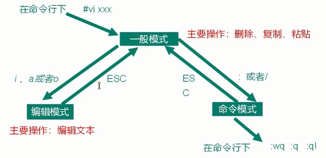

# 尚硅谷3天Linux1天Shell

> 本套linux视频教程适合所有程序员及大数据工程师、运维工程师等学习
> 
> 高级程序员必备技能
> [Bilibili](https://www.bilibili.com/video/BV1WY4y1H7d3)

## 一、学了Linux可以做什么

- 运维工程师
  - 系统运维 | 应用运维 | DBA
- 开发工程师
  - 内核/驱动开发
  - 软件开发
    - web应用 | 数据库 | 大数据 | 云计算 | 物联网
  - 嵌入式开发
- 架构师

### 本套课程

- 课程内容


- 课程特色

  - 基于Centos7
  - 简单易上手，小白学习教程
  - 详细的常用命令讲解

  > 不会Shell不是好运维

- 学习态度
  - 理论+实践：多敲命令多做测试，这样才能充分掌握Linux

## 二、Linux是什么：是一个操作系统（OS）

- Linux的诞生

  利纳斯*托瓦兹（Linus Torvalds）

  1991年大学期间通过汇编写了minix不能完成的内核，1万行代码发布了0.01版本

  **unix**分时操作系统

  1）商业，收费

  > BSD：当前仍然流行的分支 -> FreeBSD -> Darwin达尔文 -> Mac OS
  >
  > Solaris：单机性能非常强悍，运行在大型机上 -> Oracle Linux
  >
  > IBM-AIX
  >
  > HP-UX

  2）minix：Andrew Traenbaum

  > 开始于终端系统：远程访问Minix
  >
  > 文件系统
  >
  > 磁盘驱动

- GNU/Linux

  Richard Stallman：自由软件

- 计算机硬件

  硬件接口层

  > 广义的LInux：核心Kernel > 命令解释层 > shell > 外围应用层
  >
  > 狭义的Linux：LinuxKernel

- Linux发行版

  Red Hat

  > 性能强大、不太关注桌面
  >
  > RHEL
  >
  > fedora > 迭代激进，不太稳定
  >
  > centos > 基于已发布的商业版本的免费版
  >
  > ​					国内用的最多  包管理：rpm 、yam

  debian

  > 最遵循GNU
  >
  > ubuntu：外观漂亮、debian的不稳定版  > linux mint 包管理工具：apt

  suse

  > 欧洲非常流行
  >
  > 最豪华的linux系统 KDE
  >
  > openSUSE
  >
  > 国内相对较少

  archLinux

  > 轻量好用
  >
  > 滚动发行
  >
  > 稳定版：manjaro

  国内也有发行版

  > 鸿蒙
  >
  > 优麒麟
  >
  > UOS

  android

- linux VS windows

Linux 内核最小只有几百KB


## 三、下载安装

VMware虚拟机安装

- 下载

[阿里云下载 Centos7](http://mirrors.aliyun.com/centos/7.9.2009/isos/x86_64/)

- 网络

  - 桥接

    和主机平级

    能够被局域网中的其他主机访问

  - net

    创建路由与主机连接

    受主机保护，对外和主机同IP

- 标准分区

  - 挂载点

    1）/boot引导分区  1GB

    > ext4 第4代文件扩展系统：容量1EB、单个文件16TB
    >
    > 文件系统：xfs高性能日志处理系统，Centos7默认 容量8EB

    2）swap 交换分区 4G

    > 实际内存的1倍或2倍

    3）/ 根分区


## 四、linux文件

> linux中一切皆文件

- / 根目录

- /root

  - root用户家目录

- /bin

  - binary缩写，存储最常用的命令
  - link：/usr/bin

- /sbin

  - s：system，存放系统管理员使用的系统管理程序

- /boot

  - 用户数据不能写到这个目录，目录容量不大

- /dev

  - device管理设备
  - /dev/cpu

- /etc

  - 系统管理所需配置文件

- /home

  - 家目录：用户个性化数据都应该放到这里

- /var

  - 变量
  - 存放经常修改的文件

- /lib

  - 动态链接库

- /usr

  - 用户所有的应用程序

- /media

  - 识别可移动媒体设备
  - U盘
  - 光驱

- /mnt

  - 同/media

- /opt

  - 可选
  - 第三方软件包默认存放位置

- /tmp

  - 临时目录

  


## 五、编辑器

### VI：最通用

Unix操作系统和类Unix操作系统中最通用的文本编辑器

### Emacs：神之编辑器

lisp

all in one

### VIM：编辑器之神（需要常练）

**vim是什么**

从VI发展出来的一个性能更强大的文本编辑器

可以主动的以字体颜色辨别语法的正确性，方便程序设计

VIM与VI编辑器完全兼容

**编辑模式间转换**

编辑模式间转换



1. 一般模式

| yy         | 复制光标当前一行                                  |
| ---------- | ------------------------------------------------- |
| y 数字 y   | 复制一段（从光标当前行到后N行）                   |
| p          | 箭头移动到目的行粘贴                              |
| u          | 撤销上一步                                        |
| dd         | 删除光标当前行                                    |
| d 数字 d   | 删除光标（含）后多少行                            |
| x          | 剪切一个字符（当前光标），相当于del               |
| X          | 剪切一个字符（当前光标的前一个），相当于Backspace |
| yw         | 复制一个词                                        |
| dw         | 删除一个词                                        |
| shift+6(^) | 移动到行头                                        |
| shift+4($) | 移动到行尾                                        |
| w          | 移动到下一个单词（词头位置）                      |
| e          | 移动到下一个单词（词尾位置）                      |
| 1+G        | 移动到页头，数字位置                              |
| G          | 移动到页尾                                        |
| 数字N+G    | 移动到目标行                                      |

2. 编辑模式

i/a/o/I/A/O

3. 命令模式

| :w            |                                        |
| ------------- | -------------------------------------- |
| :q            |                                        |
| :wq           |                                        |
| :q!           |                                        |
| /要查找的词   | n查找下一个，N往上查找                 |
| :noh          | 取消高亮显示                           |
| :set nu       | 显示行号                               |
| :set nonu     | 关闭行号                               |
| :s/old/new    | 替换当前行匹配到的第一个old为new       |
| :s/old/new/g  | 替换当前行匹配到的所有old为new         |
| :%s/old/new   | 替换文档中每一行匹配到的第一个old为new |
| :%s/old/new/g | 替换文档中匹配到的所有old为new         |

**常用语法**

## 六、网络配置和系统管理

### 查看IP和网关

`ping`

查看虚拟机地址：win：以太网->右键->状态->IPv4地址

- 网络适配器：网卡
  - VMnet1：仅主机模式
  - VMnet8：NAT模式

- 路由
  - DHCP
    - 自动分配IP地址
    - 比较适合：人多、但不会同时在线模式

### VMware提供了三种网路连接方式

| 桥接模式   | 虚拟机直接连接外部网络的模式，主机起到了网桥的作用。<br/>这种模式下，虚拟机可以直接访问外部网路，并且对外部网络是可见的。 |
| ---------- | ------------------------------------------------------------ |
| NAT模式    | 虚拟机和主机构建一个专用网络，并通过虚拟网路地址转换（NAT）设备对IP进行转换。<br/>虚拟机通过共享主机IP可以访问外部网络，但外部网路无法访问虚拟机。 |
| 仅主机模式 | 虚拟机只与主机共享一个专用网络，与外部网络无法通信。         |

### 测试网路连接

- linux
  - ifconfig
- windows
  - ipconfig

### IP管理

默认DHCP动态分配不适合管理

**windows 设置静态IP**

VMnet8->右键->竖向->IPv4->使用下面的IP地址

没有必要这样设置

直接设置虚拟机地址作静态地址转换

把虚拟机指定静态IP就可以了

**虚拟机设置静态IP**

1. 虚拟机网络编辑器

   1. 子网IP `192.168.111.0` 最后数字必须为0：代表子网
   2. 子网掩码 `255.255.255.0`

2. 修改Linux静态IP

   1. 图形化界面

      设置->网路->配置->IPv4 Method->手动

   2. 终端

      1. `vim /etc/sysconfig/network-scripts/cfg-ens33`
      2. `BOOTPROTO=static`
      3. 静态IP需要手动指定IP
         1. IP地址 `IPADDR=192.168.111.100`
         2. 网关 `GATEWAY=192.168.111.2`
         3. DNS域名解析器 `DNS1=192.168.111.2`
         4. 子网掩码（可不配，有默认值）

3. 重启网路：否则配置不生效

   1. `service network restart`
   2. `ifconfig` 查看IP

**修改IP后可能遇到的问题**

1. 物理机ping虚拟机，但是虚拟机ping不通物理机，一般都是因为物理机的防火墙问题，把防火墙关闭就行
2. 虚拟机能ping通物理机，但是虚拟机ping不通外网，一般都是因为DNS的设置有问题
3. 虚拟机ping www.baidu.com显示域名未知等信息，一般看GATEWAY和DNS设置是否正确
4. 如果以上全部设置完还是不行，需要关闭NetworkManager服务
   1. 关闭 `systemctl stop NetworkManager`
   2. 禁用 `systemctl disable NetworkManager`
5. 如果发现systemctl status network有问题，需要检查ifcfg-ens33

### 配置主机名（需要重看视频5/26）

`hostname`查看主机名

1、vim /etc/hostname 重启服务器修改生效

2、hostnamectl set-hostname spark10 即时生效

- 把修改的主机名广播出去

1. 在hosts文件中添加主机名和ip的一一映射

vim /etc/hosts

192.168.111.100 hadoop100
192.168.111.100 hadoop101
192.168.111.100 hadoop102
192.168.111.100 hadoop103

2. 修改windows的hosts文件

追加

192.168.111.100 hadoop100
192.168.111.100 hadoop101
192.168.111.100 hadoop102
192.168.111.100 hadoop103

3. windows访问虚拟机

ping hadoop100

直接用主机名就可以远程登录，连接

保护好hosts，防止域名劫持

ssh root@hadoop100

远程登录工具

- 基于SSH
- XShell、SSH Secure Shell、SecureCRT、FinalShell、Putty、
- MobaXterm
- teamviewer
- 想看到图形化界面：VNC

上传下载工具

- Xftp
- Win SCP
- fileZilla
- scp命令远程传输文件

## 七、系统管理


## 八、常用基本命令


## 九、软件包管理

### RPM

#### RPM概述

RPM（RedHat Package Manager）

RPM包的名称格式：Apache-1.3.23-11.i386.rpm

软件名称-软件版本号.软件所运行的硬件平台.rpm文件扩展名

#### 常用参数

```bash
-a 　查询所有套件。
-i<套件档>或--install<套件档> 　安装指定的套件档
-q 　使用询问模式，当遇到任何问题时，rpm指令会先询问用户
--clean 　完成套件的包装后，删除包装过程中所建立的目录。
--nodeps 　不验证套件档的相互关联性。

```


#### RPM查询命令

```bash
rpm -qa | grep kernel # 查找相应文件
rpm -qi kernel # 查询软件包详细信息
```

#### RPM卸载命令

```bash
rpm -e RPM安装包 # 卸载软件包
rpm -e --nodeps 软件包 # 卸载软件时，不检查依赖。这样的话，那些使用该软件包的软件在此之后可能就不能正常工作了
```

#### RPM安装命令

```bash
rpm -ivh RPM包全名
# -i install安装
# -v --verbose 显示详细信息
# -h --hash 进度条
# --nodeps 安装前不检查依赖
```

### yum 仓库配置

#### yum概述

yum（Yellow dog Updater,Modified）
是一个在Fedora和RedHat以及CentOS中的Shell前端软件包管理器

基于RPM包管理器，能够从指定的服务器**自动下载RPM包并且安装**，可以**自动处理依赖关系**
并且**一次安装**所有依赖的软件包，无须繁琐地一次次下载、安装

#### yum常用命令

```bash
yum [选项] [参数]
yum -y install firefox
```

- 选项

```bash
-y # 对所有提问都回答yes
```

- 参数

```bash
install # 安装rpm软件包
update # 更新rpm安装包
check-update # 检查是否有可用的rpm软件包
remove # 删除指定的rpm软件包
list # 显示软件包信息
clean # 清理yum过期的缓存
deplist # 显示yum软件包的所有依赖关系
```

#### 修改yum软件源

1）安装wget用来从指定的URL下载文件 

```bash
yum install wget
```

2）在/etc/yum.repos.d/目录下，备份默认的repos文件

```bash
cp CentOS-Base.repo CentOS-Base.repo.backup
```

3）下载163或阿里云的repos文件，任选其一

```bash
wget http://mirrors.aliyun.com/repo/Centos-7.repo
wget http://mirrors.163.com/.help/CentOS7-Base-163.repo
```


## 十、克隆虚拟机

```bash
```


## 十一、企业真实面试题


## 十二、Shell编程
