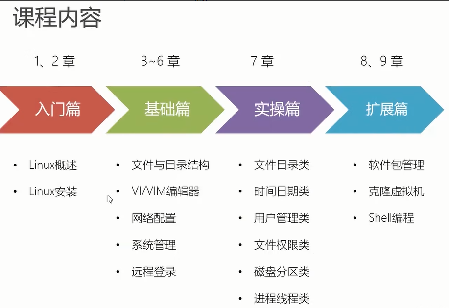
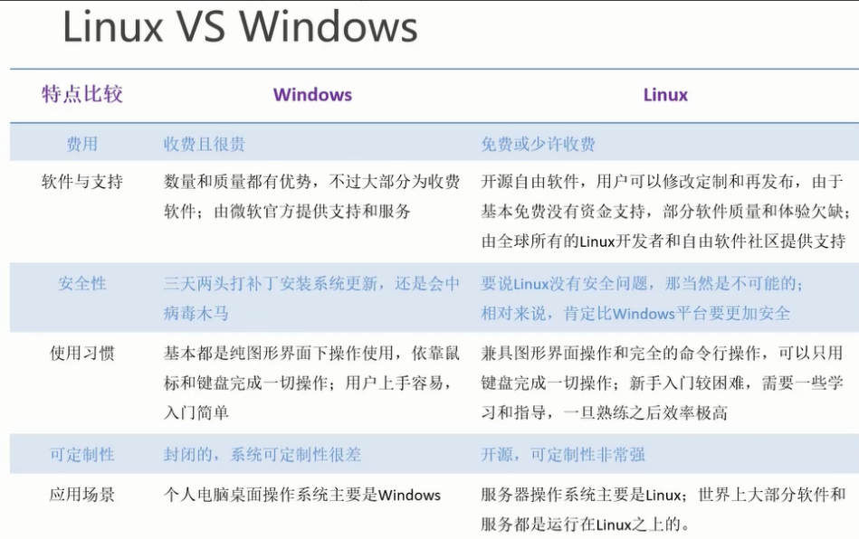

# 尚硅谷3天Linux1天Shell

> 本套linux视频教程适合所有程序员及大数据工程师、运维工程师等学习
> 
> 高级程序员必备技能
> [Bilibili](https://www.bilibili.com/video/BV1WY4y1H7d3)

## 一、学了Linux可以做什么

- 运维工程师
  - 系统运维 | 应用运维 | DBA
- 开发工程师
  - 内核/驱动开发
  - 软件开发
    - web应用 | 数据库 | 大数据 | 云计算 | 物联网
  - 嵌入式开发
- 架构师

### 本套课程

- 课程内容

- 课程特色

  - 基于Centos7
  - 简单易上手，小白学习教程
  - 详细的常用命令讲解

  > 不会Shell不是好运维

- 学习态度
  - 理论+实践：多敲命令多做测试，这样才能充分掌握Linux

## 二、Linux是什么：是一个操作系统（OS）

- Linux的诞生

  利纳斯*托瓦兹（Linus Torvalds）

  1991年大学期间通过汇编写了minix不能完成的内核，1万行代码发布了0.01版本

  **unix**分时操作系统

  1）商业，收费

  > BSD：当前仍然流行的分支 -> FreeBSD -> Darwin达尔文 -> Mac OS
  >
  > Solaris：单机性能非常强悍，运行在大型机上 -> Oracle Linux
  >
  > IBM-AIX
  >
  > HP-UX

  2）minix：Andrew Traenbaum

  > 开始于终端系统：远程访问Minix
  >
  > 文件系统
  >
  > 磁盘驱动

- GNU/Linux

  Richard Stallman：自由软件

- 计算机硬件

  硬件接口层

  > 广义的LInux：核心Kernel > 命令解释层 > shell > 外围应用层
  >
  > 狭义的Linux：LinuxKernel

- Linux发行版

  Red Hat

  > 性能强大、不太关注桌面
  >
  > RHEL
  >
  > fedora > 迭代激进，不太稳定
  >
  > centos > 基于已发布的商业版本的免费版
  >
  > ​					国内用的最多  包管理：rpm 、yam

  debian

  > 最遵循GNU
  >
  > ubuntu：外观漂亮、debian的不稳定版  > linux mint 包管理工具：apt

  suse

  > 欧洲非常流行
  >
  > 最豪华的linux系统 KDE
  >
  > openSUSE
  >
  > 国内相对较少

  archLinux

  > 轻量好用
  >
  > 滚动发行
  >
  > 稳定版：manjaro

  国内也有发行版

  > 鸿蒙
  >
  > 优麒麟
  >
  > UOS

  android

- linux VS windows

Linux 内核最小只有几百KB

## 三、下载安装

VMware虚拟机安装

- 下载

[阿里云下载 Centos7](http://mirrors.aliyun.com/centos/7.9.2009/isos/x86_64/)

- 网络

  - 桥接

    和主机平级

    能够被局域网中的其他主机访问

  - net

    创建路由与主机连接

    受主机保护，对外和主机同IP

- 标准分区

  - 挂载点

    1）/boot引导分区  1GB

    > ext4 第4代文件扩展系统：容量1EB、单个文件16TB
    >
    > 文件系统：xfs高性能日志处理系统，Centos7默认 容量8EB

    2）swap 交换分区 4G

    > 实际内存的1倍或2倍

    3）/ 根分区

## 四、linux文件

> linux中一切皆文件

- / 根目录

- /root

  - root用户家目录

- /bin

  - binary缩写，存储最常用的命令
  - link：/usr/bin

- /sbin

  - s：system，存放系统管理员使用的系统管理程序

- /boot

  - 用户数据不能写到这个目录，目录容量不大

- /dev

  - device管理设备
  - /dev/cpu

- /etc

  - 系统管理所需配置文件

- /home

  - 家目录：用户个性化数据都应该放到这里

- /var

  - 变量
  - 存放经常修改的文件

- /lib

  - 动态链接库

- /usr

  - 用户所有的应用程序

- /media

  - 识别可移动媒体设备
  - U盘
  - 光驱

- /mnt

  - 同/media

- /opt

  - 可选
  - 第三方软件包默认存放位置

- /tmp

  - 临时目录

  

## 五、编辑器

## 六、网络配置和系统管理

## 七、系统管理

## 八、常用基本命令

## 九、软件包管理

## 十、克隆虚拟机

## 十一、企业真实面试题

## 十二、Shell编程
